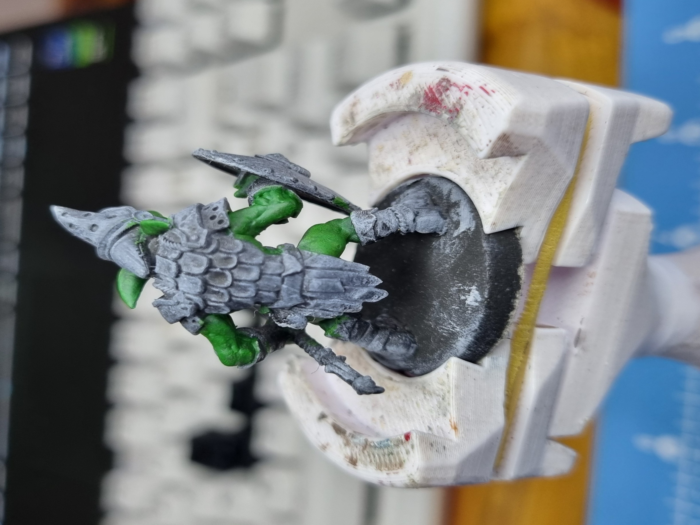
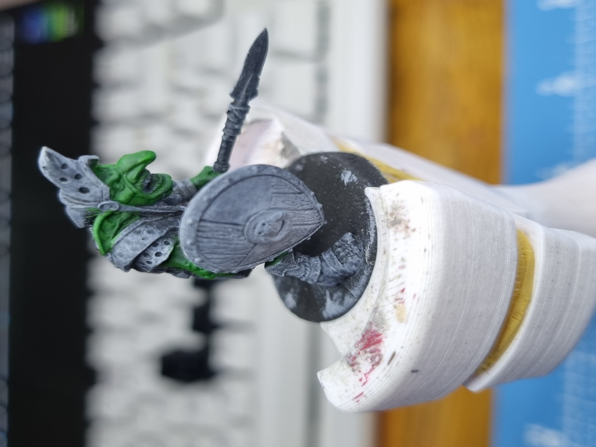
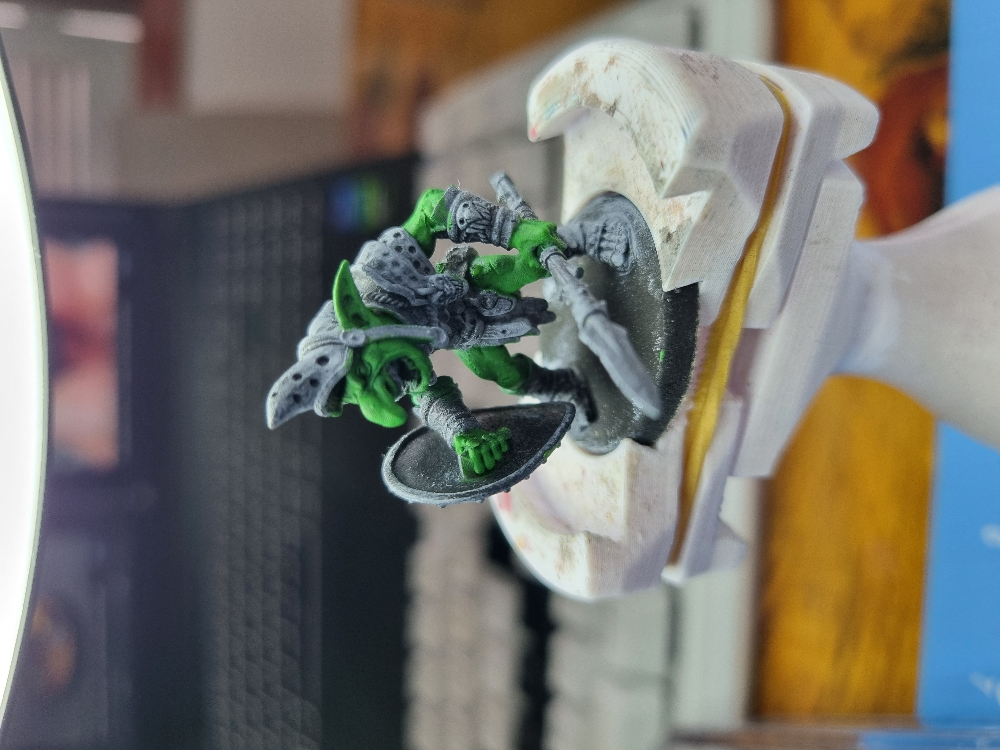
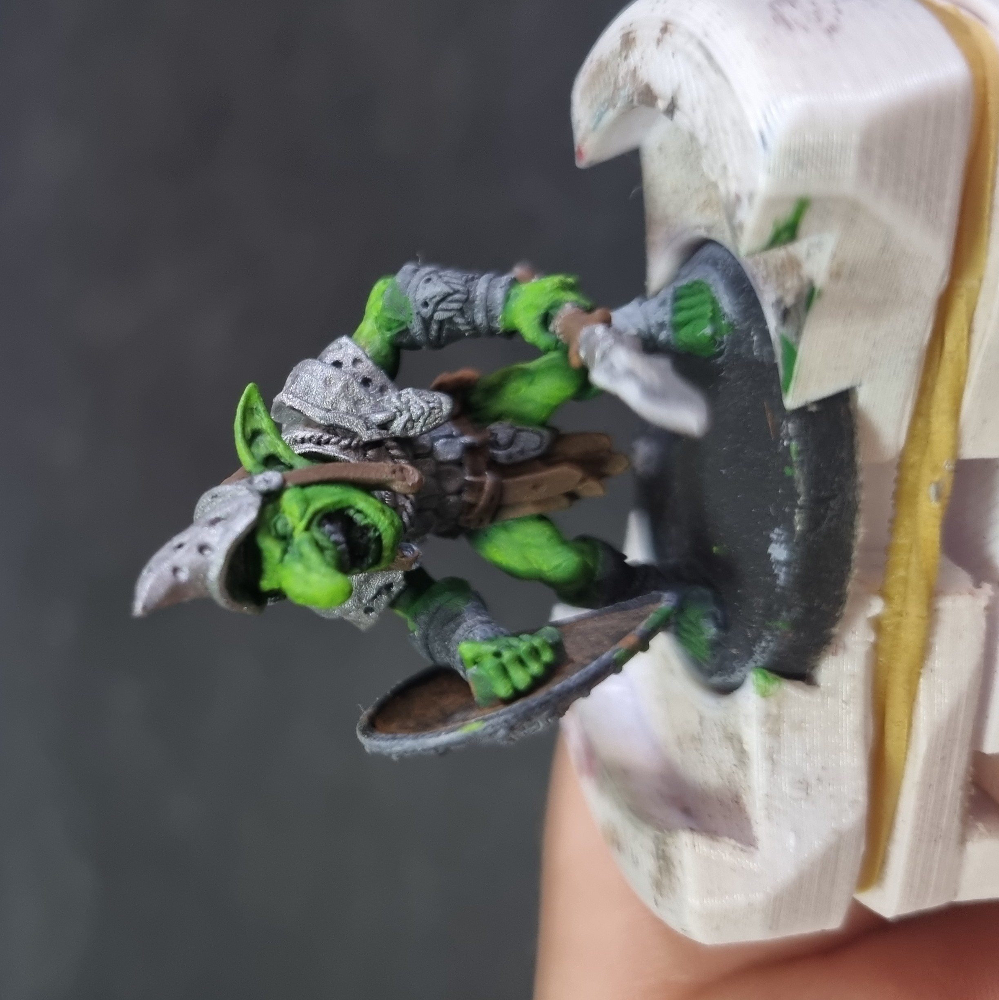
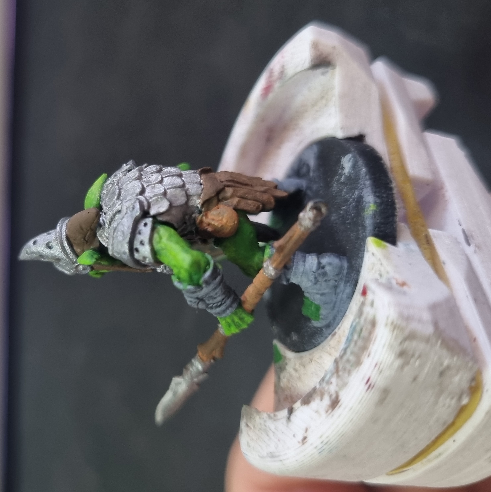
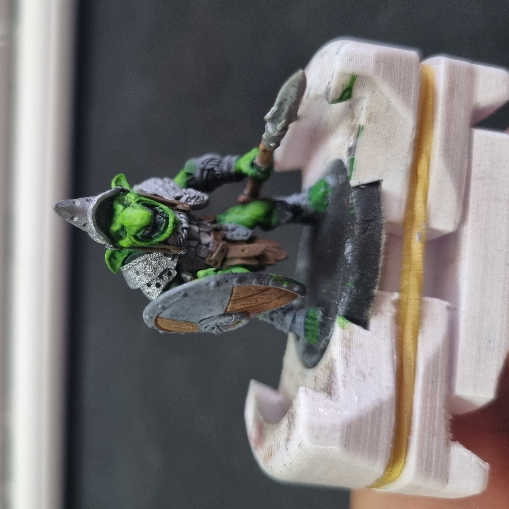
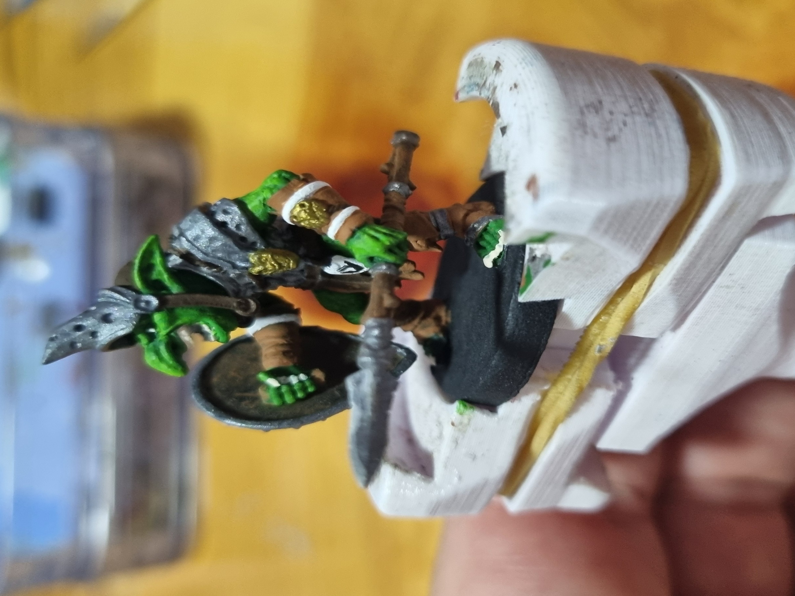
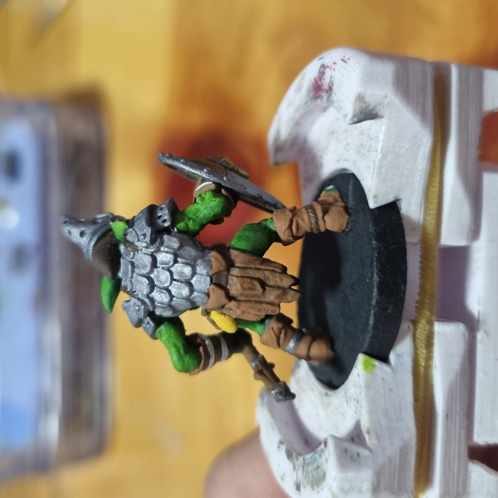
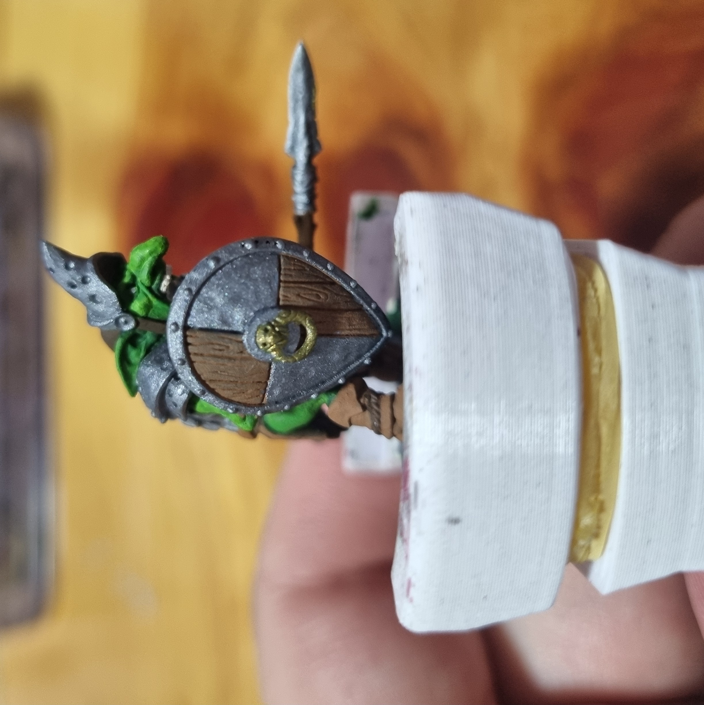
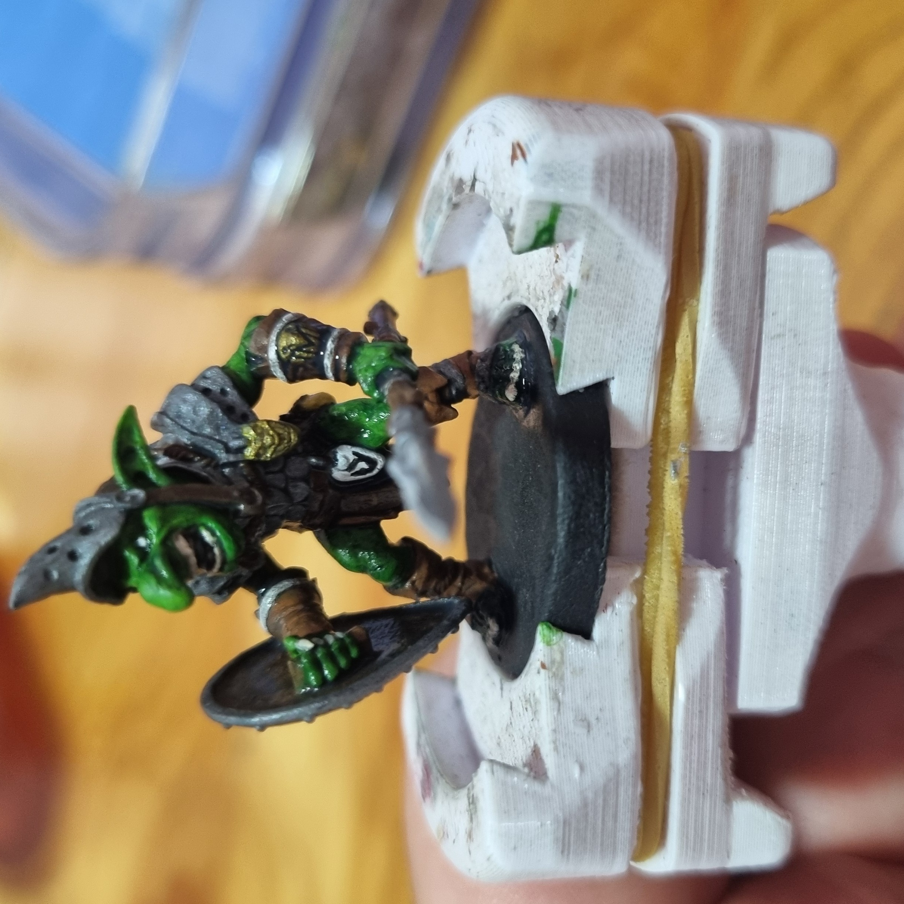

This is a model from [Artisan Guild](https://www.patreon.com/ArtisanGuild) From Faldorn Goblins pack.

First I used a black spray primer, after that I made a layer of gray zenithal and finally I used the white dry brush technique to.
After that I started adding the colors.

   

Dark green and light green for the skin, brown and light brown for the leather and laces.

   

Silver mixed with black for the armor, white for some details and gold for others.

    

To finish I used a black wash.

I used Acrilex paints, and the base was made with gray clay.

