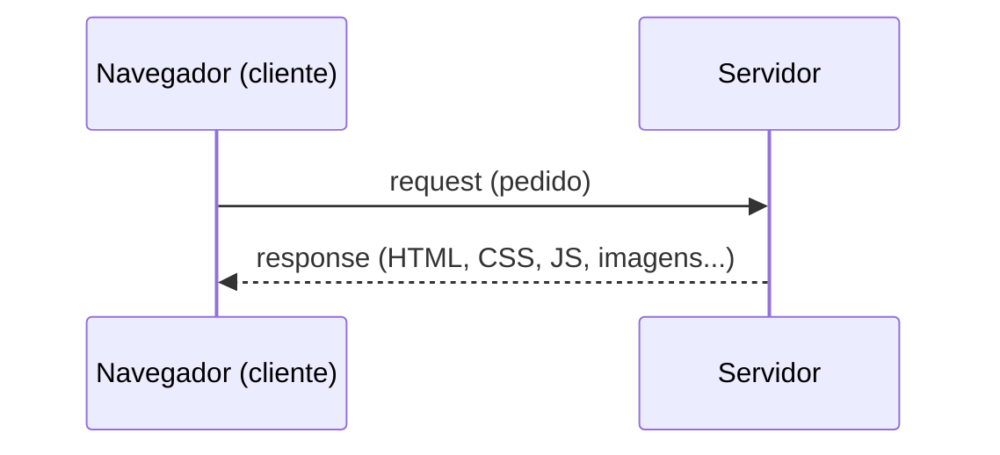
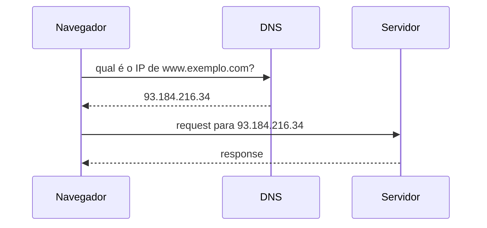

# Desenvolvimento Web

**Desenvolvimento web** é a área responsável por construir tudo o que rodamos em um navegador: sites, blogs, sistemas, painéis administrativos, redes sociais. Antes de qualquer framework ou biblioteca, três tecnologias formam a base de tudo e é por isso que este material começa por elas.

| Camada | Linguagem | Responsabilidade |
| --- | --- | --- |
| Estrutura | **HTML** | O que é cada parte do conteúdo (título, lista, formulário...) |
| Apresentação | **CSS** | Como o conteúdo aparece (cores, layout, tipografia) |
| Comportamento | **JavaScript** | Como a página reage e interage |

::: tip Como o navegador junta as três
O navegador lê o HTML e monta a árvore de elementos (o **DOM**). Em seguida aplica as regras de CSS a essa árvore, decidindo a aparência de cada elemento. Por fim, executa o JavaScript, que pode ler e alterar tanto o DOM quanto os estilos aplicados é a mesma ordem em que este material apresenta as três tecnologias.
:::

## Front-end × back-end

O que roda **no navegador do usuário** (HTML, CSS, JS) é chamado de **front-end**. O que roda **em um servidor**, cuidando de dados, autenticação e regras de negócio, é o **back-end**.

### Como a Web funciona

Antes do HTML, CSS e JavaScript, existe a própria **Web** a rede sobre a qual tudo isso roda. Ela não nasceu pronta! A web é a combinação de avanços que se sobrepuseram ao longo de décadas.

<figure class="doc-figure">
  
  <figcaption>Sir Tim Berners-Lee, criador da World Wide Web</figcaption>
</figure>

A **World Wide Web (WWW)** como conhecemos hoje é produto de vários trabalhos e pesquisas, mas é reconhecida principalmente como obra de [Sir Tim Berners-Lee](https://www.w3.org/People/Berners-Lee/), desenvolvida no CERN em 1989. Ele é creditado como criador das especificações de **URI**, **HTTP** e **HTML**, as três peças que ainda hoje sustentam qualquer página na Web.

### Os pilares da Web

A Web só existe porque três coisas diferentes já existiam, ou surgiram ao seu redor: uma rede para conectar computadores, um jeito de trocar mensagens por essa rede, e um programa capaz de exibir o conteúdo recebido.

| Pilar | Marco | Responsável |
| --- | --- | --- |
| **Internet** | ARPANET (1969) e TCP/IP (1975) | J.C.R. Licklider · Cerf & Kahn |
| **Email** | Primeiro programa de e-mail da ARPANET (1971) | Ray Tomlinson |
| **Browsers** | DOS Houdini (1986) e Mosaic (1993) | Neil Larson · Marc Andreessen |

::: tip Internet ≠ Web
A **Internet** é a infraestrutura: cabos, roteadores e protocolos (como o TCP/IP) que conectam computadores no mundo todo. A **Web** é uma das coisas que rodam sobre essa infraestrutura, um sistema de documentos interligados por hyperlinks, acessados via HTTP. Email e outras formas de mensageria também rodam sobre a Internet, mas não fazem parte da Web.
:::

A **ARPANET**, criada pela ARPA (hoje DARPA, *Defense Advanced Research Projects Agency*), foi simultaneamente um backbone e uma rede experimental. Em sua forma inicial, ligava apenas 4 universidades americanas 3e foi nela que Ray Tomlinson criou, em 1971, o primeiro programa de e-mail.

Quase duas décadas depois, com a Web já especificada por Berners-Lee, faltava um jeito acessível de exibir esse conteúdo: os **navegadores**. Depois de pioneiros como o DOS Houdini (1986), o Mosaic (1993), de Marc Andreessen, foi o primeiro browser gráfico amplamente adotado um dos grandes responsáveis por levar a Web para fora de universidades e laboratórios de pesquisa.

### O que acontece quando você acessa um site

Agora que você já sabe como a Web surgiu, vale entender, em linhas gerais, o que acontece entre o momento em que você digita um endereço no **navegador** e o momento em que a página aparece na tela.

### Cliente e servidor

Todo computador conectado à internet (um notebook, um celular, um data center inteiro) assume um de dois papéis: **cliente** ou **servidor**. O navegador é o cliente mais comum do dia a dia: ele faz uma **requisição** (*request*) pedindo algum conteúdo, e o servidor devolve uma **resposta** (*response*) com esse conteúdo.

### DNS: de nome para número

Um endereço como `www.exemplo.com` é feito para ser lido por humanos. A comunicação entre cliente e servidor na internet, porém, é feita por números: os **endereços IP**. Antes de enviar qualquer requisição, o navegador precisa descobrir qual IP corresponde àquele nome, e é aí que entra o **DNS** (*Domain Name System*).

Pense no DNS como uma agenda telefônica gigante e distribuída: você entra com o nome, ele devolve o número.

::: tip Resumindo o caminho
1. Você digita uma URL na barra de endereço do navegador.
2. O navegador pergunta ao **DNS** qual é o IP correspondente àquele nome.
3. Com o IP em mãos, o navegador envia uma **requisição** ao servidor.
4. O servidor processa o pedido e devolve uma **resposta**, geralmente com HTML, CSS, JS e outros arquivos.
5. O navegador usa esse conteúdo para montar e exibir a página.
:::

Esse ciclo de pedir e responder se repete a cada novo recurso que a página precisa: imagens, fontes, scripts, dados de uma API. É o alicerce sobre o qual todo o resto do desenvolvimento web, front-end e back-end, é construído.

<!-- 

<h4>Fundamentos JavaScript</h4>

Variáveis, tipos, funções, condicionais, loops, manipulação de DOM e CSS via JS, eventos e assincronismo.

[Ver conteúdo →](/jsFundamentos/)

 -->

