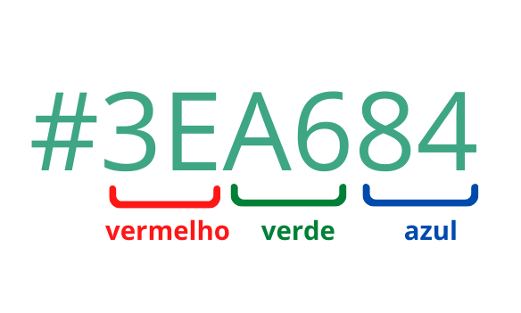

# Cascading Style Sheets

Cascading Style Sheets (**CSS**) é uma linguagem de estilos, que ao ser incorporada ao HTML permite alterar a aparência
gráfica dos componentes da página. Atualmente o CSS está na versão 3, porém foi apresentada em 1994.

Podemos classificar os recursos da linguagem em diferentes módulos, cada qual com finalidade específica.

- Selectors
- Box Model
- Backgrounds
- Image Values and Replaced Content
- Text Effects
- 2D Transformations
- 3D Transformations
- Animations
- Multiple Column Layout
- User Interface

```html
<div style="position:relative;height:220px;margin-top:50px;">
  <div style="opacity:0.5;position:absolute;left:50px;top:-30px;width:300px;height:150px;background-color:#40B3DF"></div>
  <div class="w3-theme" style="opacity:0.3;position:absolute;left:120px;top:20px;width:100px;height:170px;"></div>
  <div style="margin-top:30px;width:360px;height:130px;padding:20px;border-radius:10px;border:10px solid #EE872A;font-size:120%;">
 <h1>CSS = Styles and Colors</h1>
 <div style="letter-spacing:12px;font-size:15px;position:relative;left:25px;top:10px;">Manipulate Text</div>
 <div style="color:#40B3DF;letter-spacing:12px;font-size:15px;position:relative;left:25px;top:20px;">Colors,
 <span style="background-color:#B4009E;color:#ffffff;">&nbsp;Boxes</span></div>
 </div>
</div>
```


<figure markdown="span">
    <div style="position:relative;height:220px;margin-top:50px;">
    <div style="opacity:0.5;position:absolute;left:50px;top:-30px;width:300px;height:150px;background-color:#40B3DF"></div>
    <div class="w3-theme" style="opacity:0.3;position:absolute;left:120px;top:20px;width:100px;height:170px;"></div>
    <div style="margin-top:30px;width:360px;height:130px;padding:20px;border-radius:10px;border:10px solid #EE872A;font-size:120%;">
        <h1>CSS = Styles and Colors</h1>
        <div style="letter-spacing:12px;font-size:15px;position:relative;left:25px;top:10px;">Manipulate Text</div>
        <div style="color:#40B3DF;letter-spacing:12px;font-size:15px;position:relative;left:25px;top:20px;">Colors,
        <span style="background-color:#B4009E;color:#ffffff;">&nbsp;Boxes</span>
        </div>
    </div>
    </div>
    <br/><br/>
</figure>

## Sintaxe

A linguagem CSS3 fornece, basicamente, um vasto conjunto de propriedades de estilo, funções e outras construções que
podemos utilizar para modificar algum aspecto da aparência dos elementos HTML5.

Uma propriedade de estilo é definida por um nome e um valor. Por exemplo, se desejamos justificar determinado texto,
podemos escrever o seguinte trecho de código:

<pre class="pre">
  seletor
  <span style="color:rgb(0, 76, 178)">┌─┴─┐</span>
    p {
        text-align: justify;
        <span style="color:rgb(178, 111, 0)">└────┬────┘</span> <span style="color:rgb(0, 76, 178)">└──┬──┘</span>
        <span style="color:rgb(178, 111, 0)">propriedade</span>  <span style="color:rgb(0, 76, 178)">valor</span>
    }
</pre>

A propriedade chama-se text-align e seu valor foi configurado para justify, o qual indica que o texto deve ser
justificado. Ao final, é necessário colocar `;`. Um mesmo elemento pode receber diversas configurações de estilo
através do uso de diferentes propriedades.

O seletor indica em qual ou quais elementos esse estilo deve ser aplicado.

## Incorporar

A incorporação de código CSS3 a documentos HTML5 pode ser realizada de três formas distintas:
- arquivo externo
- elemento`<style>`
- atributo style (inline)

### Inline

Estilos inline são aqueles que acompanham o elemento, sendo definidos no atributo style. Devem ser utilizados com
cautela, pois são difíceis de alterar quando aparecem em grande quantidade no documento. É o caso do elemento `h1`
do documento apresentado na sequência. Perceba que o estilo se aplica somente ao elemento.

```html {all|4|all}
<!DOCTYPE html>
<html>
    <body>
        <h1 style="color:blue;text-align:center;">Titulo</h1>
    </body>
</html>
```

### Elemento Style

Quando utilizamos o elemento `<style>` temos maior flexibilidade na aplicação dos estilos, diferentemente do modo
inline, podemos aplicar o mesmo estilo a vários elementos do documento por meio de regras. O elemento `<style>` deve
ser adicionado dentro de `<head>` e todas as regras de estilo devem ser escritas como conteúdo do elemento.

```html
<!DOCTYPE html>
<html>
  <head>
    <title>Minha primeira página Web</title>
    <style>
      body {
        background-color: rgb(159, 169, 170);
      }
      h1, h2, h3, h4, h5, h6 {
        color: black;
        text-transform: uppercase;
      }
    </style>
  </head>
</html>
```

### Arquivo Externo

A terceira forma, em que utilizamos a vinculação de um arquivo com regras de estilo ao documento é a mais utilizada.
Isso porque, quando pensamos em um site, devemos considerar a existência de muitos documentos e, todos eles
compartilhamento da mesma apresentação. Logo, ao deixarmos as regras de estilo em um único local, podemos facilmente
compartilhá-las em todos os documentos sem a necessidade de repetir código.

Para realizar a vinculação de um arquivo CSS ao documento devemos utilizar a tag `<link>`, que também deve estar
na `<head>`.

```html {all|6|all}
<!DOCTYPE html>
<html>
  <head>
    <meta charset="utf8" />
    <title>Minha primeira página Web</title>
    <link href="estilos.css" rel="stylesheet"/>
  </head>
</html>
```

### Ordem de Relevância

!!! warning "prioridade"
    Em caso de mais de uma forma ser utilizada simultaneamente, a prioridade fica com as propriedades inline, seguidas
    daquelas definidas para o documento na tag `<style>` e, por último, as regras oriundas dos arquivos incorporados via
    `<link>`.

    1. Estilos definidos `inline`
    2. Estilos definidos na página `<style>`
    3. Estilos definidos em arquivos externos `<link>`

## Seletores

Seletores são parte de uma regra de estilo. Sua função é orientar o navegador, por meio de um padrão de pesquisa,
a encontrar os elementos que devem receber o estilo no documento

```css
p {
    text-align: center;
    color: yellow;
    font-family: "Arial", cursive;
    font-size: 40px;
}
```

A regra acima tem como seletor `p`, indicando que todos os elementos do tipo parágrafo do documento devem receber
as propriedades de estilo definidas. Cada par de `propriedade:valor` corresponde a uma declaração. Perceba que toda
declaração finaliza com um `;` e que as declarações ficam envolvidas entre chaves `{}`.

### Universal
Todo elemento da página irá receber o estilo. Utilizamos * como seletor.

```css
* {
    margin: 0px;
}
```

### Elemento
Especificamos o nome dos elementos HTML que devem receber o estilo no seletor.

```css
p {
    color: black;
}
```

### Id

Todo elemento HTML possui um atributo chamado `id`. Este atributo é utilizado para identificar de forma única um elemento
no documento. Isso significa que dois elementos não podem compartilhar o mesmo valor em `id`. No CSS, podemos especificar
um seletor para valores de `id` utilizando o caractere `#` acompanhado do valor de `id` correspondente.

```css
#cabecalho {
    background-color: black;
}
```

### Classe

Outro atributo global de elementos do HTML5 chama-se `class`. Diferentemente de `id`, diferentes elementos podem
compartilhar do mesmo valor em class e, além disso, vários valores são aceitos, deixando-se um espaço entre eles.
Seletores baseados em classe são amplamente utilizados. Sua construção requer o uso do caractere ponto `.` acompanhado
do nome da classe.

Podemos deixar o seletor mais específico, associando com um seletor de elemento, como em `p.teste`. A interpretação,
neste caso, é todo parágrafo que contém a classe teste.

```css
.artigo {
    text-align: justify;
}
p.teste {
    color:red
}
```

### Descendentes

Utilizamos este tipo de seletor para aplicar estilos a elementos com base em seus elementos "pai". Podemos selecionar,
por exemplo, todos os parágrafos (`<p>`) que são descendentes de artigos (`<article>`), desconsiderando os demais.

```css
article p {
    font-family: 'Roboto', sans-serif;
}
```

Observe que este seletor considera descendentes diretos e indiretos. Para ser mais restritivo e considerar somente
elementos que são "filhos" diretos, devemos utilizar o símbolo `>`, conforme o exemplo a seguir:

```css
article > p {
    font-family: 'Roboto', sans-serif;
}
```

### Elementos irmãos

São seletores que consideram elementos de mesmo nível ("irmãos", pois são filhos do mesmo "pai"). Para aplicar um
estilo específico para o primeiro parágrafo (`<p>`) que segue um título de segundo nível (`<h2>`),
poderíamos utilizar o operador `+` que indica adjacência:

```css
h2 + p {
    font-family: 'Roboto', sans-serif;
}
```

<br>

Se a adjacência não for necessária, apenas a idéia de ser "irmão", utilizamos o operador `~`:

```css
h2 ~ p {
    font-family: 'Roboto', sans-serif;
}
```

### Atributos

São seletores utilizados para selecionar elementos que contenham um atributo específico sua definição.

```css
a[href] {
    font-family: 'Roboto', sans-serif;
}

input[type="text"] {
    background-color: yellow;
}

a[target="_blank"] {
    background-color: yellow;
}
```

| Seletor              | Exemplo                | Descrição                                                                                                                         |
| -------------------- | ---------------------- | --------------------------------------------------------------------------------------------------------------------------------- |
| `[attribute]`        | `[target]`             | Seleciona todos os elementos com um atributo de destino                                                                           |
| `[attribute=value]`  | `[target="_blank"]`    | Seleciona todos os elementos com destino="_blank"                                                                                 |
| `[attribute~=value]` | `[title~="flower"]`    | Seleciona todos os elementos com um atributo title que contém uma lista de palavras separadas por espaços, uma das quais é "flor" |
| `[attribute^=value]` | `a[href^="https"]`     | Seleciona todos os elementos `<a>` com um valor de atributo href começando com "https"                                            |
| `[attribute$=value]` | `a[href$=".pdf"]`      | Seleciona todos os elementos `<a>` com um valor de atributo href terminando com ".pdf"                                            |
| `[attribute*=value]` | `a[href*="w3schools"]` | Seleciona todos os elementos `<a>` com um valor de atributo href contendo a substring "w3schools"                                 |


### Pseudo-Elementos

São seletores que permitem estilizar partes de um elemento e não sua integralidade. Por exemplo, podemos
estilizar somente a primeira linha de um parágrafo através da regra a seguir.
```css
p::first-line {
    font-family: 'Roboto', sans-serif;
}
```

Observe que, para todo e qualquer pseudo-elemento, devemos utilizar a sintaxe a seguir (usar ::):
```css
selector::pseudo-element {
    property: value;
}
```

Para primeira linha:

```css
p::first-line {
    color: #ff0000;
    font-variant: small-caps;
}
```

Para primeira letra

```css
p::first-letter {
    color: #ff0000;
    font-size: xx-large;
}
```


| Seletor          | Exemplo           | Descrição                                                         |
| ---------------- | ----------------- | ----------------------------------------------------------------- |
| `::after`        | `p::after`        | Insira algo após o conteúdo de cada elemento `<p>`                |
| `::before`       | `p::before`       | Insira algo antes do conteúdo de cada elemento `<p>`              |
| `::first-letter` | `p::first-letter` | Seleciona a primeira letra de cada elemento `<p>`                 |
| `::first-line`   | `p::first-line`   | Seleciona a primeira linha de cada elemento `<p>`                 |
| `::marker`       | `::marker`        | Seleciona os marcadores dos itens da lista                        |
| `::selection`    | `p::selection`    | Seleciona a parte de um elemento que é selecionado por um usuário |


### Pseudo-Classes

Pseudo-classes são utilizadas para selecionar elementos com base em algum estado específico

Observe que, para toda e qualquer pseudo-classe, devemos utilizar a sintaxe a seguir (usar `:`)

```css
selector:pseudo-class {
    property: value;
}
```

O seletor abaixo modifica a cor de todos os links visitados:

```css
a:visited {
    color: forestgreen;
    text-decoration-color: hotpink;
}
```

| Seletor     | Exemplo          | Descrição                                        |
| ----------- | ---------------- | ------------------------------------------------ |
| `:active`   | `a:active`       | Selects the active link                          |
| `:disabled` | `input:disabled` | Selects every disabled `<input>` element         |
| `:empty`    | `p:empty`        | Selects every `<p>` element that has no children |
| `:enabled`  | `input:enabled`  | Selects every enabled `<input>` element          |
| `:hover`    | `a:hover`        | Selects links on mouse over                      |
| `:link`     | `a:link`         | Selects all unvisited links                      |

### Seletor por negação

Seleciona todos os elementos que não atendem a condição especificada.

```css
div:not(.oculto) {
    background-color:red;
}
```

### Prioridade por ordem

!!! warning "prioridade"
    O estilo definido com `id` possuí prioridade, seguido pela `classe` e por último por elemento.

    1. Estilo definido com `id` = `#page { background-color: grey; }`
    2. Estilo definido com `class` `.page { background-color: blue; }`
    3. Estilo definido com `elemento` `body { background-color: red; }`

## Unidades de medida absolutas

As medidas absolutas, como pixels (`px`), polegadas (`in`), centímetros (`cm`), etc., são especificadas com um valor
fixo que não é afetado pelo ambiente ou contexto da página. Elas fornecem uma precisão absoluta e são consistentes
independentemente do dispositivo ou configuração de exibição.

Isso significa que medidas absolutas resultam em elementos com tamanhos fixos e invariáveis, independentemente do
tamanho da tela ou do navegador em que estão sendo exibidos. De modo geral, tal característica impõe problemas de
adaptação em dispositivos com tamanhos de tela variados, especialmente em dispositivos móveis ou em layouts
responsivos.

No CSS3 temos a disposição diversas medidas absolutas, contudo a que utilizamos com maior frequência é o
pixel (`px`).

```css
font-size: 16px;
width: 300px;
```

## Unidades de medida relativas

Diferentemente das absolutas, as medidas relativas, como `%` (porcentagem), `em` (relativo ao elemento pai),
`rem` (relativo ao elemento raiz), `vw` (viewport width), vh (viewport height), etc...
são dimensionadas com base em algum aspecto do ambiente de layout, como o tamanho da fonte, largura da tela ou
tamanho do elemento pai.

São muito utilizadas, pois elas se ajustam dinamicamente conforme o contexto, proporcionando uma melhor adaptação a
diferentes dispositivos e ambientes de visualização. São fundamentais para criar layouts responsivos, onde os elementos
se ajustam de acordo com o tamanho da tela, garantindo uma experiência consistente em dispositivos variados.

Deste modo, ao usar medidas relativas, é possível manter proporções consistentes entre elementos em diferentes partes
do layout, pois eles são dimensionados proporcionalmente em relação ao ambiente de exibição.

**Porcentagem (%)**

Unidade relativa as proporções do elemento pai.

```css
width: 50%;
```

**Em (em)**

Unidade relativa ao tamanho da fonte do elemento pai.

```css
font-size: 1.2em;
```

**Rem (rem)**

REM define o tamanho relativo à fonte do elemento raiz (normalmente o elemento `<html>`).
```css
margin-left: 2rem;
```

**Viewport Width (vw) e Viewport Height (vh)**

Referem-se à largura e altura da janela de visualização do navegador, respectivamente.

```css
width: 50vw;
height: 80vh;
```

**Viewport Minimum (vmin) e Viewport Maximum (vmax)**

Referem-se à menor ou maior dimensão da janela de visualização do navegador (largura ou altura), respectivamente.

```css
width: 50vmin;
height: 80vmax;
```

## Cores

Cores são um dos recursos mais importantes da linguagem CSS. Várias propriedades de estilo as utilizam, como àquelas
que modificam bordas, preenchimento de fundo, texto e sombras, por exemplo.

Temos a disposição grande variedade de cores (mais de 16 milhões) e podemos especificá-las de várias formas.
A mais simples é através do nome da cor, se a mesma constar no rol de cores suportadas pelo navegador e/ou
predefinidas na especificação do CSS3. Embora simples, esta não costuma ser a forma mais adequada para definir
valor de cor.

As outras opções que temos são código hexadecimal e as funções rgb, rgba, hsl e hlsa. Dentre todos, o código
hexadecimal é a opção mais comum, correspondendo a um conjunto de 6 caracteres iniciado com o símbolo #. Estes
caracteres representam a quantidade de vermelho, verde e azul que irá compor a cor final.

Cada canal de cor pode receber valores entre `00` (sem cor) a `ff` (cor cheia). Logo, o código `#000000` é branco,
enquanto que `#ffffff` indica a cor preta. Já para as funções rgb e rgba, a quantidade de cor de cada canal é definida
no intervalo 0 e 255, no caso da rgba, um último valor entre 0.0 e 1.0 indicando a transparência aplicada.




```css
body {
     background-color: #000010;
}
.artigo {
    background-color: rgb(200,240,255);
}
.secao {
    background-color: rgba(100,55,36,0.5);
}
```

O outro modelo de cores suportado chama-se HSL (Hue-Saturation-Lightness), especificado por meio das funções `hsl` e
`hlsa`. Novamente a função terminada com a permite especificar o canal alpha para transparência.

```css
.artigo {
    background-color: hsl(167,15,35);
}
```

| Cor                                           | Nome   | Hex Code | RGB Code           | Cor                                           | Nome    | Hex Code | RGB Code         |
| --------------------------------------------- | ------ | -------- | ------------------ | --------------------------------------------- | ------- | -------- | ---------------- |
| <div style="width: 20px; height: 20px; border-radius:10px; background-color:#FFFFFF;"></div> | White  | #FFFFFF  | rgb(255, 255, 255) | <div style="width: 20px; height: 20px; border-radius:10px; background-color:#00FF00;"></div> | Lime    | #00FF00  | rgb(0, 255, 0)   |
| <div style="width: 20px; height: 20px; border-radius:10px; background-color:#C0C0C0;"></div> | Silver | #C0C0C0  | rgb(192, 192, 192) | <div style="width: 20px; height: 20px; border-radius:10px; background-color:#008000;"></div> | Green   | #008000  | rgb(0, 128, 0)   |
| <div style="width: 20px; height: 20px; border-radius:10px; background-color:#808080;"></div> | Gray   | #808080  | rgb(128, 128, 128) | <div style="width: 20px; height: 20px; border-radius:10px; background-color:#00FFFF;"></div> | Aqua    | #00FFFF  | rgb(0, 255, 255) |
| <div style="width: 20px; height: 20px; border-radius:10px; background-color:#000000;"></div> | Black  | #000000  | rgb(0, 0, 0)       | <div style="width: 20px; height: 20px; border-radius:10px; background-color:#008080;"></div> | Teal    | #008080  | rgb(0, 128, 128) |
| <div style="width: 20px; height: 20px; border-radius:10px; background-color:#FF0000;"></div> | Red    | #FF0000  | rgb(255, 0, 0)     | <div style="width: 20px; height: 20px; border-radius:10px; background-color:#0000FF;"></div> | Blue    | #0000FF  | rgb(0, 0, 255)   |
| <div style="width: 20px; height: 20px; border-radius:10px; background-color:#800000;"></div> | Maroon | #800000  | rgb(128, 0, 0)     | <div style="width: 20px; height: 20px; border-radius:10px; background-color:#000080;"></div> | Navy    | #000080  | rgb(0, 0, 128)   |
| <div style="width: 20px; height: 20px; border-radius:10px; background-color:#FFFF00;"></div> | Yellow | #FFFF00  | rgb(255, 255, 0)   | <div style="width: 20px; height: 20px; border-radius:10px; background-color:#FF00FF;"></div> | Fuchsia | #FF00FF  | rgb(255, 0, 255) |
| <div style="width: 20px; height: 20px; border-radius:10px; background-color:#808000;"></div> | Olive  | #808000  | rgb(128, 128, 0)   | <div style="width: 20px; height: 20px; border-radius:10px; background-color:#800080;"></div> | Purple  | #800080  | rgb(128, 0, 128) |

## Fontes

A escolha de uma fonte é crucial para o sucesso de uma interface web, visto que está diretamente ligada à
experiência de leitura do usuário.

As propriedades de estilo que o CSS3 nos fornece para manipularmos fontes são `font-family`, `font-style`, `font-weight`,
`font-size`, e `font-variant`, `background-color` e `color`.

Uma curiosidade é que fontes `sans-serif` são recomendadas para uso em telas.

<figure markdown="span">
  
  <!-- <figcaption>Image caption</figcaption> -->
</figure>


### Font Family

Especifica a família de fontes que o navegador deve utilizar para renderizar o texto. A propriedade aceita vários
valores separados por vírgula, indicando opções de fontes quando não for possível utilizar a anterior. Normalmente
finalizamos especificando uma das cinco famílias genérias de fonte disponíveis: `serif`, `sans-serif`, `monospace`,
`coursive` e `fantasy`.

A família genérica deve ser utilizada para contornar a possibilidade do usuário não ter disponível em seu navegador
as outras famílias listadas. Logo, nestes casos, o navegador conseguirá preservar o padrão tipográfico com outra
fonte semelhante disponível.

No CSS existem cinco `font-family`, que o navegador pode utilizar para renderizar o texto.

- Serif fontes têm um pequeno traço nas bordas de cada letra. Eles criam uma sensação de formalidade e elegância.
- Sans serif fontes têm linhas limpas (sem pequenos traços anexados). Eles criam um visual moderno e minimalista.
- Monospace fontes aqui todas as letras têm a mesma largura fixa. Eles criam uma aparência mecânica.
- Cursive fontes imitam a caligrafia humana.
- Fantasy fontes são fontes decorativas e divertidas.

| Serif      | <span style="font-family:'Times New Roman',serif">Times New Roman</span><br><span style="font-family:Georgia,serif">Georgia</span><br><span style="font-family:Garamond,serif">Garamond</span>                 |
| ---------- | -------------------------------------------------------------------------------------------------------------------------------------------------------------------------------------------------------------- |
| Sans-serif | <span style="font-family:Arial,sans-serif">Arial</span><br><span style="font-family:Verdana,sans-serif">Verdana</span><br><span style="font-family:Helvetica,sans-serif">Helvetica</span>                      |
| Monospace  | <span style="font-family:'Courier New',monospace">Courier New</span><br><span style="font-family:'Lucida Console',monospace">Lucida Console</span><br><span style="font-family:Monaco,monospace">Monaco</span> |
| Cursive    | <span style="font-family:'Brush Script MT',cursive">Brush Script MT</span><br><span style="font-family:'Lucida Handwriting',cursive">Lucida Handwriting</span>                                                 |
| Fantasy    | <span style="font-family:Copperplate,fantasy">Copperplate</span><br><span style="font-family:Papyrus,fantasy">Papyrus</span>                                                                                   |

### Font Style

- normal - Texto normal
- italic - <span style="font-style: italic;">Texto itálico</span>
- oblique - <span style="font-style: italic;">Texto levemente inclinado</span>

```css
p.italic {
  font-style: italic;
}
```

### Font Weight

Define o peso (intensidade de negrito) da fonte. Os valores podem ser `normal`, `bold`, `bolder`, `lighter`, `100,
200, 300, 400, 500, 600, 700, 800, 900` e `inherit`. Os valores numéricos indicam uma graduação de negrito.
O valor 400 equivale a normal enquanto o valor 700 é equivalente a bold.

Os valores bolder e lighter aplicam-se em relação ao peso herdado do ancestral, enquanto normal e bold aplicam-se
em absoluto ao texto.

- normal - Texto normal
- bold - <span style="font-weight: bold;">Texto bold</span>
- bolder - <span style="font-weight: bolder;">Texto bolder</span>
- lighter - <span style="font-weight: lighter;">Texto lighter</span>

```css
p.thick {
  font-weight: bold;
}
```

### Font Variant

Indica se o texto deve ser exibido ou não considerando apenas caracteres maiúsculos, utilizando a propriedade
`small-caps`

```css
p.small {
  font-variant: small-caps;
}
```

<span style="font-variant: normal;">Texto escrito normalmente</span><br>
<span style="font-variant: small-caps;">Texto em small caps</span>


### Font Size

Permite especificar o tamanho da fonte, a partir de medidas relativas, como percentual, em, rem, etc ou medidas
absolutas como pixels.

```css
h1 {
    font-size: 16px;
    font-size: 2rem;
    font-size: 2em;
}
```

<span style="font-size: 16px">16px</span><br><br>
<span style="font-size: 2rem">2rem</span><br><br>
<span style="font-size: 2em">2em</span><br>


### Letter Spacing

```css
p {
    letter-spacing: 0.4cm;
}
```

<p style="letter-spacing: 0.4cm;">Espaçamento entre letras</p>

<br>

### Word Spacing

```css
p {
    word-spacing: 80px;
}
```

<p style="word-spacing: 80px;">Espaçamento entre palavras</p>

### Text Align

Alinhamento do texto pode ser `left`, `right`, `center`, `justify`.

```css
p {
    text-align: center;
}
```

<p style="text-align: left;">Alinhamento <code>left</code></p>
<p style="text-align: center;">Alinhamento <code>center</code></p>
<p style="text-align: right;">Alinhamento <code>right</code></p>
<p style="text-align: justify;">Alinhamento <code>justify</code>
bla bla bla bla bla bla bla bla bla bla bla bla bla bla bla bla
bla bla bla bla bla bla bla bla bla bla bla bla bla bla bla bla
</p>


### Text Decoration

Opções `none`, `underline`, `overline`, `line-through`, `blink`, `underline dotted`, `underline overline #FF3028`,
`green wavy underline`...

```css
p {
    text-decoration: underline;
}
```

<p style="text-decoration: none;">Texto underline</p>
<p style="text-decoration: underline;">Texto underline</p>
<p style="text-decoration: line-through;">Texto line-through</p>
<p style="text-decoration: overline;">Texto overline</p>
<p style="text-decoration: underline dotted;">Underline dotted</p>
<p style="text-decoration: green wavy underline;">Underline wavy green</p>


### Text Transform

Opções `none`, `capitalize`, `uppercase`, `lowercase`

<p style="text-transform: capitalize;">Texto Texto Texto</p>
<p style="text-transform: uppercase;">Texto Texto Texto</p>
<p style="text-transform: lowercase;">Texto Texto Texto</p>

### Google Fonts

Se não quiser usar nenhuma das fontes padrão em HTML, você pode usar o Google Fonts. Eles são de uso gratuito e
têm mais de 1000 fontes para você escolher.

```html
<link rel="stylesheet" href="
https://fonts.googleapis.com/css?family=Sofia
">
<style>
body {
  font-family: "Sofia", sans-serif;
}
</style>
```

### OTF, TTF, WOFF2

Existem três formatos principais de arquivos de fonte que aparecem quando você baixa uma tipografia para usar em uma página HTML, são eles TTF, OTF e WOFF/WOFF2. Eles representam basicamente a evolução histórica das fontes digitais até chegar ao padrão otimizado para a internet.

#### TTF

O formato TTF, chamado TrueType Font, é o mais antigo dos três e surgiu nos sistemas da Apple e depois foi adotado pela Microsoft. Ele foi pensado originalmente para computadores pessoais e impressão.

Por isso costuma gerar arquivos relativamente grandes. Os navegadores conseguem utilizá-lo sem problemas, o que faz dele uma solução prática para testes locais ou para projetos simples, porém não é adequado para produção na internet porque aumenta o tempo de carregamento da página.

Em CSS ele é declarado informando o tipo “truetype”, apontando para o arquivo .ttf que você colocou dentro do projeto.

#### OTF

O formato OTF, OpenType Font, apareceu depois como uma evolução do TTF criada pela Adobe em parceria com a Microsoft.

A principal diferença não é visual imediata, mas tipográfica: ele permite recursos avançados, como ligaturas automáticas, variações estilísticas e melhor controle de desenho das letras. Por isso designers costumam preferir OTF para material gráfico e layouts mais refinados. Apesar dessa qualidade superior, o arquivo continua pesado para a web, praticamente do mesmo tamanho de um TTF. Ou seja, funciona em HTML, mas também não é indicado quando a preocupação é desempenho.

#### WOFF e WOFF2

O formato WOFF e sua versão mais recente WOFF2 foram criados especificamente para a internet. Na prática, eles são um TTF ou OTF compactado para transmissão pela rede. O navegador descompacta automaticamente e renderiza a tipografia sem perda de qualidade.

O WOFF2 possui compressão ainda melhor que o WOFF tradicional, resultando em arquivos muito menores e carregamento mais rápido, tornando-se o padrão atual da web. Por isso sites profissionais normalmente usam primeiro o WOFF2 e mantêm WOFF ou TTF apenas como compatibilidade para navegadores antigos.

### Exemplo

Faça download do arquivo e salve em uma pasta do projeto. Crie a pasta `fonts` por exemplo.

Em algum lugar do css declare a fonte com `@font-face`, se ela for do tipo ttf utilize o format("truetype") se for do tipo otf utilize format("opentype"), já woff e woff2 tem o formato da extensão do arquivo.

=== "ttf"

    ```css
    @font-face {
        font-family: "MinhaFonte";
        src: url("../fonts/MinhaFonte.ttf") format("truetype");
        font-weight: normal;
        font-style: normal;
    }
    ```
=== "otf"

    ```css
    @font-face {
        font-family: "MinhaFonte";
        src: url("../fonts/MinhaFonte.otf") format("opentype");
        font-weight: normal;
        font-style: normal;
        }
    ```
=== "woff/woff2 Recomendado"

    ```css
    @font-face {
        font-family: "MinhaFonte";
        src: url("../fonts/MinhaFonte.woff2") format("woff2"),
            url("../fonts/MinhaFonte.woff") format("woff"),
            url("../fonts/MinhaFonte.ttf") format("truetype");
    }
    ```
=== "bold"

    ```css
    @font-face {
        font-family: "MinhaFonte";
        src: url("../fonts/MinhaFonte-Bold.ttf") format("truetype");
        font-weight: 700;
        font-style: normal;
    }
    ```


Depois você pode utilizar a fonte

```css
body {
  font-family: "MinhaFonte", Arial, sans-serif;
}
```


| Formato | Tamanho | Qualidade | Web       | Recomendação         |
| ------- | ------- | --------- | --------- | -------------------- |
| TTF     | Grande  | Boa       | Funciona  |   evitar em produção |
| OTF     | Grande  | Excelente | Funciona  |   evitar em produção |
| WOFF    | Médio   | Igual     | Ótimo     |   fallback           |
| WOFF2   | Pequeno | Igual     | Excelente |   use sempre         |


## Tabelas

Uma tabela em HTML serve para apresentar dados organizados em linhas e
colunas. O HTML define apenas a estrutura, o CSS é responsável pela aparência e legibilidade.

### Estrutura básica em HTML

```html
<table>
  <thead>
    <tr>
      <th>Nome</th>
      <th>Curso</th>
      <th>Nota</th>
    </tr>
  </thead>

  <tbody>
    <tr>
      <td>Ana</td>
      <td>Computação</td>
      <td>9.5</td>
    </tr>
    <tr>
      <td>Bruno</td>
      <td>Sistemas</td>
      <td>8.7</td>
    </tr>
  </tbody>
</table>
```

Sem CSS a tabela fica com aparência simples e pouco legível.

### Bordas e espaçamento

Por padrão cada célula possui bordas separadas. A propriedade `border-collapse` une essas bordas.

``` css
table {
  border-collapse: collapse;
}

th, td {
  border: 1px solid #333;
  padding: 8px;
}
```

### Destacando o cabeçalho

Cabeçalhos precisam diferenciar-se do conteúdo.

``` css
th {
  background-color: #2c3e50;
  color: white;
  text-align: left;
}
```

### Linhas alternadas (efeito zebra)

Melhora muito a leitura quando há muitos dados.

``` css
tbody tr:nth-child(even) {
  background-color: #f2f2f2;
}
```

### Efeito ao passar o mouse (hover)

Ajuda o usuário a localizar a linha que está lendo.

``` css
tbody tr:hover {
  background-color: #d6eaf8;
}
```

### Alinhamento de conteúdo

Números costumam ser centralizados ou alinhados à direita.

``` css
td:last-child {
  text-align: center;
  font-weight: bold;
}

table {
  width: 100%;
}
```

### Exemplo completo de tabela estilizada

``` css
table {
  width: 100%;
  border-collapse: collapse;
  font-family: Arial, sans-serif;
}

th, td {
  padding: 10px 12px;
  border-bottom: 1px solid #ddd;
}

th {
  background-color: #34495e;
  color: white;
  text-align: left;
}

tbody tr:nth-child(even) {
  background-color: #f8f9fa;
}

tbody tr:hover {
  background-color: #e8f4ff;
}

td:last-child {
  text-align: center;
  font-weight: bold;
}
```

### Tabelas responsivas

Tabelas são largas e não cabem bem em telas pequenas, uma solução simples é permitir rolagem horizontal.

``` css
.table-container {
  overflow-x: auto;
}
```

``` html
<div class="table-container">
  <table>
    ...
  </table>
</div>
```

```html
<table id="customers">
  <tr>
    <th>Company</th>
    <th>Contact</th>
    <th>Country</th>
  </tr>
  <tr>
    <td>Alfreds Futterkiste</td>
    <td>Maria Anders</td>
    <td>Germany</td>
  </tr>
  <tr>
    <td>Berglunds snabbköp</td>
    <td>Christina Berglund</td>
    <td>Sweden</td>
  </tr>
</table>
```

```css
#customers {
 font-family: Arial, Helvetica, sans-serif;
 border-collapse: collapse;
 width: 100%;
}
#customers td, #customers th {
 border: 1px solid #ddd;
 padding: 8px;
}
#customers tr:nth-child(even){
    background-color: #f2f2f2;}
#customers tr:hover {
    background-color: #ddd;}
#customers th {
 padding-top: 12px;
 padding-bottom: 12px;
 text-align: left;
 background-color: #04AA6D;
 color: white;}
```

## Box model

O modelo de caixa CSS é um conceito fundamental no desenvolvimento web que determina como os elementos HTML são
exibidos e posicionados em uma página web. Essencialmente, ele divide cada elemento em uma caixa retangular
com quatro componentes principais:

- Conteúdo(*content*): Esta é a área central onde reside o conteúdo real do elemento, como texto, imagens ou formulários.
Você pode estilizar o conteúdo com propriedades como cor de fundo ou estilos de fonte.

- Preenchimento(*padding*): Esta é uma área transparente que adiciona espaço ao redor do conteúdo. O preenchimento cria
um buffer entre o conteúdo e a borda.
- Borda(*border*): Esta é a linha externa decorativa que envolve o conteúdo e o preenchimento. Você pode controlar o
estilo da borda (sólida, tracejada, pontilhada), espessura e cor.
- Margem(*margin*): É a área transparente fora da borda que cria um espaçamento entre o elemento e os demais elementos
da página. As margens permitem melhor organização e capacidade de resposta nos layouts.


```css
div {
    width: 320px;
    height: 50px;
    padding: 10px;
    border: 5px solid gray;
    margin: 0;
}
```

O modelo de caixa CSS é essencialmente uma caixa que envolve cada elemento HTML. Consiste em: bordas, preenchimento,
margens e o conteúdo real.

A largura total de um elemento(tew) usamos

$$
tew = \begin{cases}
width \\
+ leftPadding \\
+ rightPadding \\
+ leftBorder \\
+ rightBorder
\end{cases}
$$

```
  320px (width of content area)
+ 20px (left padding + right padding)
+ 10px (left border + right border)
= 350px (total element width)
```

Para calcular a altura total do elemento(tel) usamos

$$
tel = \begin{cases}
height \\
+ topPadding \\
+ bottomPadding \\
+ topBorder \\
+ bottomBorder
\end{cases}
$$

```
  50px (height of content area)
+ 20px (top padding + bottom padding)
+ 10px (top border + bottom border)
= 80px (total height)
```

## Posicionamento

O posicionamento CSS refere-se a como você controla o posicionamento dos elementos em uma página da web,
independentemente do fluxo normal do documento. Por padrão, os elementos aparecem um após o outro na ordem em que
são escritos no código HTML.

### **Estático** - *static*
Este é o posicionamento padrão para todos os elementos. Os elementos são posicionados de acordo com o fluxo normal
do documento, o que significa que aparecem um após o outro na ordem em que são escritos no código HTML.

```css
div.static {
    position: static;
    border: 3px solid #73AD21;
}
```

### **Relativo** - *relative*

Elementos com posicionamento relativo permanecem em sua posição normal no fluxo, mas você pode deslocá-los
usando propriedades como `top`, `right`, `bottom`, e `left`. Estas propriedades movem o elemento em relação à
sua posição original sem afetar o layout de outros elementos.

```css
div.relative {
    position: relative;
    left: 30px;
    border: 3px solid #73AD21;
}
```

### **Absoluto** - *absolute*

Os elementos posicionados de forma absoluta são removidos do fluxo normal do documento e posicionados
em relação ao seu ancestral posicionado mais próximo (geralmente um elemento pai com posicionamento relativo ou
absoluto, ou a janela de visualização se nenhum ancestral estiver posicionado). Sua posição é determinada usando as
propriedades `top`, `right`, `bottom`, e `left` em relação ao bloco que o contém.

```css
div.absolute {
    position: absolute;
    top: 80px;
    right: 0;
    width: 200px;
    height: 100px;
    border: 3px solid #73AD21;
}
```

### **Fixo** - *fixed*

Os elementos posicionados fixos são semelhantes aos elementos posicionados de forma absoluta, mas são
posicionados em relação à janela de visualização e não ao bloco que os contém. Isso significa que eles permanecem
no lugar mesmo quando a página é rolada. O posicionamento fixo é útil para elementos que você deseja que permaneçam
visíveis na tela o tempo todo, como barras de navegação ou menus laterais.

```css
div.fixed {
    position: fixed;
    bottom: 0;
    right: 0;
    width: 300px;
    border: 3px solid #73AD21;
}
```

### **Grudento** - *stick*:

O posicionamento stick combina aspectos de posicionamento relativo e fixo. Os elementos com posicionamento
stick são inicialmente posicionados em relação à sua posição normal no fluxo, mas aderem à borda do bloco que os contém
quando rolados além de um determinado ponto. O posicionamento stick é útil para elementos que você deseja que
permaneçam visíveis até que sejam rolados, como cabeçalhos de coluna em uma tabela.

```css
div.sticky {
    position: -webkit-sticky;
    position: sticky;
    top: 0;
    padding: 5px;
    background-color: #cae8ca;
    border: 2px solid #4CAF50;
}
```

## Display

A propriedade `display` especifica como o comportamento exibição do elemento. Dentre os possíveis comportamentos estão.

| `display`   | Descrição                                                                                                                 |
| ----------- | ------------------------------------------------------------------------------------------------------------------------- |
| `inline`:   | Exibe um elemento como um elemento embutido (como `<span>`). Quaisquer propriedades de altura e largura não terão efeito. |
| `block`:    | Exibe um elemento como um elemento de bloco (como `<p>`). Ele começa em uma nova linha e ocupa toda a largura             |
| `contents`: | Faz o contêiner desaparecer, tornando os elementos filhos filhos do elemento no próximo nível acima no DOM                |
| `flex`:     | Exibe um elemento como um flex container em nível de bloco                                                                |
| `grid`:     | Exibe um elemento como um bloco- contêiner de grade de nível                                                              |
| `none`:     | Remove o elemento completamente do DOM                                                                                    |

## Flexbox

Flexbox, também conhecido como CSS Flexible Box Layout, é um modelo amplamente utilizado para criar layouts
em páginas da web. Oferece uma maneira mais eficiente de organizar e distribuir elementos em um `container`,
especialmente quando se trata de design responsivo e elementos com dimensões desconhecidas ou dinâmicas.

O Flexbox funciona estabelecendo um elemento contêiner utilizando `display: flex` que abriga elementos filhos (flex items).
Esses itens flexíveis são dispostos ao longo de um único eixo (uma linha ou coluna), com propriedades
controlando seu alinhamento, distribuição de espaço e comportamento de redimensionamento.

- Flexibilidade: organize facilmente os elementos horizontal ou verticalmente e ajuste seu tamanho com base no espaço
disponível.
- Capacidade de resposta: os layouts Flexbox se adaptam bem a diferentes tamanhos de tela, tornando suas páginas da
web responsivas.
- Alinhamento: controle preciso sobre como os elementos são alinhados dentro do contêiner, tanto horizontal quanto
verticalmente.
- Espaçamento: Gerencie a distribuição do espaço entre os elementos, permitindo espaços uniformes ou alocação flexível.

Para pensar no flex-box, podemos imaginar que num contêiner os elementos vão ser posicionados
em eixos `cross` e `main`.

<figure markdown="span">
  
  <!-- <figcaption>Image caption</figcaption> -->
</figure>


Um elemento que recebe a propriedade `display: flex;` é chamado de `flex container`. E pode receber várias outras
definições.

Dentre elas temos:

### `flex-direction`

A direção onde os elementos vão ser alinhados é a `row` da esquerda para a direita e de cima
para baixo, mas podemos alterar o comportamento para `column` utilizando a propriedade <br>
`flex-direction: column;`

#### `flex-wrap`

Por padrão, os flex items vão todos tentar se encaixar em uma só linha, usando `flex-wrap`podemos permitir
que os ítens quebrem para uma linha seguinte conforme for necessário.

- `nowrap` (padrão): todos os flex items ficarão em uma só linha
- `wrap`: os flex items vão quebrar em múltiplas linhas, de cima para baixo
- `wrap-reverse`: os flex items vão quebrar em múltiplas linhas de baixo para cima

<div style="display: flex; flex-wrap: wrap; background-color: lightgrey; border-radius: 5px;">
    <div class="flex-box-item" style="background-color: #73AD21;">1</div>
    <div class="flex-box-item" style="background-color: #40B3DF;">2</div>
    <div class="flex-box-item" style="background-color: #EE872A;">3</div>
    <div class="flex-box-item" style="background-color: #73AD21;">4</div>
    <div class="flex-box-item" style="background-color: #40B3DF;">5</div>
    <div class="flex-box-item" style="background-color: #EE872A;">6</div>
    <div class="flex-box-item" style="background-color: #73AD21;">7</div>
    <div class="flex-box-item" style="background-color: #40B3DF;">8</div>
    <div class="flex-box-item" style="background-color: #EE872A;">9</div>
</div>


#### `flex-flow`

A propriedade `flex-flow` é uma propriedade shorthand (uma mesma declaração inclui vários valores relacionados a mais
de uma propriedade) que inclui flex-direction e flex-wrap. E determina quais serão os eixos pricipal e transversal do
container. O valor padrão é `row nowrap`.

```css
.flex-container {
    flex-flow: row nowrap
        | row wrap
        | column nowrap
        | column wrap;
  }
```

### `justify-content`

Podemos alinhar os elementos dentro do container na direção do eixo principal utilizando `justify-content`;

#### `flex-start`

Alinha da esquerda para a direita no main axis.

<div style="display: flex; justify-content: flex-start; background-color: lightgrey; border-radius: 5px;">
    <div class="flex-box-item" style="background-color: #73AD21;">1</div>
    <div class="flex-box-item" style="background-color: #40B3DF;">2</div>
    <div class="flex-box-item" style="background-color: #EE872A;">3</div>
</div>

<br>

#### `flex-end`
Alinha da direita para a esquerda no main axis.

<div style="display: flex; justify-content: flex-end; background-color: lightgrey; border-radius: 5px;">
    <div class="flex-box-item" style="background-color: #73AD21;">1</div>
    <div class="flex-box-item" style="background-color: #40B3DF;">2</div>
    <div class="flex-box-item" style="background-color: #EE872A;">3</div>
</div>


#### `center`

Alinha os elementos no centro do main axis.

<div style="display: flex; justify-content: center; background-color: lightgrey; border-radius: 5px;">
    <div class="flex-box-item" style="background-color: #73AD21;">1</div>
    <div class="flex-box-item" style="background-color: #40B3DF;">2</div>
    <div class="flex-box-item" style="background-color: #EE872A;">3</div>
</div>

<br>

#### `space-between`

Alinha os elementos deixando espaços iguais entre eles main axis.

<div style="display: flex; justify-content: space-between; background-color: lightgrey; border-radius: 5px;">
    <div class="flex-box-item" style="background-color: #73AD21;">1</div>
    <div class="flex-box-item" style="background-color: #40B3DF;">2</div>
    <div class="flex-box-item" style="background-color: #EE872A;">3</div>
</div>


<style>
    .item {
        margin: 5px;
        border-radius: 5px;
        height:50px;
        width: 50px;
    }
</style>

#### `space-around`

Alinha os elementos deixando um espaço tanto antes quando depois do elemento.

<div style="display: flex; justify-content: space-around; background-color: lightgrey; border-radius: 5px;">
    <div class="flex-box-item" style="background-color: #73AD21;">1</div>
    <div class="flex-box-item" style="background-color: #40B3DF;">2</div>
    <div class="flex-box-item" style="background-color: #EE872A;">3</div>
</div>

<br>

#### `space-evenly`

Alinha os elementos deixando um espaço igual entre todos os elementos

<div style="display: flex; justify-content: space-evenly; background-color: lightgrey; border-radius: 5px;">
    <div class="flex-box-item" style="background-color: #73AD21;">1</div>
    <div class="flex-box-item" style="background-color: #40B3DF;">2</div>
    <div class="flex-box-item" style="background-color: #EE872A;">3</div>
</div>


Também existem duas palavras-chave adicionais que você pode usar em conjunto com estes valores: `safe` e `unsafe`.
Safe garante que, independente da forma que você faça esse tipo de posicionamento, não seja possível "empurrar" um
elemento e fazer com que ele seja renderizado para fora da tela (por exemplo, acima do topo), de uma forma que faça
com que o conteúdo seja impossível de movimentar com a rolagem da tela (o CSS chama isso de "perda de dados").


### `align-items`

E também podemos alinhar os elementos dentro do container na direção do `cross-axis` utilizando `align-items`.

#### `flex-start`

<div style="display: flex; height:100px; align-items: flex-start; background-color: lightgrey; border-radius: 5px;">
    <div class="flex-box-item" style="background-color: #73AD21;">1</div>
    <div class="flex-box-item" style="background-color: #40B3DF;">2</div>
    <div class="flex-box-item" style="background-color: #EE872A;">3</div>
</div>

<br>

#### `flex-end`

<div style="display: flex; height:100px; align-items: flex-end; background-color: lightgrey; border-radius: 5px;">
    <div class="flex-box-item" style="background-color: #73AD21;">1</div>
    <div class="flex-box-item" style="background-color: #40B3DF;">2</div>
    <div class="flex-box-item" style="background-color: #EE872A;">3</div>
</div>


### `center`

<div style="display: flex; height:100px; align-items: center; background-color: lightgrey; border-radius: 5px;">
    <div class="flex-box-item" style="background-color: #73AD21;">1</div>
    <div class="flex-box-item" style="background-color: #40B3DF;">2</div>
    <div class="flex-box-item" style="background-color: #EE872A;">3</div>
</div>

<br>

- stretch (padrão): estica os ítens para preencher o container, respeitando o min-width/max-width).
- flex-start/ start / self-start: ítens são posicionados no início do eixo transversal. A diferença entre eles
é sutil e diz respeito às regras de flex-direction ou writing-mode.
- center: ítens são centralizados no eixo transversal.
- baseline: ítens são alinhados de acordo com suas baselines.


### `flex-item`

Propriedades que podem ser adicionadas a um item dentro de um `flex-container`.

#### `flex-grow`

Utilizado para fazer um `flex-item` "crescer" se houver espaço disponível.

<div style="display: flex; background-color: lightgrey; border-radius: 5px;">
    <div class="flex-box-item" style="flex-grow: 1; background-color: #73AD21;">1</div>
    <div class="flex-box-item" style="background-color: #40B3DF;">2</div>
    <div class="flex-box-item" style="background-color: #EE872A;">3</div>
</div>

#### `flex-basis`

Server para sobrescrever o valor de `width` de um elemento.

<div style="display: flex; background-color: lightgrey; border-radius: 5px;">
    <div class="flex-box-item" style="flex-basis: 70px; background-color: #73AD21;">1</div>
    <div class="flex-box-item" style="background-color: #40B3DF;">2</div>
    <div class="flex-box-item" style="background-color: #EE872A;">3</div>
</div>

#### `flex-shrink`

Determina o quanto um elemento vai "encolher" para comportar mais elementos. Se definido como 0, o elemento não vai ser
alterado.

<div style="display: flex; background-color: lightgrey; border-radius: 5px;">
    <div class="flex-box-item" style="flex-shrink: 5; background-color: #73AD21;">1</div>
    <div class="flex-box-item" style="background-color: #40B3DF;">2</div>
    <div class="flex-box-item" style="background-color: #EE872A;">3</div>
    <div class="flex-box-item" style="background-color: #40B3DF;">2</div>
    <div class="flex-box-item" style="background-color: #EE872A;">3</div>
    <div class="flex-box-item" style="background-color: #40B3DF;">2</div>
    <div class="flex-box-item" style="background-color: #EE872A;">3</div>
    <div class="flex-box-item" style="background-color: #40B3DF;">2</div>
</div>
<br>

#### `flex`

Usado para particionar o container e utilizar o espaço entre os elementos.

<div style="display: flex; background-color: lightgrey; border-radius: 5px;">
    <div class="flex-box-item" style="flex: 1; background-color: #73AD21;">1</div>
    <div class="flex-box-item" style="flex: 1; background-color: #40B3DF;">2</div>
    <div class="flex-box-item" style="flex: 1; background-color: #EE872A;">3</div>
</div>
<br>
<div style="display: flex; background-color: lightgrey; border-radius: 5px;">
    <div class="flex-box-item" style="flex: 1; background-color: #73AD21;">1</div>
    <div class="flex-box-item" style="flex: 2; background-color: #40B3DF;">2</div>
    <div class="flex-box-item" style="flex: 1; background-color: #EE872A;">3</div>
</div>


#### `align-self`

Essa propriedade sobrescreve o valor do align-item do `flex-container` apenas para esse `flex-item`.


<div style="display: flex; height: 340px; background-color: lightgrey; border-radius: 5px;">
    <div class="flex-box-item" style="align-self: center; flex: 1; background-color: #73AD21;">1</div>
    <div class="flex-box-item" style="flex: 2; background-color: #40B3DF;">2</div>
    <div class="flex-box-item" style="flex: 1; background-color: #EE872A;">3</div>
</div>

#### `order`

Modifica a ordem onde um elemento vai aparecer, recebendo uma unidade como parâmetro. O valor default para cada
`flex-item` é 0.

<div style="display: flex; background-color: lightgrey; border-radius: 5px;">
    <div class="flex-box-item" style="order: 2; flex: 1; background-color: #73AD21;">1</div>
    <div class="flex-box-item" style="flex: 1; background-color: #40B3DF;">2</div>
    <div class="flex-box-item" style="flex: 1; background-color: #EE872A;">3</div>
</div>

A utilização dessa propriedade não é recomendada, pois altera a ordem de renderização de forma arbitrária


---

https://developer.mozilla.org/en-US/docs/Learn/CSS

https://diegolusa.github.io/web

https://dev.to/r4h33m/cmyk-and-rgb-hsv-and-hsl-introducing-the-chromatic-compendium-1d7

https://htmlcolorcodes.com/

https://www.color-hex.com/

https://developer.mozilla.org/pt-BR/docs/Web/CSS/font-family

https://www.w3schools.com/csSref/default.asp

https://www.tutorialrepublic.com/css-tutorial

https://www.nngroup.com/articles/serif-vs-sans-serif-fonts-hd-screens/#toc-screen-typography-for-online-reading-1

https://developer.mozilla.org/en-US/docs/Learn/CSS/CSS_layout/Flexbox

https://www.w3schools.com/cssref/playdemo.php?filename=playcss_display&preval=inline

https://css-tricks.com/snippets/css/a-guide-to-flexbox/

https://www.w3schools.com/css/css_website_layout.asp

https://www.alura.com.br/artigos/css-guia-do-flexbox