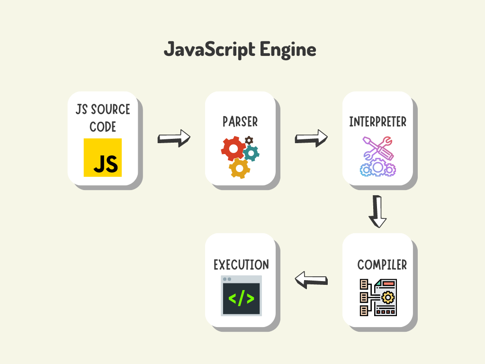
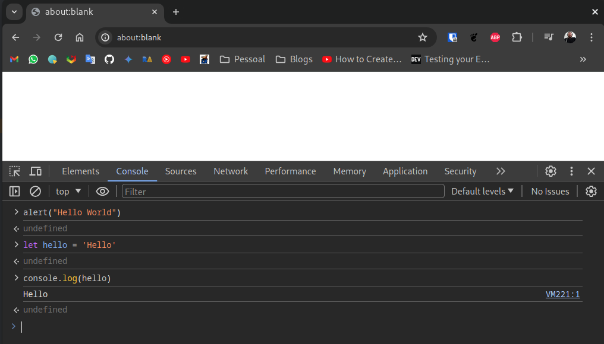
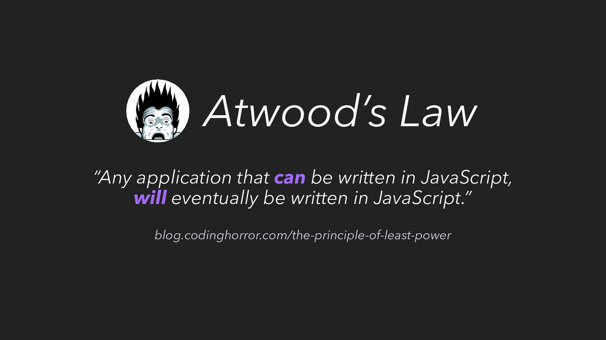
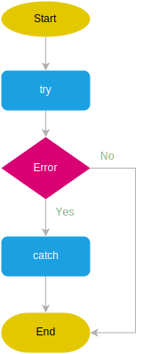

# Javascript

JavaScript é uma linguagem de programação interpretada de alto nível usada para criar páginas e aplicativos.
É uma linguagem do lado do cliente, o que significa que é executada no navegador do usuário
sem a necessidade de interação com o servidor.

- **Dinâmico**: permite atualizações em tempo real e interatividade do usuário.
- **Interpretado**: Executa cada linha de código sequencialmente, facilitando a depuração.
- **Client-side**: é executado no navegador, evitando a necessidade de comunicação direta com o servidor.
- **Orientado a eventos**: responde a ações e eventos do usuário, como cliques, rolagem e entrada do teclado.
- **Orientado a objetos**: utiliza objetos para armazenar dados.
- **multi-plataforma**: suporta todos os principais navegadores da web.
- **Extensível**: Permite adicionar novos recursos e funcionalidades por meio de bibliotecas e frameworks.

<!--
In-browsers’ JavaScript is unable to access the hardware devices and has no control over them.
JavaScript is not capable enough to modify or change the browser’s settings, such as extensions, homepages, and more.
JavaScript is also unable to access the local file system, which also makes it less secure as it is unable
to delete files on the local machine that are private to any user.
-->

O nome verdadeiro não é Javascript e sim ECMAScript, mas é popularmente chamado de Javascript.

Foi criado em 1995 e foi escrito em apenas 10 dias por Brendan Eich baseado em outras linguagens como Java, Perl, Scheme, HyperTalk, Self, and AWK.

Foi criado para interagir de forma rápida com os elementos DOM do HTML.


## Engines

Quando uma página da web é carregada, o código JavaScript é baixado no navegador do usuário. O motor(*engine*)
JavaScript do navegador lê e executa o código linha por linha.

Internamente, várias etapas estão envolvidas durante a execução do código, o básico consiste em receber o javascript
em código de alto nível, converte-o em código de máquina, faz a alocação de memória e executa nosso
programa.

[ECMA](https://ecma-international.org/publications-and-standards/standards/ecma-262/)
Script é um padrão que especifica como o Javascript será executado ou podemos dizer como ele se comportará,
por isso com cada mecanismo o Javascript funciona quase da mesma maneira.

<figure markdown="span">
  {width=50%}
</figure>


- **Parsing**: Se alguma página da web contém o código JavaScript, uma vez carregado, o analisador lê e converte o código
JavaScript em uma estrutura chamada Abstract Syntax Tree (AST), que também é conhecida como sintaxe do código.
- **Compiling**: Depois que o código JavaScript for convertido em AST, ele será compilado em bytecode ou código de máquina,
dependendo da plataforma de destino. Isso é feito porque o bytecode é mais rápido de executar e o código da máquina é a
linguagem nativa que o hardware da máquina entende.
- **Executing**: Depois que o código JavaScript é compilado, ele está pronto para ser executado no navegador.
- **Interagindo com o navegador**: JavaScript realiza diversos eventos no navegador, como manipulação de API, tratamento de
DOM, realização de solicitações HTTP e muito mais. Todas essas interações do JavaScript com o navegador com a ajuda de APIs e interfaces.

<figure markdown="span">
  {width=50%}
</figure>

## Script

Inline script é utilizado para pequenos trechos de javascript deve ser criado dentro da tag `HEAD`.

```html
<!DOCTYPE html>
<html>
  <head>
    <title>Hiperlinks</title>
    <meta charset="utf-8">
    <script>
        alert("Hello World");
    </script>
  </head>
  <body>
    <p>Blog</p>
    <div id="teste"></div>
  </body>
</html>
```

Outra forma é chamar a tag script como último elemento da tag `BODY` de um arquivo externo

```html
<!DOCTYPE html>
<html>
  <head>
    <title>Hiperlinks</title>
    <meta charset="utf-8">
  </head>
  <body>
    <p>Blog</p>
    <div id="teste"></div>
    <script src="js/main.js" />
    <script src="https://www.w3schools.com/js/myScript.js"/>
    </script>
  </body>
</html>
```

Podemos utilizar o javascript para manipular o DOM(*Document Object Model*) da página.

```html
<!DOCTYPE html>
<html>
<body>

<h2>What Can JavaScript Do?</h2>

<p id="demo">JavaScript can change HTML content.</p>

<button type="button"
        onclick='document.getElementById("demo").innerHTML = "Hello JavaScript!"'>
    Click Me!
</button>

</body>
</html>
```



```js
document.getElementById("demo").style.fontSize = "35px";
document.getElementById("demo").style.display = "none";
document.getElementById("meuId");          // Seleciona pelo ID
document.getElementsByClassName("classe"); // Retorna HTMLCollection
document.getElementsByTagName("p");        // Retorna todos os <p>
document.querySelector(".classe");         // Primeiro que combina
document.querySelectorAll("div > p");      // Todos que combinam
```

Sempre que setamos um id em um elementos o javascript automáticamente cria uma variável com esse elemento. Também podemos adicionamos elementos a variáveis, como por exemplo a função getElementsByClassName retorna uma coleção com todos os elementos que implementão a classe `example`

```js
demo = document.getElementById("demo").style.display = "none";
examples = document.getElementsByClassName("example");
```

```js
function myFunction() {
  document.getElementById("demo").innerHTML = "Paragraph changed.";
}

elemento.innerHTML = "Novo <b>conteúdo</b>"; // Aceita HTML
elemento.textContent = "Apenas texto";       // Texto puro
```

## Alterando atributos de elementos

Podemos alterar os atributos de um elemento...

```js
elemento.setAttribute("src", "imagem.png");
elemento.getAttribute("href");
elemento.removeAttribute("disabled");
```

ou seu estilo...

```js
elemento.style.color = "red";
elemento.style.backgroundColor = "yellow";

elemento.classList.add("destaque");
elemento.classList.remove("oculto");
elemento.classList.toggle("ativo");
```


## Document.write

Você pode escrever em um elemento HTML, usando innerHTML. Ao escrever na saída de um elemento HTML usando `document.write()` depois da página ter sido carregada, vai apagar todo o HTML. CUIDADO!

```html
<!DOCTYPE html>
<html>
<body>

<h2>My First Web Page</h2>
<p>My first paragraph.</p>

<p>Never call document.write after
  the document has finished loading.
It will overwrite the whole document.</p>
<button onclick="docwrite()">
  click aqui</button>

<script>
function docwrite() {
    document.write(5 + 6);
}
</script>
</body>
</html>
```

## Curiosidades

Seguem algumas curiosidades sobre o javascript.

### Nome

O nome "JavaScript" pode gerar confusão, mas é importante saber que não tem relação direta com a linguagem Java. Originalmente, foi criado com o nome Mocha, depois mudou de nome para LiveScript, finalmente, foi batizado de JavaScript em 1995, como uma estratégia de marketing da Netscape, para aproveitar a popularidade de Java na época.

### NaN é Estranho

`NaN`, abreviação de "Not a Number" (Não é um Número) é utilizado para representar um valor que não é um número válido. Mas aqui está o problema, `NaN` não é igual a si mesmo!

```js
console.log(NaN === NaN); // false
```

Este comportamento aparentemente sem sentido pode levar a resultados inesperados se você não tomar cuidado.

### Falso-Verdadeiro

As regras de igualdade flexíveis do JavaScript podem levar a alguns resultados inesperados, especialmente ao lidar com valores falsos e verdadeiros. Por exemplo:

```js
console.log(1 == true); // true
console.log(2 == true); // false
console.log(0 == false); // true
console.log("" == false); // true
console.log("" == 0); // true
```

### lei de Atwood

Segundo a lei de [Atwood](https://blog.codinghorror.com/the-principle-of-least-power)

<figure markdown="span">
  
</figure>


> Jeff Atwood - Programador, co-fundador do stack-overflow, soltou essa frase em 2007


## Sobre a linguagem

<div align="center" markdown="1">
| abstract | arguments | await      | boolean  | in       | instanceof | int          | interface |
| -------- | --------- | ---------- | -------- | -------- | ---------- | ------------ | --------- |
| break    | byte      | case       | catch    | let      | long       | native       | new       |
| char     | class     | const      | continue | null     | package    | private      | protected |
| debugger | default   | delete     | do       | public   | return     | short        | static    |
| double   | else      | enum       | eval     | super    | switch     | synchronized | this      |
| export   | extends   | false      | final    | throw    | throws     | transient    | true      |
| finally  | float     | for        | function | try      | typeof     | var          | void      |
| goto     | if        | implements | import   | volatile | while      | with         | yield     |
</div>


<div class="grid" markdown>
  <div align="center" markdown="1">
| Comparador | Descrição                 |
| ---------- | ------------------------- |
| `==`       | Mesmo valor               |
| `===`      | Mesmo valor e tipo        |
| `!=`       | Diferente                 |
| `!==`      | Diferente em valor e tipo |
| `<`        | Menor que                 |
| `>`        | Maior que                 |
| `<=`       | Menor ou igual a          |
| `>=`       | Maior ou igual a          |

  </div>
  <div align="center" markdown="1">
| Operador | Descrição     |
| -------- | ------------- |
| `+`      | Adição        |
| `-`      | Subtração     |
| `*`      | Multiplicação |
| `/`      | Divisão       |
| `**`     | Exponencial   |
| `%`      | Módulo        |
| `++`     | Incrementar   |
| `--`     | Decrementar   |

  </div>
</div>

## Comentários

Podem ser escritos com `//comentário` ou `/* comentário */`.

## Variáveis

Podem ser definidas com `var`, `let` e `const`.

- `var`: define o escopo global, usado em antigas versões
- `let`: define o escopo sendo o bloco onde ela foi criada
- `const`: define uma constante


## Operadores lógicos

Conforme você deve ter observado, o comando if avalia uma expressão lógica, cujos únicos valores possíveis são `true` ou `false`.

- **OR - `||`**:
```js
true || false //true
10 > 5 || 10 > 20 //true
false || false //false
10 > 100 || 10 > 20 //false
```

- **AND - `&&`**:
```javascript
true && true //true
1 > 2 && 2 > 1 //false
true && false //false
4 === 4 && 3 > 1 //true
```

- **NOT** - `!`:

```js
let verdadeiro = true;
let falso = !true;
```

- Ternário
  `let voteable = (age < 18) ? "Too young" : "Old enough";`

## Estruturas condicionais

As estruturas condicionais na programação visam oferecer ao programador maneiras de tomar decisões dentro de um programa, executando diferentes blocos de código com base em condições específicas.

Elas permitem que o fluxo de execução do programa seja alterado de acordo com a avaliação de condições lógicas, cujo valor poder ser verdadeiro ou falso, a depender do estado da execução.

1. if-else

```javascript
let hour = 19

if (hour < 18) {
  greeting = "Good day";
} else {
  greeting = "Good evening";
}

console.log(greeting);
```

2. if-else-if

```javascript
void main() {
  let isWeekend = true;
  let weather = "rainy";

  if (isWeekend) {
    if (weather == "sunny") {
      print("Sol");
    } else if (weather == "rainy"){
      print("Chuva");
    } else {
       print("Nevando");
    }
  }
}
```

3. switch

O getDay() é um método que retorna o dia da semana entre 0 e 6.

```javascript
switch (new Date().getDay()) {
  case 6:
    text = "Hoje é sábado";
    break;
  case 0:
    text = "Hoje é domingo";
    break;
  default:
    text = "Dia de semana";
}
```

## Estruturas de repetição

Laços de repetição são estruturas de controle que permitem criar iterações, ou seja, repetição de uma ou mais intruções.

As estruturas de repetição (ou laços, ou loops) servem para executar um bloco de código várias vezes, sem que você precise repetir o código manualmente.


### for

`for` possui 3 parâmetros, inicialização, condição e pós-execução.

```javascript
for (let i = 0; i < 5; i++) {
  text += "The number is " + i + "<br>";
}
```

### for in array

```javascript
const cars = ["BMW", "Volvo", "Mini"];

let text = "";
for (let x of cars) {
  text += x + "<br>";
}
```

### for in object

```javascript
const person = {name:"John", sn:"Doe"};

let text = "";
for (let x in person) {
  text += person[x];
}
```

### foreach

O método `forEach()` chama uma função (uma função de retorno de chamada) uma vez para cada elemento do array.

```javascript
const numbers = [45, 4, 9, 16, 25];

let txt = "";
numbers.forEach(myFunction);

function myFunction(value, index, array) {
  txt += value;
}
```

### while

`while` é utilizado para executar enquanto uma condição for verdadeira.

```javascript
let i = 0;
while (i < 5) {
  console.log("bla");
  i++;
}
```

### do while

`do while` executa um bloco e depois confere uma condição para repetir o bloco.

```javascript
let x = 0;
do {
  console.log(x)
  x++;
} while (x < 5);
```

## Funções

São uma forma de reaproveitar e também organizar o código.

```js
function multiply(num1, num2) {
  let result = num1 * num2;
  return result;
}
```

```shell
multiply(4, 7);
```

Função anônima

```js
(function (a) {
  return a + 100;
});
```

Arrow function

```js
(a) => a + 100;

const func = (x) => x * x;
/* expression body syntax
implied "return" */

const func2 = (x, y) => {
  return x + y;
};
/* with block body,
 explicit "return" needed */

```

## Typeof

```js
typeof "John"                 // Returns "string"
typeof 3.14                   // Returns "number"
typeof NaN                    // Returns "number"
typeof false                  // Returns "boolean"
typeof [1,2,3,4]              // Returns "object"
typeof {name:'John', age:34}  // Returns "object"
typeof new Date()             // Returns "object"
typeof function () {}         // Returns "function"
typeof myCar                  // Returns "undefined" *
typeof null                   // Returns "object"
```

## Arrays

Arrays são um tipo de objeto e possuem algumas funções.

```js
const number = [1, 2, 3, 4];
const cars = ["Logan", "Duster"];
const mixed = [1, "test", "test"];
const cars = new Array("Logan", "Duster");
let car = cars[0];
cars[0] = "Fusca";
```

- `length`: quantidade de elementos de um array
  `cars.length;`
- `[]`: acessa determinada posição de um array `[0]` é o primeiro elemento
  `cars[0]`
- `cars[cars.length - 1]`: acessa o último elemento

```js
const cars = new Array("Logan", "Duster");
let cars = cars.at(2);
```

- `push`: Adiciona um item ao array
- `pop`: Remove o último elemento do array

```js
cars.push('Oroch');
cars.pop();
```

## HTML DOM

Quando uma página é carregada o browser cria um DOM(**Document Object Model**) que acessamos usando o objeto `document`.

<div align="center" markdown="1">

</div>

O javascript possuí métodos para manipular o DOM do browser. Para isso precisamos encontrar os elementos dentro
do `document`, podemos usar as funções.

- Encontrar elemento usando `id`

  `document.getElementById(id)`
- Encontrar elemento usando `class`

  `document.getElementsByClassName(name)`
- Encontrar elemento usando `tag`

  `document.getElementsByTagName(name)`

### Mudando elementos

- Altera o conteúdo de um elemento
  - `element.innerHTML = new content`
- Altera o valor de um atributo
  - `element.attribute = new value`
- Altera o valor de um estilo
  - `element.style.property = new style`
- setAttribute
  - `element.setAttribute(attribute, value)`

### Adicionar ou Remover

- Cria elemento `hmtl`
  - `document.createElement(element)`
- Remover `html` elemento
  - `document.removeChild(element)`
- Adicionar elemento `html`
  - document.appendChild(element)
- Remover elemento `html`
  - `document.replaceChild(new, old)`

## DOM Events

Usando javascript podemos reagir a eventos como clicar em um elemento ou click do mouse, load de uma página, mouse
por cima de um elemento, alteração de um input field ou envio de um formulário.

```javascript
<h1 onclick="changeText(this)">Click on this text!</h1>
<script>
  function changeText(id) {
  id.innerHTML = "Ooops!";
}
</script>
```

### `onload` e `onunload`

O envento `onload` ocorre quando a página é carregada, e `onunload` é chamado ao sair de uma página.
`<body onload="checkCookies()">`

### `oninput`

Evento disparado quando o usuário insere dados. `<input type="text" id="fname" oninput="upperCase()">`

### `onchange`

Evento que acorre ao modificar o valor de um elemento. `<input type="text" id="fname" onchange="upperCase()">`

### `onmouseover` e `onmouseout`

Evento que ocorre quando o mouse do usuário vai para cima ou saí de um evento.

```javascript
<div onmouseover="mOver(this)" onmouseout="mOut(this)"
style="background-color:#D94A38;width:120px;height:20px;padding:40px;">
Mouse Over Me</div>

<script>
function mOver(obj) {
  obj.innerHTML = "Thank You"
}
function mOut(obj) {
  obj.innerHTML = "Mouse Over Me"
}
</script>
```

### `onmousedown`, `onmouseup` e `onclick`

Os eventos onmousedown, onmouseup e onclick fazem parte de um clique do mouse. Primeiro, quando um botão do mouse é
clicado, o evento onmousedown é acionado, depois, quando o botão do mouse é liberado, o evento onmouseup é acionado e,
finalmente, quando o clique do mouse é concluído, o evento onclick é acionado.

```javascript
<div onmousedown="mDown(this)" onmouseup="mUp(this)"
style="background-color:#D94A38;width:90px;height:20px;padding:40px;">
Click Me</div>
<script>
function mDown(obj) {
  obj.style.backgroundColor = "#1ec5e5";
  obj.innerHTML = "Release Me";
}
function mUp(obj) {
  obj.style.backgroundColor="#D94A38";
  obj.innerHTML="Thank You";
}
</script>
```

```javascript
<h1 onmouseover="style.color='red'" onmouseout="style.color='black'">
Mouse over this text</h1>
```

```javascript
const element = document.getElementById("intro");
const element = document.getElementsByTagName("p");
const x = document.getElementsByClassName("intro");
const x = document.querySelectorAll("p.intro");
```

```javascript
<body onload="mymessage()">
<h1>JavaScript HTML Events</h1>
<h2>The onload Attribute</h2>
```

### event listner

O `event listner` permite adicionar eventos a elementos dentro do javascript em tempo de execução.

```javascript
document.getElementById("myBtn").addEventListener("click", displayDate);

element.addEventListener("click", function(){ alert("Hello World!"); });

element.addEventListener("click", myFunction);

function myFunction() {
  alert ("Hello World!");
}

window.addEventListener("resize", function(){
  document.getElementById("demo").innerHTML = sometext;
});

element.removeEventListener("mousemove", myFunction);
```

### Form Validation

```javascript
function validateForm() {
  let x = document.forms["myForm"]["fname"].value;
  if (x == "") {
    alert("Name must be filled out");
    return false;
  }
}

<form name="myForm" action="/action_page.php" onsubmit="return validateForm()"
      method="post">
  Name: <input type="text" name="fname">
  <input type="submit" value="Submit">
</form>
```

## Try Catch

{align=left}

Em JavaScript, o bloco `try...catch` é um mecanismo para tratar erros que podem ocorrer durante a execução
do seu código. Ele fornece uma maneira de gerenciar situações inesperadas com elegância e evitar que
seu programa trave.

```javascript
try {
  // Código que pode causar erros
  console.log(x); // 'x' não foi definido
} catch (err) {
  // Trabalhamos com o erro
  console.error("Erro", err.message);
}
```

<br/><br/><br/><br/><br/>

## Callbacks

Em JavaScript, um retorno de chamada(`callback`) é uma função passada como argumento para outra função.
Isso permite que a função externa delegue uma tarefa ou ação à função de retorno de chamada, que é
então invocada em um ponto específico da execução da função externa.
Esse padrão é particularmente útil na programação assíncrona, onde uma função
pode precisar aguardar a conclusão de outra operação antes de prosseguir.

```javascript
function logar(some) {
  console.log("Resultado " + some);
}

function calcular(num1, num2, funcaoCallback) {
  let resultado = num1 + num2;
  funcaoCallback(resultado);
}

calcular(1, 2, logar);
```

### Timeout

Aqui, `setTimeout` recebe dois argumentos: a função de retorno de chamada (`sayHiAfter3Seconds`) e o atraso
em milissegundos (3000). Após 3 segundos, o mecanismo JavaScript executará o retorno de chamada,
imprimindo `Olá!` para o console.

```javascript
function sayHiAfter3Seconds() {
  console.log("Hi there!");
}

setTimeout(sayHiAfter3Seconds, 3000);
```

### Interval

A função `setInterval` do javascript determina um callback que vai ser chamado com intervalos definidos, no exemplo
abaixo `myFunction` é passado para `setInterval()` como argumento, 1000 é o número de milissegundos entre intervalos,
então `myFunction()` será chamado a cada segundo.

```javascript
setInterval(myFunction, 1000);

function myFunction() {
  let d = new Date();
  document.getElementById("demo")
          .innerHTML=
          d.getHours() + ":" +
          d.getMinutes() + ":" +
          d.getSeconds();
}
```

## Promises

As `promises` são uma ferramenta poderosa em JavaScript para lidar com operações assíncronas.
Eles fornecem uma maneira mais estruturada e limpa de gerenciar a eventual conclusão (ou falha) de uma operação,
em comparação com funções de retorno de chamada tradicionais.

Uma `promise` é um objeto que representa o resultado eventual de uma operação assíncrona. Existe em um dos três estados:

- **pending**: O estado inicial, indicando que a operação está em andamento.
- **fulfilled**: A operação foi concluída com sucesso e a promessa contém o valor resultante.
- **rejected**: A operação encontrou um erro e a promessa contém o objeto de erro.

A `promise` melhora a legibilidade do código, fornecendo uma maneira mais clara de encadear operações assíncronas e
lidar com cenários de falha e sucesso.

Tratamento de erros: as promessas fornecem um local central para tratar erros por meio do método `.catch()`.
Encadeamento: As promessas podem ser encadeadas usando `.then()` para executar uma sequência de operações
assíncronas, uma após a outra.


As `promises` são criadas usando o construtor `promise`, que usa uma função executora como argumento.

- **resolve**: Função usada para indicar a conclusão passando o valor resultante.
- **reject**: Uma função usada para sinalizar um erro, passando o objeto de erro.

```javascript
const myPromise = new Promise(
  (resolve, reject) => {
  // algo assíncrono aqui
  if (resultado) {
    resolve("Operation successful!");
  } else {
    reject(new Error("Operation failed"));
  }
});
```

Para lidar com o resultado de uma promessa(*promise*), usamos os métodos `.then()`, `.catch()` e `.finally()`.

- `.then(onFulfilled, onRejected)`: Anexa retornos de chamada para a resolução (cumprimento ou rejeição) da promise.
- `.catch(onRejected)`: Anexa um retorno de chamada apenas para a rejeição da promise.
- `.finalmente(onFinally)`: anexa um retorno de chamada invocado quando a promise é cumprida (`fulfilled` ou
`rejected`), independentemente do resultado.

```javascript
myPromise.then((value) => {
    console.log(value); // "Operation succeeded!"
}).catch((error) => {
    console.error(error); // "Operation failed."
}).finally(() => {
    console.log("Operation has been completed.");
});
```

```javascript
let faultyPromise = new Promise((resolve, reject) => {
    throw new Error("Something went wrong!");
});

faultyPromise.catch((error) => {
    console.error(error.message); // "Something went wrong!"
});
```

### `async` e `await`

`async` e `await` são `keywords` utilizadas para trabalhar com métodos assíncronos...

- Funções assíncronas(`async`): as funções declaradas com a palavra-chave async são assíncronas.
Eles retornam implicitamente uma `promise`.
- Palavra-chave (`await`): usada em funções assíncronas para esperar até que uma promessa
seja resolvida (`fulfilled` ou `rejected`). A palavra-chave await só pode ser usada dentro de funções assíncronas.

<br>

```javascript
async function fetchData() {
  await
    fetch('https://jsonplaceholder.typicode.com/todos/1')
      .then(response => response.json())
      .then(json => console.log(json))
}
```

## Fetch API

A API Fetch é uma maneira moderna de buscar recursos (como dados) de servidores usando JavaScript.
Ele fornece uma abordagem mais simplificada e baseada em `promises`.

Enviamos então um `request` onde podemos usar os parâmetros:

- url: o URL para o qual a solicitação é enviada.
- options (opcional): um objeto que contém configurações para a solicitação, como:
  - method: O método HTTP (por exemplo, "GET", "POST", "PUT", "DELETE").
  - headers: Um objeto que representa os cabeçalhos a serem enviados com a solicitação.
  - body: O corpo da solicitação, normalmente usado com métodos como 'POST' ou 'PUT'.
  - mode: O modo da solicitação (por exemplo, 'cors', 'no-cors', 'same-origin').
  - credentials: o modo de credenciais (por exemplo, 'omitir', 'mesma origem', 'incluir').
  Tratamento de respostas

A API Fetch retorna um objeto `response` que inclui informações sobre a resposta, como:

- ok: Um booleano que indica se a solicitação foi bem-sucedida (status no intervalo 200-299).
- status: o código de status HTTP (por exemplo, 200, 404).
- statusText: A mensagem de status correspondente ao código de status ('OK', 'Não encontrado').
- headers: Cabeçalhos associados à resposta.
- body: O corpo da resposta. Os métodos comuns para consumir o corpo são:
  - response.text(): Lê o corpo como uma string de texto.
  - response.json(): analisa o corpo como JSON.

```javascript
fetch('https://api.example.com/data')
  .then(response => response.json())
  .then(data => {
    console.log("Fetched data:", data);
  })
  .catch(error => {
    console.error("Error fetching data:", error);
  });
```

```html
<h1>Posts from JSONPlaceholder</h1>
<ul id="posts-list"></ul>

<script>
    const url = 'https://jsonplaceholder.typicode.com/posts';

    fetch(url)
        .then(response => response.json()) // Convert response to JSON
        .then(data => {
            const postList = document.getElementById('_posts-list');

            data.forEach(post => {
                const listItem = document.createElement('li');
                listItem.textContent = `Title: ${post.title}`;
                postList.appendChild(listItem);
            });
        })
        .catch(error => console.error('Error:', error));
</script>
```

