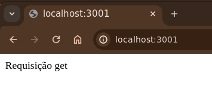
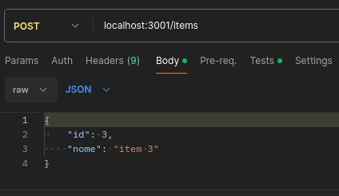
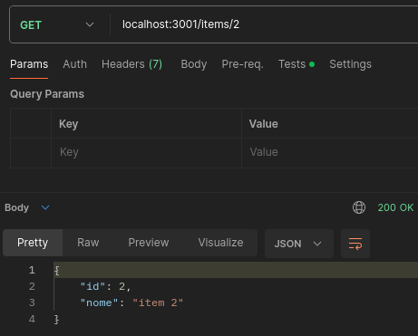
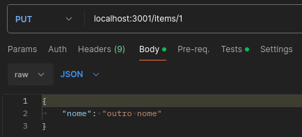
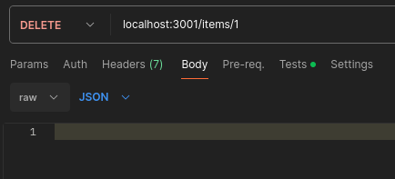

# API com Nodejs

[Node.js](https://nodejs.org/pt-br/about/ ) é um ambiente de tempo de execução JavaScript de código aberto e multi plataforma .
É uma ferramenta popular para quase qualquer tipo de projeto!

O Node.js executa o mecanismo JavaScript V8, o núcleo do Google Chrome, fora do navegador.

Um aplicativo Node.js é executado em um único processo, sem criar um novo thread para cada
solicitação.

O node possibilita criar código para o servidor usando a mesma linguagem(JavaScript) utilizada no lado do cliente.

O nodejs tem utiliza [package managers](https://nodejs.org/en/download/package-manager) para instalação do node. Além
de existir binários para os principais SO's e a opção de compilar o código fonte.

O [NVM](https://github.com/nvm-sh/nvm)(*Node version manager*) é um gerenciador de versões do node, possibilitando
a utilização de diversas versões.

## Hello World!

- Criar pasta para a api node e entra nela
  - mkdir minhaapi
  - cd minhaapi
  - npm init > seguir default
  - indicar nome do entry point > `server.js`

Isso vai criar o `package.json`
  - criar o arquivo `index.js`
  - `console.log("Hello World");`

```json
{
  "name": "minhaapi",
  "version": "1.0.0",
  "description": "projeto TEDII",
  "main": "index.js",
  "scripts": {
    "test": ""
  },
  "author": "",
  "license": "GPL 3.0"
}
```
<br>

Execute o programa com `node server.js`

## NPM

O NPM[(*Node Package Manager*)](https://www.npmjs.com){style="color: grey"} é uma biblioteca para compartilhar código e um gerenciador de
dependências.

```json
{
  "name" : "foo",
  "version" : "1.2.3",
  "description" : "A package",
  "main" : "index.js",
  "keywords" : ["foo", "fool", "foolish"],
  "author" : "John Doe",
  "licence" : "ISC"
}
```

O comando para instalar um package é o `--install` ele vai fazer download do package e suas dependências na pasta
`node_modules`, e adicionar esse package no arquivo `package.json` dentro da propriedade `dependencies`.

O parâmetro `--save-dev` vai salvar o package em `devDependencies` para ser usado apenas no ambiente de desenvolvimento.

O parâmetro `--save-optional` vai salvar o package em `optionalDependencies` não sendo exclusivamente necessária para
a execução.

O parâmetro `--no-save` é auto-explicativo.

## Iniciando o projeto

Vamos instalar 3 dependências para o sistema:

- [Express:](https://expressjs.com/pt-br/){style="color: grey"}
  - `npm install express --save`
- [Nodemon:](https://nodemon.io/){style="color: grey"}
  - `npm install nodemon --save-dev`
- [Cors:](http://expressjs.com/en/resources/middleware/cors.html){style="color: grey"}
  - `npm install cors --save`

Para instalar esse projeto pela primeira vez, ao executar `npm install` o `npm` vai instalar todas as dependências que
estiverem salvas no `package.json`.

```json
{
  "name": "detranupf",
  "version": "1.0.0",
  "description": "projedo TEDII",
  "main": "index.js",
  "scripts": {
    "test": ""
  },
  "author": "",
  "license": "ISC",
  "dependencies": {
    "cors": "^2.8.5",
    "express": "^4.18.2",
    "nodemon": "^3.1.0"
  }
}
```

### CORS

CORS é uma lib que funciona como um middleware, ele nos permite "relaxar" a segurança aplicada a uma API.
Isso é feito contornando os cabeçalhos, que especificam quais podem acessar a API.

- Cross-Origin
- Resource
- SharingAccess-Control-Allow-Origin
- origins

Em outras palavras, o CORS é um recurso de segurança do navegador que restringe solicitações HTTP de origem cruzada
com outros servidores e específica quais domínios acessam seus recursos.

### Nodemon

Nodemon é uma lib open source criada para habilitar *hot reload* no código, entre outras funcionalidades:

- reinicialização automática
- detectar extensão de arquivos monitorados
- monitorar pastas e alterações

```json
"scripts": {
  "test": "echo ... && exit 1",
  "dev":"nodemon index.js"
},
```

<br>

```shell
 leon@leon-dev > npm run dev

> detranupf@1.0.0 dev
> nodemon server.js

[nodemon] 3.1.0
[nodemon] to restart, enter `rs`
[nodemon] watching path(s): *.*
[nodemon] watching: js,mjs,cjs,json
[nodemon] starting `node index.js`
```

### Express

Express é um web framework para node. Vamos editar o `index.js` para utilizar o express.

```js
console.log("Server UP");

const express = require('express');
const app = express();

port = 3001;

app.get('/', (req, res) => {
  res.send('Requisição get')
});

app.listen(port, () => {})
```

Ao acessar `localhost:3001`

<figure markdown="span">
  
</figure>

### ES Modules

Modularizar a aplicação é uma abordagem para tornar o código mais fácil para leitura e
manutenção. Ela consiste em transformar scripts em módulos.

Ele substitui o `require` de arquivos pela sintaxe `import` e `export`.

Primeiro precisamos dizer ao nosso app json que utilizaremos módulos, para isso vamos modificar o `package.json`

```json
{
  "name": "detranupf",
  "version": "1.0.0",
  "description": "projedo TEDII",
  "main": "index.js",
  "type": "module",
  "scripts": {
    "test": ""
  },
  "author": "",
  "license": "ISC",
  "dependencies": {
    "cors": "^2.8.5",
    "express": "^4.18.2",
    "nodemon": "^3.1.0"
  }
}
```

<!--
Ao invés de adicionar `"type": "module"` é possível renomear os arquivos `js` para `mjs` de módulo então o `server.js` vira `server.mjs`.
-->


```js
import express from "express";

const app = express();
console.log("Server UP");

port = 3001;

app.get('/', (req, res) => {
  res.send('Requisição get')
});

app.listen(port, () => {})
```

## CRUD

CRUD(*Create, Read, Update, Delete*), são as quatro operações básicas de bancos de dados relacionais, porém esse
conceito pode ser aplicado a outros tipos de banco de dados.

CRUD's podem ser utilizados para testar software, ou como base para desenvolvimento, criando as estruturas básicas
e depois se aprofundando.

As operações são autoexplicativas...

- `Create`: Cria registros
- `Read`: Lista registros
- `Update`: Modifica registros
- `Delete`: Deleta registros


<figure markdown="span">
  
</figure>

### List (Read)

Vamos então buscar mais dados da nossa API, criando uma rota chamada `items`. Vamos criar uma lista em javascript para
retornar utilizando um método `get`.

Para isso vamos criar uma lista de item em `app.js`
```js
var items = [
  {
    id:1,
    item: "item 1"
  },
  {
    id:2,
    item: "item 2"
  }
]
```

E vamos criar um método `get` serializando os items com o json. Vamos setar um status code 200 de sucesso.

```js
app.get("/items", (req, res) => {
  res.status(200).json(items);
});
```

E a resposta vai ser algo como:

`result`
```json
[
    {
        "id": 1,
        "nome": "item 1"
    },
    {
        "id": 2,
        "nome": "item 2"
    }
]
```

### Post (Create)

Agora vamos adicionar um item a nossa lista de items. Para isso precisamos fazer um `post` declarando que iremos enviar
dados para a API através do `body` da requisição.

Precisamos também adicionar um `middleware` ao nosso app, para dar acesso ao express e poder trabalhar com a requisição.

```js {all|2|all}
const app = express();
app.use(express.json())

app.post("/items", (req, res) => {
   items.push(req.body);
   res.status(201).send("Adicionado");
});
```

Mas precisamos enviar os dados do registro que queremos criar. No `body` da requisição vamos adiconar os dados.

<figure markdown="span">
  
</figure>

Aqui `app.use(express.json())` temos uma  temos aqui uma função executando outra função, isso se chama middleware.
No caso do Express, esses middlewares são utilizados para ter acesso às requisições e às respostas no momento em que
elas estão sendo feitas, e para fazer algumas ações nelas, como exemplo, modificar o objeto ou enviar mais informações.

Aqui `express.json`o serve que qualquer requisição cujo corpo é um objeto compatível com JSON, como um objeto com id e título ou um array
de objetos, passará por esse middleware e será convertido e analisado (ou 'parseado') para JSON.

Toda vez que recebemos dados via o corpo(*body*) em uma requisição, eles chegam convertidos como string. Embora eles
tenham o formato JSON, formato de objeto, com pares de chave-valor, eles viajam na conexão HTTP no formato string. Para conseguirmos utilizar os dados como JSON, ou seja, acessar as propriedades deles, precisamos converter essa string
novamente para JSON.

### Get (Read)

Para buscar a informação adicionada vamos criar um método `get`
```js
app.get("/items/:id", (req, res) => {
  const index = buscaItem(req.params.id);
  res.status(200).json(items[index]);
});
```

Precisamos de uma função para buscar o item na lista.
```js
function buscaItem(id) {
    return items.findIndex(item => {
       return item.id === Number(id);
    });
}
```

<figure markdown="span">
  
</figure>

### Update

E para alterar um registro? Precisamos identificar qual registro queremos editar.

```js
app.put("/items/:id", (req, res) => {
  const index = buscaItem(req.params.id);
  items[index].nome = req.body.nome;
  res.status(200).json(items[index]);
});
```

<figure markdown="span">
  
</figure>


### Delete

Para remover um registro a lógica é muito parecida, precisamos indicar qual registro vai ser removido.

```js
app.delete("/items/:id", (req, res) => {
  const index = buscaItem(req.params.id);
  items.splice(index, 1);
  res.status(200).send("item removido");
});
```

<figure markdown="span">
  
</figure>


## Estrutura

Vamos organizar melhor nossa aplicação. Crie uma pasta `src` para organizar melhor o código.

Vamos criar um novo arquivo chamado `app.js` que vai ter a lógica de rotas e outras atribuições e deixar o `index.js`
apenas como servidor.


`app.js`
```js
import express from 'express';

const app = express();
app.get("/", (req, res) => {
   res.status(200).send("home");
});

export default app;
```

`index.js`
```js
import app from "./src/app.js";

const PORT = 3001;
app.listen(PORT, () => {
   console.log("Server UP")
});
```

<!--
Os ES Modules, também conhecidos como ECMAScript Modules, são uma das principais adições ao JavaScript moderno.
Esses módulos permitem que os desenvolvedores
organizem seu código em arquivos separados, tornando o código mais legível, fácil de manter e reutilizável.
Neste artigo técnico, exploraremos o conceito de ES Modules, como eles funcionam e como usá-los em sua aplicação.
req e res é um callback function
-->

Também vamos criar pastas para separar os endpoints e sua lógica, para isso dentro da pasta de código fonte `src` crie
as pastas `controllers` e `routes`. Cada "entidade" ou "feature" do sistema vai ter seu arquivo de controller e rotas.

O controller vai ser responsável por armazenar a lógica de cada endpoint, práticamente todo o código relacionado ao
processamento dessa rota.

```js
/* usuarioController.js */
import pool from "../db.js";

export const getUsuarios = (req, res) => {
  try {
    res.status(200);
  } catch (err) {
    console.error(err);
    res.status(500).json({ message: 'Erro ao listar usuarios' });
  }
};

```

No arquivo de routes(*rotas*) vamos definir o caminho e qual função do controller vai ser chamado.

```js
/* usuarioRoutes.js */
import express from 'express';
import { getUsuarios } from '../controllers/userController.js';
const router = express.Router();

router.get('/', getUsuarios);

export default router;
```

E no nosso app vamos chamar os arquivos de rotas.

```js
import express from 'express';
import usuarioRoutes from './routes/usuarioRoutes.js';

const app = express();
app.use("/api/usuarios", usuarioRoutes);

export default app;
```

## Persistência em BD

Vamos utilizar o postgres para fazer a persistência dos dados. Nas máquinas do laboratório utilizamos o usuário
`postgres` com senha `masterkey`. Lembre que é necessário subir o serviço do postgres no windows.

### Env

Para utilizar credênciais de login em serviços uma prática comum é utilizar variáveis de ambiente para armazenar,
login, senha, url entre outras informações sensíveis.

[`Dotenv`](https://www.npmjs.com/package/dotenv) é um módulo de dependência zero que carrega variáveis ambiente de
um arquivo `.env` para `process.env.`, armazenando a configuração no ambiente separadamente do código.

```text
DB_NAME=projeto
DB_USER=postgres
DB_PASSWORD=masterkey
DB_HOST=localhost
```

### Lib PG

A lib [`pg`](https://www.npmjs.com/package/pg), é uma biblioteca para comunicação com o Postgresql.

```javascript
import pg from 'pg';
import dotenv from 'dotenv/config.js';

const { Pool } = pg;
const dbName = process.env.DB_NAME;
const dbUser = process.env.DB_USER;
const dbHost = process.env.DB_HOST;
const dbPassword = process.env.DB_PASSWORD;
const pool = new Pool({
    user: dbUser,
    host: dbHost,
    database: dbName,
    password: dbPassword,
    port: 5432
});
export default pool;
```

O pool de conexão do pg mantém um conjunto de conexões abertas e as reutiliza conforme necessário ele “empresta”
uma conexão e a “libera” automaticamente quando a query é concluída.

```javascript
import pool from "../db.js";
export const getTodasPessoas = async (req, res) => {
    const client = await pool.connect();
    try {
        const result = await client.query('SELECT * FROM Usuarios');
        //const jsonData = result.rows.map(row => ({
        //    id: row.id,
        //    name: row.name
        //}));
        res.status(200).json(result.rows);
    } catch (err) {
        console.error(err);
        res.status(500).json({ message: 'Erro ao buscar pessoas' });
    } finally {
        client.release();
    }
};
```

<!--
O uso do pooling otimiza o uso das conexões ao banco, evitando a criação e o fechamento constantes de conexões.
Manutenção Fácil: A separação da lógica de conexão em um módulo dedicado torna o código mais modular e fácil de atualizar.
Escalabilidade: Esse padrão facilita a escalabilidade da aplicação conforme a necessidade de gerenciar múltiplas conexões.
-->

## Refatorando os métodos...

```js
export const getUsuario = async (req, res) => {
try {
const usuarioId = req.params.id;
const client = await pool.connect();
const result = await client.query(`
            SELECT * FROM Usuarios WHERE id_usuario = $1
        `, [usuarioId]);

        res.status(200).json(result.rows);
    } catch (err) {
        console.error(err);
        res.status(500).json({ message: 'Erro ao buscar pessoas' });
    }
};
```


```js
export const deleteUsuario = async (req, res) => {
try {
const usuarioId = req.params.id;
const client = await pool.connect();
const result = await client.query(`
            DELETE FROM Usuarios WHERE id_usuario = $1
        `, [usuarioId]);

        res.status(200).send('usuario deletado');
    } catch (err) {
        console.error(err);
        res.status(500).json({ message: 'Erro ao buscar pessoas' });
    }
};
```

```js
export const postUsuarios = async (req, res) => {
try {
  const usuario = req.body;
  const client = await pool.connect();
  const result = await client.query(`
      INSERT INTO Usuarios(id_usuario, nome, email, password)
      VALUES ($1, $2, $3, $4) RETURNING *
  `, [
      usuario.id,
      usuario.nome,
      usuario.email,
      usuario.password
     ]
  );
  res.status(201).send('Usuário adicionado com sucesso');
  } catch (err) {
  console.error(err);
  res.status(500).json({ message: 'Erro ao buscar pessoas' });
  }
};
```

```js
export const putUsuario = async (req, res) => {
const id = req.params.id;
const nome = req.body.nome;
const client = await pool.connect();
  try {
    const result = await client.query(
    `UPDATE Usuarios SET nome = $2
     WHERE id_usuario = $1
     RETURNING *`,
      [id, nome]
    );
    if (result.rows.length === 0) {
      return res.status(404).json({ message: 'Usuário não encontrado' });
    }
    res.json(result.rows);
  } catch (err) {
      console.error(err);
      res.status(400).json({ message: 'Erro ao atualizar usuário' });
  }
};
```

