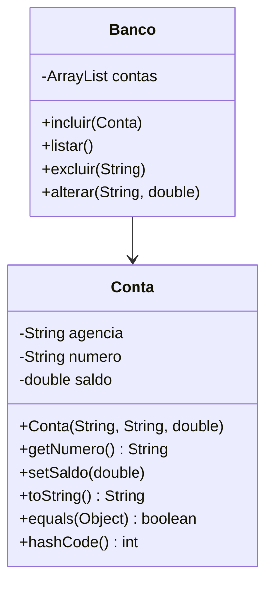

### Identidade de Objetos (`equals` e `hashCode`)

Em Programação Orientada a Objetos (POO), cada objeto é uma instância única de uma classe.
Mesmo que dois objetos possuam os mesmos valores em seus atributos, eles podem representar entidades diferentes na memória.

A identidade de objetos é o conceito que distingue se duas referências apontam para o mesmo objeto (mesma posição de memória) ou apenas para objetos equivalentes em conteúdo.

Em Java, isso é tratado principalmente por dois métodos herdados da classe Object:

- `equals(Object obj)`
- `hashCode()`

#### O método `equals()`

O método `equals()` é utilizado para comparar o conteúdo lógico de dois objetos. Por padrão, o método `equals()` da classe compara referências de memória.

```bash
Conta c1 = new Conta("001", "12345-6");
Conta c2 = new Conta("001", "12345-6");

System.out.println(c1 == c2);       // false (referências diferentes)
System.out.println(c1.equals(c2));  // false (ainda compara referências, se não for sobrescrito)
```
Nesse caso, c1 e c2 possuem o mesmo conteúdo, mas são objetos diferentes na memória.
Para que equals() considere o conteúdo, precisamos sobrescrevê-lo.

```java
@Override
public boolean equals(Object obj) {
    if (this == obj)
        return true;
    if (obj == null || getClass() != obj.getClass())
        return false;
    Conta conta = (Conta) obj;
    return agencia.equals(conta.agencia) && numero.equals(conta.numero);
}
```

Agora, o método compara os atributos agencia e número, ou seja, o conteúdo lógico que define a igualdade de duas contas.

#### O método `hashCode()`

O método hashCode() retorna um inteiro que representa o código hash do objeto.
Esse código é usado por estruturas de dados baseadas em hash, como:

- HashSet
- HashMap
- HashTable

Essas coleções utilizam o valor de hashCode() para organizar e localizar rapidamente objetos.
Quando equals() é sobrescrito, hashCode() também deve ser sobrescrito.
Isso é obrigatório para manter o contrato de igualdade entre objetos em coleções baseadas em hash.

#### Classe Conta

```java
public class Conta {
    private String agencia;
    private String numero;
    private double saldo;

    public Conta(String agencia, String numero, double saldo) {
        this.agencia = agencia;
        this.numero = numero;
        this.saldo = saldo;
    }

    public String getNumero() { return numero; }
    public void setSaldo(double saldo) { this.saldo = saldo; }

    @Override
    public String toString() {
        return String.format("Conta [Agência=%s, Número=%s, Saldo=R$ %.2f]",
                             agencia, numero, saldo);
    }

    @Override
    public boolean equals(Object obj) {
        if (this == obj) return true;
        if (obj == null || getClass() != obj.getClass()) return false;
        Conta conta = (Conta) obj;
        return numero.equals(conta.numero) && agencia.equals(conta.agencia);
    }

    @Override
    public int hashCode() {
        return java.util.Objects.hash(agencia, numero);
    }
}
```

### Substituição de `toString()`

O método `toString()` é um dos métodos mais importantes herdados da classe `Object` em Java.
Ele é utilizado para obter uma representação textual de um objeto, geralmente com o objetivo de exibir informações de forma legível ao usuário, registrar logs ou depurar o código.

A implementação padrão de `toString()` na classe Object retorna uma string com `nomeClasse@codigoHexadecimal`.

```java
Conta c1 = new Conta("001", "12345-6");
System.out.println(c1.toString());
```
> Conta@5e2de80c

Para tornar a saída mais significativa, é recomendado sobrescrever o método `toString()` em suas classes.

A sobrescrita deve retornar uma representação textual contendo os principais atributos do objeto, de forma legível e contextualizada.

```java
public class Conta {
    private String agencia;
    private String numero;
    private double saldo;

    public Conta(String agencia, String numero, double saldo) {
        this.agencia = agencia;
        this.numero = numero;
        this.saldo = saldo;
    }

    @Override
    public String toString() {
        return "Conta [agencia=" + agencia + ", numero=" + numero + ", saldo=" + saldo + "]";
    }
}
```

A classe acima funciona da seguinte forma:

```java
Conta c1 = new Conta("001", "12345-6", 2500.00);
System.out.println(c1.toString());
```

> Conta [agencia=001, numero=12345-6, saldo=2500.0]

Tente também utilizando `String.format`

```java
@Override
public String toString() {
    return String.format("Conta: Agência %s | Número %s | Saldo: R$ %.2f",
                          agencia, numero, saldo);
}
```

### Coleções de objetos

Em aplicações orientadas a objetos, é comum precisar manter vários objetos do mesmo tipo, por exemplo, várias contas bancárias, produtos, alunos, ou clientes.
Para isso, o Java oferece a API de Collections, que contém classes e interfaces para manipulação de conjuntos dinâmicos de dados.

A classe mais utilizada é ArrayList, que faz parte do pacote java.util.

#### ArrayList

O ArrayList é uma lista dinâmica que armazena objetos de forma sequencial, permitindo inserir, remover, acessar, alterar e percorrer elementos da lista.

Ao contrário de um array tradicional, o ArrayList ajusta automaticamente o tamanho conforme novos elementos são adicionados facilitando operações de busca, filtragem e iteração.

```java
import java.util.ArrayList;

ArrayList<Conta> contas = new ArrayList<>();
```

!!! tip
    A sintaxe <Conta> é um parâmetro genérico, garantindo que apenas objetos Conta possam ser inseridos na lista.

#### Incluir objetos

Para adicionar um objeto à lista, utilizamos o método add().

```java
Conta c1 = new Conta("001", "12345-6", 3500.00);
contas.add(c1);

contas.add(new Conta("001", "65432-1", 1200.00));
```

Também é comum implementar um método auxiliar que encapsula essa inclusão:

```java
public void incluirConta(Conta conta) {
    contas.add(conta);
    System.out.println("Conta adicionada com sucesso!");
}
```

#### Listar objetos

Para exibir todos os elementos, utiliza-se o loop for-each, que percorre toda a lista.

```java
for (Conta c : contas) {
    System.out.println(c);
}
```

Se a classe `Conta` tiver o método `toString()` sobrescrito... ele será exibido de forma automática.


#### Remover objetos

Podemos remover um objeto de uma lista utilizando seu índice ou removendo o objeto.

```java
contas.remove(0); // remove o primeiro elemento da lista
```

Para que a remoção por objeto funcione corretamente, é necessário que a classe Conta tenha os métodos equals() e hashCode() sobrescritos.

```java
Conta c = new Conta("001", "65432-1", 1200.00);
contas.remove(c);
```

#### Alterar objetos

Para modificar um objeto armazenado, primeiro localizamos sua posição (índice) e depois usamos o método `set()`.

```java
Conta c = contas.get(1);  // obtém o objeto no índice 1
c.setSaldo(5000.00);      // altera um atributo
contas.set(1, c);         // atualiza o objeto na lista
```

Ou, usando um loop para localizar uma conta específica:

```java
for (Conta c : contas) {
    if (c.getNumero().equals("12345-6")) {
        c.setSaldo(7000.00);
        System.out.println("Saldo atualizado com sucesso!");
        break;
    }
}
```

#### Exemplo classe Banco

```java
import java.util.ArrayList;

public class Banco {
    private ArrayList<Conta> contas = new ArrayList<>();

    public void incluir(Conta c) {
        contas.add(c);
        System.out.println("Conta incluída!");
    }

    public void listar() {
        for (Conta c : contas) {
            System.out.println(c);
        }
    }

    public void excluir(String numero) {
        Conta encontrada = null;
        for (Conta c : contas) {
            if (c.getNumero().equals(numero)) {
                encontrada = c;
                break;
            }
        }
        if (encontrada != null) {
            contas.remove(encontrada);
            System.out.println("Conta removida!");
        } else {
            System.out.println("Conta não encontrada!");
        }
    }

    public void alterar(String numero, double novoSaldo) {
        for (Conta c : contas) {
            if (c.getNumero().equals(numero)) {
                c.setSaldo(novoSaldo);
                System.out.println("Saldo alterado!");
                return;
            }
        }
        System.out.println("Conta não encontrada!");
    }
}
```

#### Classe main

```java
public class TesteBanco {
    public static void main(String[] args) {
        Banco banco = new Banco();
        banco.incluir(new Conta("001", "12345-6", 2500.0));
        banco.incluir(new Conta("001", "65432-1", 1000.0));

        System.out.println("Listando contas:");
        banco.listar();

        banco.alterar("12345-6", 5000.0);
        banco.excluir("65432-1");

        System.out.println("Após alterações:");
        banco.listar();
    }
}
```

#### Diagrama UML

