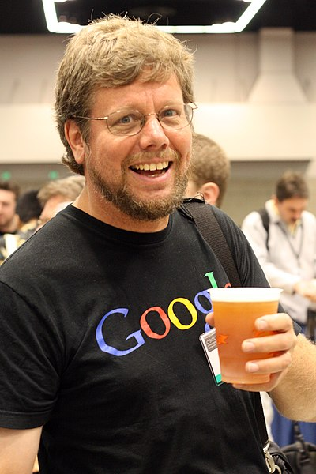

# Linguagem de Programação Python

Python é uma linguagem de programação de alto nível, interpretada, de propósito geral e com forte ênfase na legibilidade do código.

É uma das linguagens mais populares do mundo, usada em áreas como desenvolvimento web, automação, análise de dados, inteligência artificial, ciência de dados, computação científica e ensino de programação.

- Sintaxe limpa e legível: o uso de indentação (espaços) define blocos de código ao invés de chaves ou palavras-chave, o que torna o código mais legível.

- Multiparadigma: suporta programação imperativa, orientada a objetos e funcional.
- Tipagem dinâmica e forte: as variáveis não precisam de declaração de tipo, mas os tipos são respeitados em tempo de execução.
- Grande biblioteca padrão: inclui módulos para lidar com arquivos, expressões regulares, protocolos de rede, JSON, datas, entre outros.
- Grande ecossistema de pacotes: com ferramentas como pip e o repositório PyPI, é fácil instalar bibliotecas para quase qualquer necessidade, como NumPy, pandas, Flask, TensorFlow, etc.
- Portabilidade: programas em Python rodam em múltiplas plataformas com pouca ou nenhuma modificação.
- Interatividade: é possível usar o interpretador de forma interativa (REPL) facilitando testes e aprendizado.

 

Guido van Rossum(<i>Haarlem, 31 de janeiro de 1956</i>) é um matemático e programador de computadores holandês, mais conhecido por ser o autor da linguagem de programação Python. Guido Van Rossum publicou a primeira versão do código Python (versão 0.9.0) em 1991. Versão 2.0 em 2000 e 3.0 em 2008.

Na comunidade Python, ele é conhecido como Benevolent Dictator for Life (BDFL), o que significa que ele continua a supervisionar o processo de desenvolvimento do Python, tomando decisões quando necessário.

Entretanto, em julho de 2018, ele anunciou que estaria se afastando desta função devido a desentendimentos com a equipe de desenvolvimento da linguagem Python.

  > [Zen of Python](https://peps.python.org/pep-0020/){:target="_blank"}

<!--
# Linguagem de Programação Python

Python é uma linguagem de programação de alto nível, interpretada, de propósito geral e com forte ênfase na legibilidade do código.
É uma das linguagens mais populares do mundo, usada em áreas como desenvolvimento web, automação, análise de dados, inteligência artificial, ciência de dados, computação científica, e ensino de programação.

- Sintaxe limpa e legível: o uso de indentação (espaços) define blocos de código, ao invés de chaves ou palavras-chave, o que torna o código mais legível.

- Multiparadigma: suporta programação imperativa, orientada a objetos e funcional.
- Tipagem dinâmica e forte: as variáveis não precisam de declaração de tipo, mas os tipos são respeitados em tempo de execução.
- Grande biblioteca padrão: inclui módulos para lidar com arquivos, expressões regulares, protocolos de rede, JSON, datas, entre outros.
- Grande ecossistema de pacotes: com ferramentas como pip e o repositório PyPI, é fácil instalar bibliotecas para quase qualquer necessidade, como NumPy, pandas, Flask, TensorFlow, etc.
- Portabilidade: programas em Python rodam em múltiplas plataformas com pouca ou nenhuma modificação.
- Interatividade: é possível usar o interpretador de forma interativa (REPL) facilitando testes e aprendizado.

 

  

    
Guido van Rossum(<i>Haarlem, 31 de janeiro de 1956</i>) é um matemático e programador de computadores holandês, mais conhecido por ser o autor da linguagem de programação Python.

    
Na comunidade Python, ele é conhecido como Benevolent Dictator for Life (BDFL), o que significa que ele continua a supervisionar o processo de desenvolvimento do Python, tomando decisões quando necessário.

    
Entretanto, em julho de 2018, ele anunciou que estaria se afastando desta função devido a desentendimentos com a equipe de desenvolvimento da linguagem Python.

    
Guido Van Rossum publicou a primeira versão do código Python (versão 0.9.0) em 1991. Versão 2.0 em 2000 e 3.0 em 2008.

  

  

> [Zen of Python](https://peps.python.org/pep-0020/)

{:target="_blank"}
-->