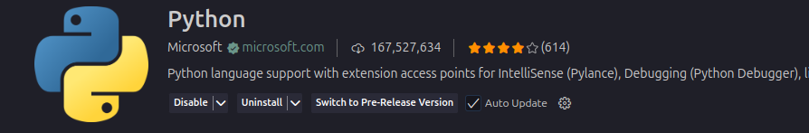
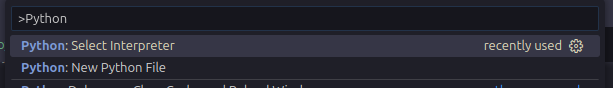

# Instrumentalização


O Python pode ser utilizado com diversos sistemas operacionais e arquiteturas. Faça o download em [Python.org](https://www.python.org/downloads/){:target="_blank"} e siga o passo a passo de acordo com o seu sistema operacional.

Um gerênciador de runtimes como [asdf](https://asdf-vm.com/){:target="_blank"} ou [mise](https://mise.jdx.dev/){:target="_blank"} pode facilitar a utilização de diferentes versões.

Se a instalação finalizou corretamente ao utilizar o comando:

```sh
python --version
```

Deve exibir como saída a versão instalada do python.

## Console Python (REPL)

No python temos um ferramenta chamada terminal interativo, também chamado de REPL(Read, Evaluate, Print, Loop)

O console interativo do Python pode ser acessado com:
```sh
python
```
No console, é possível testar comandos rapidamente:
```python
>>> print("Olá, Mundo!")
Olá, Mundo!
```

Você pode usar o comando `exit` para sair do REPL.


## Visual Studio Code


O [Visual Studio Code](https://code.visualstudio.com/) é um Ambiente de Desenvolvimento Integrado(*Integrated Development Environment - IDE*) da Micrsoft que em partes é open source.

É a ide mais utilizada no [mundo](https://survey.stackoverflow.co/2024/technology#most-popular-technologies-new-collab-tools).

Com o VScode instalado, adicione a extensão do Python no VS Code

- Vá em Extensões (Ctrl+Shift+X).
- Busque por Python (desenvolvida pela Microsoft) e instale.



## VENV

O `venv`(*virtual environment*) é o módulo padrão do Python (desde a versão 3.3) para criar ambientes virtuais isolados.

Ele permite que você tenha um ambiente Python separado para cada projeto, com suas próprias bibliotecas e dependências.

Para criar o ambiente em um projeto digite no terminal, dentro da pasta do seu projeto:

```bash
python -m venv venv
```

Com a pasta criada precisamos ativar esse venv

- Windows:
```bash
.\venv\Scripts\activate
```

- Linux/macOS:
```bash
source venv/bin/activate
```

Quando ativado, você verá algo assim no terminal:
```bash
(venv) C:\Users\seu-usuario\meu-projeto>
```

No VScode você precisa selecionar o interpretador Python. Pressione `Ctrl+Shift+P` para abrir a paleta de comandos.

Depois digite `"Python: Select Interpreter".`



(deve mostrar `./venv/bin/python` ou `.\venv\Scripts\python.exe`)
