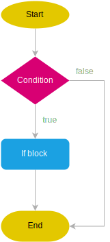
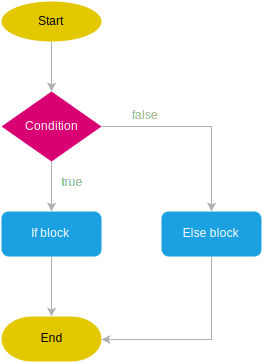
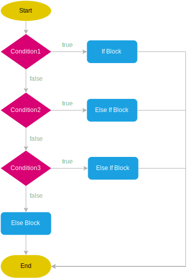

# Python

Ao escrever código em python podemos executar esse código de algumas formas. A mais comum é criar um arquivo `.py` por exemplo `hello.py` e no terminal executar o comando:

```sh
python hello.py
```

Quando você executa esse comando, você está instruindo o interpretador Python a:

- Carregar o arquivo hello.py
- Interpretar e executar linha por linha o conteúdo desse arquivo
- Exibir no terminal qualquer saída gerada (como chamadas print() ou mensagens de erro)


## Declaração de Variáveis

Em Python, as variáveis são utilizadas para armazenar valores e são declaradas atribuindo um valor a um nome específico. Ao contrário de outras linguagens, Python não exige a declaração explícita de tipos de dados, pois opera sob o princípio da tipagem dinâmica (o tipo de dado é inferido pelo intepretador na medida que o código é analisado).

No exemplo abaixo estamos declarando algumas variáveis. Em Python, não é necessário especificar o tipo da variável, ele é dinâmicamente tipado.

```python
nome = "Alice"   # Texto, string
afirmacao = True # Booleano, bool
idade = 25       # Inteiro, int
altura = 1.70    # Ponto flutuante, float
PI = 3.14159     # Constante
GRAVIDADE = 9.8  # Constante
```

## Comentários em Python

Comentários são trechos de texto dentro do código-fonte que são ignorados pelo interpretador Python durante a execução do programa. Eles são utilizados para explicar o código, fazer anotações, fornecer documentação ou desativar temporariamente partes do código. Seu uso é altamente recomendável, pois auxilia na documentação do código.

Temos a disposição diferentes duas maneiras distintas de comentar código: comentário de linha e comentário de bloco. Comentários de linha começam com o símbolo # e continuam até o final da linha. São úteis para adicionar breves explicações ou notas em uma única linha de código.

```python
# Este é um comentário de linha única
```

```python
"""
Este é um comentário de múltiplas linhas.
Pode ser útil para documentação.
"""
```

Quando pensamos em comentários devemos levar em consideração alguns critérios importantes para torná-los realmente úteis no processo de desenvolvimento. Os principais deles são:

- Escrever comentários suficientemente descritivos que irão apoiar o entendimento do algoritmo
- Não comentar situações óbvias
- Padronizar a escrita de comentários no código-fonte.


## Tipos de Dados e Conversões

No Python, os tipos de dados definem a natureza dos valores armazenados em variáveis.

| Tipo  | Descrição                                                                                                 | Exemplo                              |
| ----- | --------------------------------------------------------------------------------------------------------- | ------------------------------------ |
| int   | Números inteiros, positivos ou negativos, sem casas decimais.                                             | x = 10, y = -5                       |
| float | Números reais, com casas decimais. Também pode representar notação científica.                            | pi = 3.14, e = 2.7e3                 |
| str   | Cadeia de caracteres (texto). Deve ser delimitada por aspas simples ou duplas.                            | nome = "Python", s = 'Oi'            |
| bool  | Valores booleanos que representam verdadeiro (True) ou falso (False).                                     | ativo = True, erro = False           |
| list  | Coleção ordenada e mutável de itens, que pode conter diferentes tipos de dados. Definida entre colchetes. | nums = [1, 2, 3]                     |
| tuple | Coleção ordenada e imutável de itens. Definida entre parênteses.                                          | cores = ("azul", "vermelho")         |
| set   | Coleção desordenada de itens únicos. Definida entre chaves.                                               | vogais = {'a', 'e', 'i'}             |
| dict  | Estrutura que armazena pares chave-valor. Definida entre chaves com dois pontos separando chave e valor.  | aluno = {"nome": "Ana", "idade": 20} |
| None  | NoneType, Representa a ausência de valor                                                                  | vazio = None                         |

### Entradas e saídas

Para receber entrada do usuário, Python oferece a função `input()`. O valor retornado após executar a função foi o que o usuário digitou no terminal. Aqui estamos falando de entrada em terminal, ou seja, sem uso de interface gráfica.

No trecho de código que segue, a mensagem `Digite seu nome: ` é impressa na tela e o cursor fica aguardando a entrada do usuário. Após o usuário digitar os dados e pressionar ENTER, o valor é armazenado na variável `nome`.

```python
nome = input("Digite seu nome: ")
```

Já para exibir informações para o usuário, podemos usar a função `print()`, conforme o exemplo a seguir. No código em questão, será impresso na tela a mensagem `Olá, ` acompanhada do valor da variável `nome`.

```python
print("Olá,", nome)
```

Não necessáriamente precisamos enviar uma mensagem com o input.

```python
print("Digite seu nome")
nome = input()
```

### Conversões

!!! warning "Importante"
    O `input()` SEMPRE retorna uma string, conversões podem ser necessárias. O Python permite a conversão de tipos com funções como:

```python
int("10")       # Converte string para inteiro → 10
float(5)        # Converte inteiro para float → 5.0
str(3.14)       # Converte número para string → "3.14"
```

Outras funções para conversão de tipos são mostradas na tabela abaixo:

!!! info "Funções de conversão"
    | Função      | Descrição |
    |------------|-----------|
    | `int(x)`   | Converte para inteiro |
    | `float(x)` | Converte para ponto flutuante |
    | `str(x)`   | Converte para string |
    | `bool(x)`  | Converte para booleano |
    | `list(x)`  | Converte para lista |
    | `tuple(x)` | Converte para tupla |
    | `set(x)`   | Converte para conjunto |
    | `dict(x)`  | Converte para dicionário (se a estrutura for compatível) |

Essas funções recebem um valor e convertem para o tipo desejado. Podemos converter por exemplo o valor de um `input`:

```python
idade = int(input("Digite sua idade: "))
```

O código acima vai:

1. mostrar a mensagem `"Digite sua idade: "` para o usuário
2. o valor enviado pelo usuário é uma `string`
3. a função `int` vai tentar converter o valor do input para um inteiro

Nesse exemplo se o valor enviado pelo usuário for um inteiro válido a variável `idade` vai receber esse valor.

### Strings

As strings são usadas para representar texto e são imutáveis, o que significa que uma vez que uma string é criada, ela não pode ser alterada. O Python fornece uma grande variedade de métodos embutidos para manipular e operar em strings de maneira eficiente.

```python
s1 = "aspas duplas"
s2 = 'aspas simples'
s3 = """string
multilinha"""
```

Com uma string podemos fazer algumas operações...

| Operação     | Exemplo             | Resultado      |
| ------------ | ------------------- | -------------- |
| Concatenação | `"Olá, " + "mundo"` | `"Olá, mundo"` |
| Repetição    | `"ha" * 3`          | `"hahaha"`     |
| Indexação    | `"Python"[0]`       | `'P'`          |
| Fatiamento   | `"Python"[1:4]`     | `'yth'`        |
| Comprimento  | `len("Python")`     | `6`            |
| Verificação  | `"Py" in "Python"`  | `True`         |


Ou usar algumas funções como `len()` que retorna o comprimento da string, ou seja, o número de caracteres presentes nela.

```python
string = "Olá, mundo!"
print(len(string))
```

Podemos usar a `upper()` para converter todos os caracteres da string para maiúsculo, enquanto `lower()` os converte para minúsculo.

```python
string = "Olá, Mundo!"
print(string.upper())
print(string.lower())
```

As funções `strip()`, `lstrip()` e `rstrip()` removem espaços em branco e caracteres especiais do início e/ou final da string.

```python
string = "   Olá, Mundo!   "
print(string.strip())
print(string.lstrip())
print(string.rstrip())
```

A função `split()` divide a string em uma lista de substrings com base em um separador, enquanto `join()` junta uma lista de strings em uma única string.

```python
string = "Python é lindo"
string = "Python.lindo"
lista = string.split()
lista2 = string.split(".")
print(lista)
print(lista2)

string_nova = "-".join(lista)
print(string_nova)
```

A função `replace()` substitui todas as ocorrências de uma substring por outra.

```python
string = "Python é incrível!"
nova_string = string.replace("incrível", "fantástico")
print(nova_string)
```

As funções `startswith()` e `endswith()` verificam se a string começa ou termina com uma determinada substring, respectivamente.

```python
string = "Olá, Mundo!"
print(string.startswith("Olá"))
print(string.endswith("!"))
```

Enquanto a função `find()` retorna a primeira ocorrência de uma substring na string, já a função `index()` retorna o índice da primeira ocorrência. A diferença é que `index()` gera uma exceção se a substring não for encontrada.

```python
string = "Python é uma linguagem de programação"
print(string.find("linguagem"))
print(string.index("linguagem"))
```

Também temos a função `count()` que conta o número de ocorrências de uma substring na string.

```python
string = "Python é uma linguagem de programação, e Python é incrível!"
print(string.count("Python"))
```

### Identificando tipos

Na incerteza de que tipo de valor uma variável armazena, podemos encontrar e testar o tipo de uma variável usando as funções `type()` e `instanceOf()`. A a função `type()` recebe um valor e mostra o tipo correspondente.

```python
x = 10
y = 3.14
texto = "Olá, Python!"
lista = [1, 2, 3]
dicionario = {"nome": "Alice", "idade": 25}

print(type(x))          # <class 'int'>
print(type(y))          # <class 'float'>
print(type(texto))      # <class 'str'>
print(type(lista))      # <class 'list'>
print(type(dicionario)) # <class 'dict'>
```

## Operadores aritméticos

Os operadores aritméticos são utilizados para realizar operações matemáticas em valores numéricos.

Em sua grande maioria, são os mesmo da Matemática e representam operações como adição, subtração, multiplicação, divisão, por exemplo. Na sequência vamos apresentar eles.

```python
resultado = 5 + 3     # Soma
resultado = 10 - 7    # Subtração
resultado = 4 * 6     # Multiplicação
resultado = 20 / 5    # Divisão
resultado = 20 // 6   # Divisão inteira
resultado = 20 % 6    # Resto da Divisão
resultado = 2 ** 3    # Exponenciação
```

## Saída de Dados print()

A função `print()` exibe valores no console do REPL, é utilizada para mostrar algo, e pode ser utilizada como ferramenta de depuração.

```python
print("Olá, mundo!")  # Simples string
print(10 + 5)         # Operação matemática
print("Python", 3.11) # Vários valores separados por espaço
```

Podemos personalizar a saída com sep (separador) e end (finalizador).

```python
print("Python", "é", "incrível", sep="-")
print("Linha 1", end=" ")
print("Linha 2")
```

Ainda podemos formatar a saída de dados

```python
print("Meu nome é %s e tenho %d anos." % (nome, idade))
```

### f-strings

As f-strings são a forma recomendada atualmente para formatação de strings no Python moderno.

```python
nome = "Alice"
idade = 25
print(f"Meu nome é {nome} e tenho {idade} anos.")

print("Meu nome é {} e tenho {} anos.".format(nome, idade))
```

No caso de números `float`. Podemos definir o tamanho de casas decimais a ser mostrado.

```python
pi = 3.14159265359
print(f"O valor de pi com 4 casas decimais é: {pi:.4f}")
```

| Estilo      | Exemplo                  | Observação        |
| ----------- | ------------------------ | ----------------- |
| `f-string`  | `f"Olá, {nome}"`         | Moderno e claro   |
| `.format()` | `"Olá, {}".format(nome)` | Mais verboso      |
| `%`         | `"Olá, %s" % nome`       | Antigo, estilo C  |


## Indentação

Em Python, a `indentação` é um conceito fundamental e parte integrante da sintaxe da linguagem. Diferentemente de muitas outras linguagens de programação, que utilizam chaves `{}` para delimitar blocos de código, Python utiliza a indentação para definir a estrutura e a organização do código.

A indentação é utilizada para indicar a estrutura hierárquica do código, especialmente em construções como loops, condicionais, funções e classes. Ela define quais linhas de código estão dentro de um determinado bloco e quais estão fora.

Por convenção, é recomendado utilizar ***quatro espaços*** para cada nível de indentação. Embora o uso de tabulações (tab) seja permitido. Spaces over Tabs é uma discussão sem fim na programação...

<iframe width="100%" height="500" src="https://www.youtube.com/embed/V7PLxL8jIl8?si=DgY0iWD0lXYHYCwD&amp;start=147" title="Spaces over tabs" frameborder="0" allow="accelerometer; autoplay; clipboard-write; encrypted-media; web-share" referrerpolicy="strict-origin-when-cross-origin" allowfullscreen></iframe>

```python
if idade >= 18:
    print("Você é maior de idade.")
else:
    print("Você é menor de idade.")
```

No exemplo acima, as linhas de código dentro do bloco `if` e `else` estão indentadas com quatro espaços, indicando que elas pertencem a esses blocos condicionais.

```python
def saudacao():
    print("Olá, Mundo!")

saudacao()
```

!!! warning "Importante"
    O uso incorreto da indentação resulta em erro!


## Operadores de comparação

Conforme você deve ter observado, o comando `if` avalia uma expressão lógica, cujos únicos valores possíveis são `VERDADEIRO` ou `FALSO`. Expressões nem sempre são simples, contendo apenas uma premissa. Tipicamente, temos duas ou mais premissas lógicas compondo as expressões. Neste caso, precisamos dos operadores lógicos para unir as partes.

Operadores de comparação são usados para comparar valores e expressões, resultando em valores *booleanos* (True ou False) que indicam se a comparação é verdadeira ou falsa.

| Operador  | Descrição                        | Exemplo      | Retorno |
|-----------|----------------------------------|--------------|---------|
| `==`      | Igual a                          | `5 == 5`     | `True`  |
| `!=`      | Diferente de                     | `5 != 3`     | `True`  |
| `>`       | Maior que                        | `7 > 3`      | `True`  |
| `<`       | Menor que                        | `2 < 5`      | `True`  |
| `>=`      | Maior ou igual a                 | `4 >= 4`     | `True`  |
| `<=`      | Menor ou igual a                 | `3 <= 5`     | `True`  |

Esses operadores são frequentemente usados em instruções condicionais (como `if`, `elif`, `else`), onde o fluxo do programa depende do resultado das comparações.

!!! info "Operadores de Comparação"
    === "Igualdade"
        O operador **== (igual a)** verifica se dois valores são iguais. Não confunda com `=`, que indica atribuição.
        ```python
            a = 5
            b = 10
            print(a == b)
        ```

    === "Diferença"
        O operador **!= (diferente de)** verifica se dois valores são diferentes.
        ```python
            a = 5
            b = 10
            print(a != b)
        ```
    === "Menor que"
        O operador **< (menor que)** verifica se o valor à esquerda é menor que o valor à direita.
        ```python
            a = 5
            b = 10
            print(a < b)
        ```
    === "Maior que"
        O operador **> (maior que)** verifica se o valor à esquerda é maior que o valor à direita.
        ```python
            a = 5
            b = 10
            print(a > b)
        ```
    === "Menor ou igual a"
        O operador **<= (menor ou igual a)** verifica se o valor à esquerda é menor ou igual ao valor à direita.
        ```python
            a = 5
            b = 10
            print(a <= b)
        ```
    === "Maior ou igual a"
        O operador **>= (maior ou igual a)** verifica se o valor à esquerda é maior ou igual ao valor à direita.
        ```python
            a = 5
            b = 10
            print(a >= b)
        ```

Também é importante mencionar que os operadores de comparação podem ser combinados com operadores lógicos (`and`, `or`, `not`) para criar condições mais complexas. Isso permite construir lógicas de decisão mais elaboradas em um programa.


## Operadores lógicos

Operadores lógicos são elementos fundamentais em linguagens de programação que permitem combinar e avaliar condições booleanas. Eles são essenciais para controlar o fluxo de execução de um programa com base em diversas situações e critérios.


### Operador `and`


<div class="grid" markdown>
  <div markdown="1">

Este operador retorna `True` se ambas as expressões que ele conecta forem verdadeiras e `False` caso contrário.

Ele é frequentemente utilizado para verificar se múltiplas condições devem ser atendidas para que uma determinada ação seja tomada.

```python
idade = 25
if idade >= 18 and idade <= 30:
    print("Você é um adulto.")
```

  </div>
  <div align="center" markdown="1">

Tabela verdade do operador `and`

| A     | B     | A and B |
| ----- | ----- | ------- |
| True  | True  | True    |
| True  | False | False   |
| False | True  | False   |
| False | False | False   |

  </div>
</div>

### Operador `or`

<div class="grid" markdown>
  <div markdown="1">

Este operador retorna `True` se pelo menos uma das expressões que ele conecta for verdadeira e `False` apenas se ambas as expressões forem falsas.

Ele é útil quando pelo menos uma de várias condições precisa ser verdadeira para que uma ação seja executada.

```python
peso = 200
if peso >=190 or peso <= 210:
    print("Peso válido.")
```

  </div>
  <div align="center" markdown="1">

Tabela verdade do operador `or`

| A     | B     | A or B |
| ----- | ----- | ------ |
| True  | True  | True   |
| True  | False | True   |
| False | True  | True   |
| False | False | False  |

  </div>
</div>


### Operador `not`

<div class="grid" markdown>
  <div markdown="1">

Este operador é utilizado para inverter o valor de uma expressão booleana. Se a expressão original for True, o `not` a transformará em False, e vice-versa.

Ele é frequentemente utilizado para verificar se uma condição não é verdadeira.

```python
idade = 15
if not idade >= 18:
  print("Você é menor de idade.")
```

  </div>
  <div align="center" markdown="1">

Tabela verdade para o operador `not`

| A     | not A |
| ----- | ----- |
| True  | False |
| False | True  |

  </div>
</div>

## Estruturas Condicionais

As estruturas condicionais na programação visam oferecer ao programador maneiras de tomar decisões dentro de um programa, executando diferentes blocos de código com base em condições específicas.

Elas permitem que o fluxo de execução do programa seja alterado de acordo com a avaliação de condições lógicas, cujo valor poder ser verdadeiro ou falso, a depender do estado da execução.

!!! important "Condições Lógicas"
    Uma condição lógica é uma expressão cujo resultado de sua avaliação será verdadeiro (True) ou falso (False). Utilizam-se operadores de comparação e operadores lógicos na composição das expressões.

<br/>



### if

O comando condicional mais básico em Python é o if, que permite verificar se uma condição lógica é verdadeira e então executar um bloco de código associado a ela.

```python
idade = 18

if idade >= 18:
  print("Idade igual maior que 18")
```

No exemplo acima, o código verifica se a variável idade é maior ou igual a 18. Se for, imprime a mensagem `Idade igual ou superior a 18 anos`.

O bloco do if só vai ser executado nesse caso se o resultado da condição lógica for verdadeiro, após isso o código é interpretado normalmente.

<br/>

### Conversão para Boolean

Nas condições lógicas podemos receber valores e fazer a conversão para booleanos `True` ou `False`:

```python
print(bool(0))         # False
print(bool(1))         # True
print(bool(""))        # False
print(bool("Python"))  # True
print(bool([]))        # False
print(bool([1, 2]))    # True
```

<br/>



### else

Ao utilizar o comando o if, temos a disposição o else, utilizado para executar um bloco de código quando a condição especificada NÃO é verdadeira.

```python
idade = 16

if idade >= 18:
    print("Maior  de idade.")
else:
    print("Menor de idade.")
```

No exemplo acima, a condição lógica do `if` é falsa, o interpretador então vai executar o bloco do `else`.

Também podemos testar mais casos que apenas um `if` e um `else`, usando o operador `elif`.

<br/>



### elif

Há casos em que temos a necessidade de múltiplas condições. Para isso, utilizamos o comando `elif` (abreviação de else if), que permite verificar condições adicionais após a condição inicial `if`. Tal construção permite a criação de uma cadeia de testes para avaliar várias condições em uma única instrução.

```python
idade = 20

if idade < 18:
    print("Menor de idade.")
elif idade == 18:
    print("Você acabou de atingir a maioridade.")
else:
    print("Você é maior de idade.")
```

Neste caso, se a idade for igual a 18, o programa imprime `Você acabou de atingir a maioridade.` Se a idade for maior que 18, ele imprime `Você é maior de idade.` Se nenhuma das condições anteriores for verdadeira, o programa imprime `Você é menor de idade.`

Os comandos condicionais em Python também podem ser aninhados, ou seja, podem conter outros comandos condicionais dentro deles. Contudo, não é boa prática aplicar vários níveis de aninhamento, pois isso aumenta a complexidade e reduz a legibilidade do código.

### match

O comando [`match`](https://docs.python.org/3/tutorial/controlflow.html#match-statements) foi introduzido no Python a partir da versão 3.10 e oferece uma nova forma de realizar múltiplas comparações de padrões de forma mais legível e concisa do que as estruturas condicionais tradicionais.

Ele é especialmente útil quando se tem múltiplas condições a serem verificadas e quando cada condição envolve uma expressão de padrão específica.

O `match` funciona de maneira semelhante ao `switch` em outras linguagens de programação. Observe o exemplo:

```python
def dia_da_semana(numero):
  match numero:
    case 1:
      print("Domingo")
    case 2:
      print("Segunda-feira")
    case 3:
      print("Terça-feira")
    case 4:
      print("Quarta-feira")
    case 5:
      print("Quinta-feira")
    case 6:
      print("Sexta-feira")
    case 7:
      print("Sábado")
    case _:
      print("Número inválido")
```

Neste exemplo, a função `dia_da_semana` recebe um número e utiliza o comando `match` para verificar qual dia da semana corresponde a esse número. Se o número corresponder a um dos casos especificados (de 1 a 7), o programa imprime o nome do dia correspondente. Caso contrário, imprime `Número inválido`.

O `match` permite a combinação de padrões mais complexos usando a sintaxe `case <padrão> if <condição>:`, onde `<padrão>` é um padrão a ser verificado e `<condição>` é uma expressão booleana que também deve ser verdadeira para que a correspondência seja feita.

```python
match valor:
  case valor if valor>0 and valor%2==0:
    print("PAR e POSITIVO")
  case valor if valor>0 and valor%2!=0:
    print("ÍMPAR e POSITIVO")
  case valor if valor<0 and valor%2==0:
    print("PAR e NEGATIVO")
  case valor if valor<0 and valor%2!=0:
    print("ÍMPAR e NEGATIVO")
  case _:
    print("ZERO")
```

Também podemos testar vários valores em cada caso utilizando o operador `|`.

Isso por vezes é necessário quando o mesmo tratamento deve ser aplicado a mais de um valor da variável em avaliação.

```python
match codigo:
  case 0 | -1:
    print("Valor 0 ou -1")
  case 1 | 2 | 3:
    print("Valor 1, 2, ou 3.")
  case _:
    print("Algum outro valor")
```

## Coleções de dados

As coleções de dados são estruturas fundamentais em programação utilizadas para armazenar e organizar múltiplos valores de maneira eficiente. Elas permitem a manipulação de grandes volumes de informação, possibilitando operações como inserção, remoção, pesquisa e iteração de elementos.

Em Python, as coleções mais comuns são listas, tuplas, conjuntos e dicionários. As listas são estruturas ordenadas e mutáveis, permitindo a adição e remoção de elementos conforme necessário. Já as tuplas são semelhantes às listas, porém imutáveis, o que garante maior segurança e eficiência quando os dados não precisam ser alterados.

Os conjuntos são coleções não ordenadas que não permitem elementos duplicados, sendo úteis para operações como união e interseção. Por outro lado, os qdicionários armazenam pares de chave e valor, possibilitando acesso rápido aos dados por meio de uma chave única, em vez de um índice numérico.

Cada tipo de coleção possui características específicas que se adaptam a diferentes necessidades. O uso adequado dessas estruturas melhora o desempenho do código e facilita a manipulação de informações em diversas aplicações.


| Coleção        | Descrição                                                                     | Características principais                                                 | Exemplo                                                                      |
| -------------- | ----------------------------------------------------------------------------- | -------------------------------------------------------------------------- | ---------------------------------------------------------------------------- |
| **list**       | Coleção ordenada e mutável de elementos                                       | - Ordenada<br>- Mutável<br>- Permite elementos duplicados                  | `lista = [1, 2, 3, 4, 2]`                                                    |
| **tuple**      | Coleção ordenada e imutável de elementos                                      | - Ordenada<br>- Imutável<br>- Permite elementos duplicados                 | `tupla = (1, 2, 3, 4, 2)`                                                    |
| **set**        | Coleção não ordenada, mutável e não permite elementos duplicados              | - Não ordenada<br>- Mutável<br>- Não permite duplicados                    | `conjunto = {1, 2, 3, 4}`                                                    |
| **dict**       | Coleção de pares chave-valor, mutável e ordenada                              | - Chaves únicas<br>- Mutável<br>- Permite busca rápida por chave           | `dicionario = {'a': 1, 'b': 2}`                                              |


### Listas

As listas são uma estrutura de dados versátil que permite armazenar coleções de itens em uma ordem específica.

São mutáveis, o que significa que você pode adicionar, remover e modificar itens conforme necessário sem gerar uma cópia do objeto. Normalmente, as listas são utilizadas para armazenar dados de forma homogênea, ou seja, todos os items apresentam mesmo tipo. Contudo, é possível criar listas com elementos de tipos distintos, pois o Python não impõe a necessidade de homogeneidade.

Para criar uma lista, podemos especificar os valores entre colchetes. Cada elemento deve ser separado dos demais com vírgulas. Caso a lista deva estar vazia, basta utilizar `[]`.

```python
minha_lista = [1, 2, 3, 4, 5]
outra_lista = ["teste1", "teste2"]
```

O acesso aos elementos se dá por meio de um índice numérico (inteiro), que começa SEMPRE em 0.
O índice deve ser aplicado utilizando o operador de slicing ([]).

```python
print(minha_lista[0])
print(outra_lista[2])
```

O mesmo se aplica ao modificar o valor de uma posição, basta atribuir ao índice desejado um novo valor.

```python
minha_lista[0] = 100
print(minha_lista)
```

As principais operações que podem ser realizadas com listas são:

**Adição de elementos**: `append()`, `insert()` <br/>
```python
minha_lista = [1,2,3,4]
minha_lista.append(5)
minha_lista.insert(0,0)
minha_lista.insert(5,6)
```

**Remoção de elementos**: `remove()`, `pop()` <br/>

```python
minha_lista = [1,2,3,4]
minha_lista.remove(1)   # Indica qual valor deve ser removido
minha_lista.pop(0)      # remove o primeiro valor
minha_lista.pop()       # remove o último valor
```

Resumo

- **Adicionar elemento ao final**: `lista.append(5)`
- **Inserir em posição específica**: `lista.insert(1, 15)`
- **Remover por valor**: `lista.remove(3)`
- **Remover por índice**: `lista.pop(2)`
- **Ordenar**: `lista.sort()`
- **Reverter**: `lista.reverse()`
- **Comprimento**: `len(lista)`

Já em termos de funções, relacionam-se às listas as funções:

`len()`: Retorna o número de elementos em uma lista. <br/>
```python
minha_lista = [1,2,3,4]
len(minha_lista)
```

`sum()`: Retorna a soma de todos os elementos em uma lista. <br/>
```python
minha_lista = [1,2,3,4]
sum(minha_lista)
```

`max()` e `min()`: máximo e mínimo em uma lista. <br/>
```python
minha_lista = [1,2,3,4]
min(minha_lista)
max(minha_lista)
```

#### ***List Comprehension***

*List comprehension* é uma maneira concisa e elegante de criar listas em Python. Ela permite criar listas de forma mais eficiente e legível, muitas vezes em uma única linha de código.

A sintaxe utilizada é apresentada na sequência. Observe que `expressão` define cada elemento da nova lista, enquanto `item` corresponde ao elemento presente em `iterável` (origem dos dados para criação da nova lista).

```python
[expressão for item in iterável]
```

O recurso de *list comprehension* é muito utilizado na programação, não somente para criar listas, mas também dicionários e conjuntos. Conhecer bem a sintaxe e aplicação certamente é um diferencial importante.

Vejamos alguns exemplos concretos:

```python
# Lista contendo o quadrado dos valores de 1 a 6
quadrados = [x ** 2 for x in range(1, 6)]

# Lista contendo apenas os números pares da variável `numeros`
numeros = [1, 2, 3, 4, 5, 6, 7, 8, 9, 10]
pares = [x for x in numeros if x % 2 == 0]

# Lista contendo tuplas do resultado das combinações de valores possíveis entre 1 e 4 (produto cartesiano)
tuplas = [(x, y) for x in range(1, 4) for y in range(1, 4)]
```


#### ***Slicing***

*Slicing* é uma técnica que permite extrair partes específicas de uma coleção de dados (string, lista, tupla, etc). O operador de slicing é de grande valia para manipulação eficiente e flexível de dados. A sintaxe básica é  ```string[início:fim:passo]```, onde:

- `início`: Índice onde o slicing começa. Se não especificado, é considerado o início da string.
- `fim`: Índice onde o slicing termina. Este índice não é incluído na substring resultante. Se não especificado, é considerado o final da string.
- `passo`: Opcional. Define o intervalo entre os caracteres a serem considerados durante o slicing. Se não especificado, o padrão é 1.

Observe alguns exemplos de uso do `slicing`.

```python
numeros = [10, 20, 30, 40, 50, 60, 70, 80]

# Pegando do índice 1 ao 4 (o índice 5 não é incluído)
sublista = numeros[1:5]
print(sublista)

numeros = [1, 2, 3, 4, 5, 6, 7, 8, 9]

# Omissão do índice de início (começa do início da lista)
print(numeros[:4])  # [1, 2, 3, 4]

# Omissão do índice de fim (vai até o final da lista)
print(numeros[5:])  # [6, 7, 8, 9]

numeros = [0, 1, 2, 3, 4, 5, 6, 7, 8, 9]

# Pegando de 2 em 2
print(numeros[::2])  # [0, 2, 4, 6, 8]

# Pegando de 3 em 3
print(numeros[::3])  # [0, 3, 6, 9]

letras = ['A', 'B', 'C', 'D', 'E']

# Invertendo com slicing
print(letras[::-1])  # ['E', 'D', 'C', 'B', 'A']

numeros = [10, 20, 30, 40, 50, 60, 70, 80, 90]

# Pegando os elementos de trás para frente de 2 em 2
print(numeros[::-2])  # [90, 70, 50, 30, 10]

```

### Tuplas

Uma tupla é uma estrutura de dados semelhante a uma lista, mas com a diferença crucial de que ela é **imutável**. Isso significa que uma vez criada, seus elementos não podem ser alterados. As tuplas são definidas utilizando parênteses `()`.

Geralmente tuplas são utilizadas para agregar dados diversos, mantendo-os imutáveis e dispostos de uma determinada ordem. Se houver apenas um elemento na tupla, é necessário incluir uma vírgula após o elemento para diferenciá-lo de uma expressão entre parênteses. O acesso aos dados é feito por índices e a maneira mais comum de iterar sobre os dados é através do laço `for`.

```python
tupla_com_um_elemento = (10,)
minha_tupla = (1, 2, 3, 4, 5)
tupla_vazia = ()
print(minha_tupla[0])  # Saída: 1
print(minha_tupla[2])  # Saída: 3

for e in minha_tupla:
    print(e)
```

```python
tupla = (1, 2, 3, 4)
```

- **Acesso por índice**: `tupla[0]` → `1`
- **Fatiamento**: `tupla[1:3]` → `(2, 3)`
- **Desempacotamento**:

```python
a, b, c, d = tupla
```

- **Contagem de elementos**: `tupla.count(2)` → `1`
- **Índice de elemento**: `tupla.index(3)` → `2`
- **Comprimento**: `len(tupla)` → `4`

### Dicionários

Um dicionário é uma estrutura de dados que armazena pares chave-valor. É uma das estruturas de dados mais utilizadas devido à sua eficiência e flexibilidade. Os dicionários são **mutáveis**, o que significa que você pode adicionar, modificar e remover itens conforme necessário. Cada chave em um dicionário deve ser única e associada a um único valor. As chaves podem ser de qualquer tipo, como strings, números, tuplas, listas, outros dicionários, etc.

Dicionários são sempre construídos na premissa de `chave` e `valor`

> `key` e `value`

Com dicionários podemos criar estruturas mais complexas de dados.


```python
dicionario = {'a': 1, 'b': 2, 'c': 3}
```

- **Acesso por chave**: `dicionario['a']`
- **Modificação**:

```python
dicionario['a'] = 10

for key in dicionario.keys():
  print(key)

for key, value in dicionario.items():
  print(f"{key}: {value}")
```

Para criar um dicionário, devemos utilizar a sintaxe de chaves `{}` e especificar os pares chave-valor separados por vírgulas. O acesso aos valores armazenados é feito por meio da chave informada entre `[]`.

```python
meu_dicionario = {"nome": "Alice", "idade": 30, "cidade": "Nova York"}
outro_dicionario = {}
outro_dicionario["marca"] = "Toyota"
outro_dicionario["modelo"] = "Corolla"
```

Se a chave não existir no dicionário, será lançada uma exceção `KeyError`. Para evitar isso, podemos utilizar usar o método `get()`, que permite indicar um valor padrão caso a chave não exista.

```python
print(meu_dicionario.get("cidade", "Não encontrado"))  # Saída: Nova York
print(meu_dicionario.get("profissão", "Não encontrado"))  # Saída: Não encontrado
```

Os principais métodos disponíveis em objetos de dicionário são:

- `keys()`: Retorna uma lista contendo todas as chaves do dicionário.
- `values()`: Retorna uma lista contendo todos os valores do dicionário.
- `items()`: Retorna uma lista de tuplas contendo todos os pares chave-valor do dicionário.
- `update()`: Atualiza o dicionário com os pares chave-valor de outro dicionário ou de uma sequência de pares chave-valor.

- **Adicionar novo par**: `dicionario['d'] = 4 ou dicionario.update({"d": 4})`
- **Remover chave**: `del dicionario['b']` ou `dicionario.pop('a')`
- **Atualizar o valor de uma chave**: `dicionario.update({"a": 10})`
- **Obter todas as chaves**: `dicionario.keys()`
- **Obter todos os valores**: `dicionario.values()`
- **Obter todos os itens**: `dicionario.items()`
- **Verificar chave**: `'a' in dicionario`
- **Comprimento**: `len(dicionario)`
- **Limpar dicionario**: `dicionario.clear()`


### Conjuntos

Um conjunto é uma estrutura de dados que armazena elementos únicos e não ordenados. Os conjuntos são muito úteis para realizar operações de conjunto oriundos da Matemática, como união, interseção, diferença e teste de pertencimento. Os conjuntos são mutáveis, assim como listas e dicionários.

Para criar um conjunto utilizamos a função `set()` ou a sintaxe de chaves `{}`. Se o objetivo for criar um conjunto vazio, então será necessário utilizar `set()`.

```python
meu_conjunto = {1, 2, 3, 4, 5}
conjunto_vazio = set()
```

Para adicionar elementos, utilizamos o método `add()`. Já para remover um elemento, temos a disposição os métodos `remove()` ou `discard()`. A diferença é que `remove()` gera um erro se o elemento não estiver presente no conjunto, enquanto `discard()` não gera nenhum erro.

```python
meu_conjunto.add(6)
meu_conjunto.remove(5)
meu_conjunto.discard(2)
```


Tal qual ocorre na Matemática, o uso de conjuntos no Python oferece suporte às mesmas operações. Para fins didáticos, vamos utilizar como exemplo dois conjuntos de números inteiros, identificados pelas variáveis `conjunto_a` e `conjunto_b`. Tais conjuntos contém os seguintes valores:

```python
conjunto_a = {1, 3, 5, 7, 9}
conjunto_b = {2, 4, 6, 8, 10}

print("Conjunto A:", conjunto_a)
print("Conjunto B:", conjunto_b)
```

!!! note "Operações sobre conjuntos"

    === "`union()`, `|`"
        Retorna um novo conjunto com todos os elementos de ambos os conjuntos.

        ```python
        conjunto_uniao = conjunto_a | conjunto_b
        print("Conjunto União:", conjunto_uniao)
        ```

    === "`intersection()`, `&`:"
        Retorna o que há de comum entre ambos os conjuntos.

        ```python
        conjunto_inserseccao = conjunto_a & conjunto_b
        print("Conjunto Intersecção:", conjunto_inserseccao)
        ```

    === "`difference()`, `-`"
        Retorna um novo conjunto com os elementos presentes no primeiro conjunto que não estão no segundo.

        ```python
        conjunto_diferenca = conjunto_a - conjunto_b
        print("Conjunto Diferença:", conjunto_diferenca)
        ```

    === "`symmetric_difference()`, `^`"
        Retorna um novo conjunto contendo os elementos que estão em apenas um dos conjuntos, nunca em ambos.

        ```python
        conjunto_diferenca = conjunto_a ^ conjunto_b
        print("Conjunto Diferença:", conjunto_diferenca)
        ```

    === "`issuperset()`, `>=`"
        Verifica se um conjunto é **superconjunto** de outro. Para ser superconjunto, é necessário ter todos os elementos do outro conjunto avaliado, sendo possível ter elementos adicionais.

        ```python
        conjunto_a >= conjunto_b
        ```

    === "`issubset()`, `<=`"
        Verifica se um conjunto é **subconjunto** de outro. Para ser subconjunto é preciso que todos os elementos do conjunto estejam contidos no outro avaliado.

        ```python
        conjunto_a <= conjunto_b
        ```

- **Adicionar elemento**: `conjunto.add(5)`
- **Remover elemento**: `conjunto.remove(3)`
- **Verificar existência**: `2 in conjunto`
- **União**: `conjunto | {6, 7}`
- **Interseção**: `conjunto & {2, 4, 6}`
- **Diferença**: `conjunto - {2, 4}`
- **Comprimento**: `len(conjunto)`

## Estruturas de repetição
Laços de repetição são estruturas de controle que permitem criar iterações, ou seja, repetição de uma ou mais intruções.

As estruturas de repetição (ou laços, ou loops) servem para executar um bloco de código várias vezes, sem que você precise repetir o código manualmente.

Imagine que você precisa imprimir “Olá!” 10 vezes. Em vez de escrever print("Olá!") dez vezes, você usa um loop para automatizar isso.

No Python, as principais estruturas são o `for` e o `while`.


### For (*laço*)

O laço `for` pode ser usado para iterar sobre uma sequência (como uma lista, tupla, dicionário, conjunto ou string) ou outro objeto iterável qualquer.
Ele executa um bloco de código para cada item da sequência. Seu uso é destinado justamente para situações em que conhecemos de antemão a quantidade de ciclos (iterações) necessárias.

```python
# Lista de valores
lista = [1, 2, 3, 4, 5]
for numero in lista:
  print(numero)

# Caracteres de uma string
palavra = "Python"
for letra in palavra:
  print(letra)
```

```python
# Dicionários
dicionario = {'a': 1, 'b': 2, 'c': 3}
for chave, valor in dicionario.items():
  print(chave, valor)

# Intervalo de valores
for i in range(1, 6):
  print(i)

for par in range(0, 10, 2):
  print(par)
```

A função `range()` gera uma sequência de números inteiros em um intervalo especificado. Esta função é comumente utilizada conjuntamente com o laço for para iterar sobre uma sequência de números. O uso da função range() é simples, pois compreende informar apenas o valor final da sequência. Há também opções para modificar o valor de início e o incremento.

Considerando que a assinatura da função é range(start, stop, step), temos que:

- start: O valor inicial da sequência (opcional). Se não especificado, o padrão é 0.
- stop: O valor final da sequência (obrigatório). A sequência gerada não inclui este valor.
- step: O incremento entre os números na sequência (opcional). Se não especificado, o padrão é 1.

```python
for i in range(1, 10, 2):
  print(i)
```

### While (*enquanto*)

O laço `while` serve ao mesmo propósito do for: repetir instruções. Contudo, é usado especialmente para repetir um bloco de código enquanto uma condição especificada for verdadeira. Em boa parte dos casos, a quantidade de iterações não pode ser determinada com exatidão antecipadamente.

```python
# Imprimindo números de 1 a 5 usando while
contador = 1
while contador <= 5:
  print(contador)
  contador += 1

# Pedindo entrada ao usuário até que ele insira "sair"
while True:
  entrada = input("Digite algo (ou 'sair' para sair): ")
  if entrada == 'sair':
    break  # Sai do laço
  print("Você digitou:", entrada)
```

#### break, continue e else

Tanto o laço for quanto while podem conter um bloco `else` em sua definição. O uso assemelha-se ao else da construção try except.
No caso dos laços, o bloco else será executado sempre que o laço concluir suas iterações normalmente, ou seja, sem o uso de break internamente.

O comando `continue` é utilizado para interromper a iteração atual de um loop e passar para a próxima iteração, ignorando o restante do código que segue até o final do bloco.
No código abaixo, quando i tiver valor igual a 3, o comando `print(i)` não será executado.
Isso porque, executar a instrução continue, o interpretador irá retornar para o início do laço, iniciando uma próxima iteração sem considerar as instruções que estão na sequência.

```python
for i in range(1, 6):
  if i == 3:
    continue
  print(i)
```

O comando `break` é utilizado para interromper completamente a execução de laço de repetição.
Quando o break é encontrado dentro de um laço, o controle do programa é transferido para a instrução imediatamente após o bloco.
Em nosso exemplo apresentado abaixo, quando i alcançar o valor 3, o laço será interrompido e o interpretador seguirá com o próximo comando após o bloco for () (no caso é x = 10).

```python
for i in range(1, 6):
  if i == 3:
    break
  print(i)
x = 10
```

## Funções

Uma função é um bloco de código reutilizável que realiza uma tarefa específica, geralmente encapsulando um conjunto de instruções para evitar a repetição de código e modularizar um programa. O conceito de função é fundamental na programação, pois facilita a escrita, leitura, manutenção ea reutilização do código ao longo do tempo. Além disso, utilizar funções melhora a testabilidade do código, uma propriedade muito importante para processos que buscam garantir a qualidade do código produzido.

Toda função deve ser **declarada** para então ser utilizada em outras partes do código. A declaração da função compreende definir seu nome, uma lista de parâmetros (ou deixar em branco) e um corpo que contém as instruções a serem executadas. Em Python, isso é feito usando a palavra reservada `def`.

```python
def saudacao():
    print("Olá, seja bem-vindo!")
```

Depois de uma função ser declarada ela pode ser usada ou "chamada" em outro lugar no código.

```python
saudacao()
```

### Parâmetros

Os parâmetros funcionam como variáveis locais, tendo visibilidade apenas no escopo das instruções que pertencem ao bloco da função. Definimos parâmetros sempre que precisamos receber do contexto externo à função valores necessários ao seu processamento. Isso oferece maior amplitude de uso da função, tornando-a mais genérica (e este é o objetivo!).

Funções também podem retornar valores a quem as chamou. A palavra reservada `return` aplicada nestes casos. Nossa funcão de exemplo utiliza tal recurso, pois retorna a soma dos valores informados por parâmetro.


```python
def minha_funcao(param1, param2):
    return param1 + param2
```

Uma vez definida, a função pode ser chamada (invocada) em qualquer parte do programa, passando os argumentos necessários, quando estes tiverem sido definidos.

```python
    resultado = minha_funcao(10, 5)
    print(resultado)
```

!!! info "Quais são os componentes de uma funcão"

    === "**Nome da função**"
        Identificador único que diferencia uma função das outras. Segue as regras de nomenclatura de variáveis na linguagem de programação.
    === "**Parâmetros**"
        Variáveis listadas na definição da função, que recebem os valores dos argumentos passados durante a chamada da função. São valores que a função irá receber do mundo externo e são utilizados para torná-la genérica em propósito de uso. Lembre-se que parâmetros são opcionais, assim como podem ser definidos com valores padrão.
    === "**Argumentos**"
        Nome formal dado aos valores passados para os respectivos parâmetros da função quando ela é chamada.
    === "**Corpo da função**"
        Corresponde ao bloco de código que define as operações realizadas pela função. Esse bloco é executado quando a função é chamada. É sua implementação.
    === "**Valor de retorno**"
        O resultado que a função devolve ao ponto onde foi chamada, usando a palavra-chave `return`. Uma função pode não retornar nenhum valor. Neste caso, em Python, o valor `None` é implicitamente retornado. Outras linguagens chamam de `void`.

O `return` pode finalizar uma função, mesmo que existam linhas abaixo.

```python
def teste():
    print("Antes do return")
    return "Saindo da função"
    print("Depois do return")  # Nunca será executado
```

O `return` pode retornar múltiplos valores também.

```python
def operacoes(a, b):
    return a + b, a - b, a * b

soma, sub, mult = operacoes(5, 3)
print(soma, sub, mult)  # 8 2 15
```
O pde não retornar nada (retornar `None`), se você não usar return, ou usar return sozinho, a função retorna None por padrão.

```python
def sem_retorno():
    print("Executando...")

resultado = sem_retorno()
print(resultado)  # None
```

### Funções com número de argumentos variáveis

Há casos específicos onde é conveniente permitir que uma função possa receber uma quantidade indeterminada de argumentos. Para este fim, a linguagem Python oferece dois recursos distintos: usando `*args` para argumentos posicionais variáveis e `**kwargs` para argumentos nomeados variáveis.

!!! info "Como funcionam parâmetros de quantidade variável?"

    === "Argumentos Posicionais Variáveis (`*args`)"

        Quando não sabemos de antemão quantos argumentos serão passados para uma função, é possível usar `*args` na definição da função. `*args` permite que a função receba um número arbitrário de argumentos posicionais, que são recebidos internamente como uma tupla.

        ```python
        def soma(*args):
            return sum(args)

        print(soma(1, 2, 3))
        print(soma(10, 20, 30, 40))
        ```

    === "Argumentos Nomeados Variáveis (`**kwargs`)"

        Para o case de uma quantidade variável de argumentos nomeados, utilizamos `**kwargs`. `**kwargs` permite que a função receba um número arbitrário de argumentos nomeados, que são recebidos internamente como um dicionário.

        ```python
        def imprimir_dados(**kwargs):
            for chave, valor in kwargs.items():
                print(f"{chave}: {valor}")

        imprimir_dados(nome="Alice", idade=30, cidade="São Paulo")
        ```


    === "Combinação de `*args` e `**kwargs`"

        É possível combinar `*args` e `**kwargs` na mesma função para aceitar uma quantidade variável de argumentos posicionais e nomeados. Quando usados juntos, `*args` deve vir antes de `**kwargs` na definição da função.

        ```python
        def misturar_argumentos(a, b, *args, **kwargs):
            print(f"a: {a}, b: {b}")
            print("args:", args)
            print("kwargs:", kwargs)
        misturar_argumentos(1, 2, 3, 4, 5, x=10, y=20)
        ```

### Escopo e ciclo de vida de variáveis

Quando trabalhamos com funções, assim como ocorre com outros comandos de bloco, devemos estar cientes do **escopo de visibilidade** das variáveis e de seu **ciclo de vida**. O escopo de uma variável refere-se ao contexto dentro do qual essa variável é reconhecida e pode ser utilizada na programação. Já o ciclo de vida diz respeito ao período de existência em memória, desde a criação até sua destruição.

No **escopo local**, variáveis ali definidas existem somente naquele contexto. São variáveis disponíveis apenas às instruções do escopo e seus subníveis.  É o caso de variáveis criadas dentro de funções, cuja existência se restringe ao corpo da mesma. Utilizar variáveis locais é uma boa prática de programação. Outro ponto importante é que a variável somente está disponível para uso após a sua declaração. Isso significa que, em instruções anteriores, mesmo estando no escopo de visibilidade, a variável estará indisponível.

   ```python
   def minha_funcao():
       x = 10  # X só existe no contexto desta função
       print(x)
   ```

O **escopo global**, por sua vez, compreende as variáveis definidas fora de qualquer função. Estas variáveis são acessíveis em qualquer parte do programa. Sempre que possível, o escopo global deve ser evitado. Isso porque o uso deste tipo de variável cria dependências desnecessárias entre os componentes e aumenta a probabilidade de ocorrência de bugs. **A regra de ouro é evitar variáveis globais**.

   ```python
   x = 10  # Esta variável vale para todo o programa

   def minha_funcao1():
       x = x + 1

   def minha_funcao2():
       print(x)

   ```

Para certas situações, é necessário utilizar as palavras reservadas [`global`](https://www.w3schools.com/python/ref_keyword_global.asp) e [`nonlocal`](https://www.w3schools.com/python/ref_keyword_nonlocal.asp) para resolver questões associadas com escopo de variáveis no Python.

## Imports e Módulos

O `import` serve para carregar módulos (bibliotecas) em Python. Um módulo pode ser um arquivo .py com funções, ou uma biblioteca mais complexa (como o `math`, `random`, ou bibliotecas externas como `pandas`, `requests`).

```python
import math
print(math.sqrt(16))  # 4.0
```

Podemos importar uma única função se necessário:

```python
from math import sqrt
print(sqrt(25))  # 5.0
```

Ou adicionar um apelid para um import, mas saiba que isso pode deixar o código mais "sujo" se não utilizado de forma adequada.

```python
import math as m
print(m.pi)  # 3.14159...
```

O módulo `math` faz parte da biblioteca padrão do Python (não precisa instalar), já outros módulos externos precisam de uma instalação para funcionar.

### PIP

`pip` é o gerenciador de pacotes do Python, ele serve para instalar bibliotecas externas que não vêm com o Python.


```python
pip install requests
```

Isso instala a biblioteca requests (para fazer requisições HTTP), depois de instalar, você pode importar no seu normalmente.

### Requirements

O `requirements.txt` é um arquivo de texto usado para listar as bibliotecas que seu projeto precisa.

Ele permite que outras pessoas (ou servidores) instalem todas as dependências de um projeto de uma vez só, facilitando a instalação de pacotes.

```
requests==2.31.0
flask>=2.0
pandas
```

Após instalar todas as dependências de um projeto você pode gerar um requirements.txt de forma automática:

```
pip freeze > requirements.txt
```

E para instalar as dependências de um projeto com requirements você pode usar o comando `pip install -r requirements.txt`

## Função Main

Função `main()` é utilizada na organização do código e embora não seja obrigatória, é comum definir uma função chamada main() para organizar a lógica principal de um programa:

```py
def main():
    print("Executando o programa principal")

if __name__ == "__main__":
    main()
```

Em um script Python existe uma variável especial chamada `__name__`, quando o script é executado diretamente, `__name__` é igual a `__main__`.

```py
# arquivo: saudacoes.py
def ola():
    print("Olá, mundo!")

if __name__ == "__main__":
    ola()
```

Se você executar python saudacoes.py diretamente, o resultado será `Olá, mundo!` Mas se importar esse arquivo em outro script:

```py
# arquivo: outro.py
import saudacoes
```

Nada será impresso, pois __name__ será "saudacoes", e o bloco if __name__ == "__main__" não será executado pois Quando o script é importado como um módulo em outro script, __name__ passa a ser o nome do módulo.

## Módulos

Um módulo é um arquivo Python (.py) que contém definições de funções, classes, variáveis e até mesmo código executável.

```py
# arquivo: saudacao.py

def ola(nome):
  return f"Olá, {nome}!"
```

Esse arquivo `saudacao.py` é um módulo. Ele pode ser importado e usado assim

```py
# outro arquivo: main.py

import saudacao

print(saudacao.ola("Prof"))

```

Módulos podem servir várias funções como reutilização, organização do código, separar funcionalidades em arquivos diferentes ajuda a manter o código limpo e modular.

- database.py → funções de acesso ao banco de dados
- utils.py → funções utilitárias
- main.py → lógica principal do programa

<div align="center" markdown="1">
| Tipo                     | Exemplo             | Descrição                                           |
| ------------------------ | ------------------- | --------------------------------------------------- |
| **Módulo padrão**        | `math`, `os`, `sys` | Vêm com a instalação do Python                      |
| **Módulo externo**       | `numpy`, `requests` | Precisam ser instalados via `pip`                   |
| **Módulo personalizado** | `meumodulo.py`      | Criados por você, geralmente em seu próprio projeto |
</div>

É comum encontrar erros durante a importação de arquivos ou bibliotecas dentre eles os mais comuns são:

- `ModuleNotFoundError`: quando o arquivo/módulo não é encontrado
- `ImportError`: quando a função/classe não pode ser importada
- Arquivo com nome conflitante com módulos padrão (`math.py`, `json.py`)


Dos modelos padrões podemos citar  os módulos padrão que fazem parte da biblioteca do python.

```python
import math

print(math.sqrt(25))  # Saída: 5.0
```

Também podemos importar uma "parte" da biblioteca como no exemplo abaixo

```python
from math import sqrt

print(sqrt(36))  # Saída: 6.0
```

E também criar "alias" ou apelidos para as importações

```python
import numpy as np

array = np.array([1, 2, 3])
print(array)
```

## Como o Python encontra os arquivos?

O Python procura os módulos na seguinte ordem:

1. Diretório atual do script
2. Variáveis de ambiente (`PYTHONPATH`)
3. Diretórios padrão da instalação do Python

Você pode ver os caminhos onde o Python procura por módulos assim:

```python
import sys
print(sys.path)
```

### Criando um Pacote

Quando você tem muitos módulos relacionados ou faz sentido organizar alguns arquivos pode cirar um pacote.

```
meu_projeto/
├── main.py
├── utils/
│   ├── __init__.py
│   ├── saudacao.py
│   └── calculadora.py
```

Uso:

```python
from utils.saudacao import ola
```

O arquivo __init__.py transforma a pasta em um pacote Python, em versões mais antigas do Python, sem o __init__.py, a pasta não era reconhecida como pacote.
Mesmo que hoje em dia isso não seja mais obrigatório no Python 3.3+, a prática ainda é recomendada.

Ele tende a ser um arquivo vazio, porém pode ser utilizado para inicialização, quando o pacote for importado o arquivo `init` é executado.

<div align="center" markdown="1">
| Função do `__init__.py`     | Descrição                                                |
| --------------------------- | -------------------------------------------------------- |
| Declarar pacote             | Torna uma pasta um pacote reconhecido pelo Python        |
| Código de inicialização     | Pode conter lógica executada na importação do pacote     |
| Expor API pública do pacote | Permite facilitar a importação direta de funções/classes |
</div>

## Módulo datetime

O Python fornece módulos poderosos para manipular datas e horas, facilitando a manipulação e operações com esse formato.

- datetime (mais usado)
- time
- calendar


```py
import datetime

#ou

from datetime import datetime

agora = datetime.now()
print(agora)  # Ex: 2025-06-02 16:45:30.123456

print(agora.date())  # Ex: 2025-06-02
print(agora.time())  # Ex: 16:45:30.123456
```

Podemos criar uma variável com um datetime especifico

```py
from datetime import datetime

# Ano: 2000
# Mês: 1
# Dia: 1
# Hora: 12
# Minuto: 0
# Segundo: 0
# datetime(ano, mês, dia, hora, minuto, segundo)
nascimento = datetime(2000, 1, 1, 12, 0, 0)
print(nascimento)
```

Esse tipo de objeto é útil para

- Comparar datas (ex: aniversários, validade)
- Calcular tempo decorrido
- Armazenar e manipular registros temporais em sistemas

```py
from datetime import datetime

agora = datetime.now()
nascimento = datetime(2000, 1, 1, 12, 0, 0)
idade = agora - nascimento
print(f"Você nasceu há {idade.days} dias!")
```

### Diferença entre datas `timedelta`

A função `timedelta` é útil para encontrar a diferença entre as datas


```py
from datetime import timedelta

# timedelta(days=0, seconds=0, microseconds=0, milliseconds=0, minutes=0, hours=0, weeks=0)

amanha = agora + timedelta(days=1)
ontem = agora - timedelta(days=1)

print("Amanhã:", amanha)
print("Ontem:", ontem)

diferenca = timedelta(days=7, hours=5)

print("Dias:", diferenca.days)  # 7
print("Segundos:", diferenca.seconds)  # 18000 (5 horas * 3600)
print("Total em segundos:", diferenca.total_seconds())  # 630000.0
```

| Operação               | Resultado                    |
| ---------------------- | ---------------------------- |
| `datetime + timedelta` | Nova data/hora no futuro     |
| `datetime - timedelta` | Nova data/hora no passado    |
| `datetime - datetime`  | Objeto `timedelta`           |
| `.days`, `.seconds`    | Acessa partes do `timedelta` |
| `.total_seconds()`     | Converte tudo para segundos  |


### Função `strftime`

E para formatar as datas podemos usar a função `.strftime()`

```py
print(agora.strftime("%d/%m/%Y"))  # Ex: 02/06/2025
print(agora.strftime("%H:%M:%S"))  # Ex: 16:45:30
```

| Código | Significado       | Exemplo |
| ------ | ----------------- | ------- |
| `%Y`   | Ano com 4 dígitos | 2025    |
| `%m`   | Mês (01-12)       | 06      |
| `%d`   | Dia do mês        | 02      |
| `%H`   | Hora (00-23)      | 16      |
| `%M`   | Minuto            | 45      |
| `%S`   | Segundo           | 30      |

### Conversão de datas `strptime`

Podemos utilizar essa função para converter uma string para uma data

```py
data_str = "02/06/2025"
data_obj = datetime.strptime(data_str, "%d/%m/%Y")
print(data_obj)
```

### Timezones

```py
from datetime import datetime, timezone, timedelta

utc = datetime.now(timezone.utc)
print("UTC:", utc)

brasil = utc.astimezone(timezone(timedelta(hours=-3)))
print("Horário de Brasília:", brasil)
```

### Medindo tempo decorrido

Podemos usar o tempo para medir o tempo decorrido de uma execução

```py
import time

inicio = time.time()

# operação demorada
time.sleep(2)

fim = time.time()
print(f"Tempo decorrido: {fim - inicio:.2f} segundos")
```

## Captura e tratamento de exceções

Exceções são eventos que ocorrem durante a execução de um programa e interrompem seu fluxo normal devido a situações inesperadas ou erros. Elas são usadas para lidar com condições anômalas, como entrada inválida do usuário, falhas na rede, falta de memória ou tentativa de acesso a um arquivo inexistente. O desenvolvedor pode criar também exceções customizadas que representam estados inválidos de negócio, como saldo negativo, limite de transferência excedido, entre outras situações.

Na maioria das linguagens de programação, as exceções são tratadas por meio de blocos de tratamento que capturam e lidam com os erros de maneira controlada. O fluxo típico envolve:

1.	**Lançamento da Exceção (Throwing an Exception)**: Quando um erro ocorre, a linguagem gera uma exceção automaticamente, ou o programador pode lançá-la explicitamente.
2.	**Captura da Exceção (Catching an Exception)**: Um bloco de código tenta capturar e tratar a exceção para evitar que o programa falhe inesperadamente (termine abruptamente).
3.	**Finalização (Finally Block - opcional)**: Algumas linguagens como o Python permitem executar um bloco de código independentemente de ter ocorrido ou não uma exceção.

```py
try:
    # bloco com código que pode gerar exceção
    ...
except TipoDeErro:
    # bloco executado se ocorrer esse tipo de erro
    ...
else:
    # bloco executado se não houver erro
    ...
finally:
    # sempre executado (com ou sem erro)
    ...
```

O `try`, `except`, `finally` é a estrutura em Python que permite lidar com exceções de forma controlada e garantir que determinadas ações sejam executadas independentemente de ocorrer uma exceção ou não.

```python
try:
    arquivo = open("arquivo.txt", "r")
    conteudo = arquivo.read()
    print(conteudo)
except FileNotFoundError:
    print("O arquivo não foi encontrado.")
else:
    print("O arquivo foi lido com sucesso.")
finally:
    arquivo.close()  # Garante que o arquivo seja fechado, mesmo se ocorrer uma exceção
```

!!! info  "Detalhando a estrutura try/except/finally"

    === "Bloco try`"
        Corresponde ao código do fluxo normal de execução que se deseja monitorar a ocorrência de exceções. Sua presença é obrigatória.


    === "Bloco `except`"
        Este bloco captura exceções específicas que podem ocorrer dentro do bloco `try`. É possível ter vários blocos `except` para diferentes tipos de exceções. Isso permite tornar o tratamento de cada tipo de situação específico.

    === "Bloco `else`"
        É opcional e executado apenas se nenhuma exceção ocorrer dentro do bloco `try`. É útil para código que deve ser executado apenas em caso de não ter ocorrido exceções.

    === "Bloco `finally`"
        Se declarado, o bloco `finally` será sempre executado, independentemente de ocorrer uma exceção ou não dentro do bloco `try`. É usado para garantir que determinadas ações, como a liberação de recursos, sejam executadas mesmo em caso de exceção.


<div align="center" markdown="1">
| Exceção             | Quando ocorre                             |
| ------------------- | ----------------------------------------- |
| `ZeroDivisionError` | Divisão por zero                          |
| `ValueError`        | Valor inválido para uma operação          |
| `TypeError`         | Tipo de dado incorreto para a operação    |
| `IndexError`        | Acesso a índice inválido em listas/tuplas |
| `KeyError`          | Chave inexistente em dicionários          |
| `FileNotFoundError` | Arquivo não encontrado                    |
| `ImportError`       | Erro ao importar módulos                  |
</div>


```py
from datetime import datetime

entrada = input("Digite uma data no formato DD/MM/AAAA: ")

try:
    data = datetime.strptime(entrada, "%d/%m/%Y")
    print("Data válida:", data.strftime("%A, %d de %B de %Y"))
except ValueError:
    print("Formato inválido. Use DD/MM/AAAA.")
```

ou tentando capturar múltiplos tipos de erros

```py
try:
    ...
except (ValueError, TypeError) as e:
    print(f"Ocorreu um erro: {e}")
```

A biblioteca padrão do Python oferece diversos tipos de exceção nativas. A lista completa pode ser encontrada na [documentação oficial](https://docs.python.org/3/library/exceptions.html).