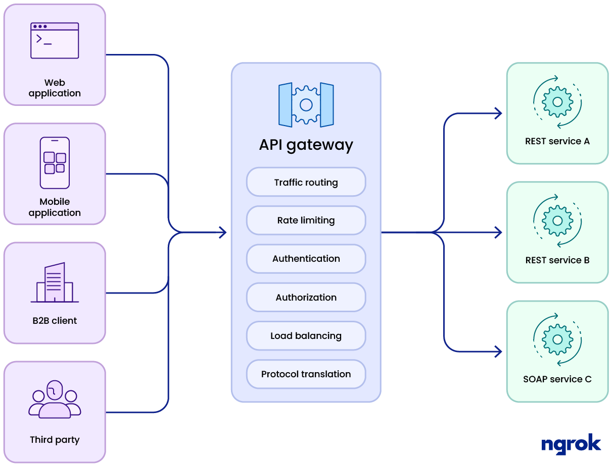

# API Gateway

Um Gateway da API é um componente de rede que funciona entre o cliente e os serviços de backend.
Em vez de se comunicar diretamente com seu backend, os clientes enviam suas chamadas apenas para o gateway da API. (*Comunicação indireta*)

<figure markdown="span">
  
</figure>

Lá, as solicitações recebidas podem ser processadas diretamente ou encaminhadas para os serviços subjacentes.
Dentre os serviços realizados por um gateway estão:

- Autenticação
- Controle de acesso
- Roteamento
- Balanceamento de carga
- Rate Limit
- Cache
- Monitoramento
- Monetização

O projeto de gateway que vamos usar como [exemplo](../../static/gateway.zip){:download="gateway"} tem a seguinte estrutura de pastas

```
├── docker-compose.yml
├── gateway/
│   ├── internal/
│   ├── main.go
│   └── Dockerfile
└── mockapi/
    ├── main.go
    └── Dockerfile
```

Para subir a estrutura de containers utilize

```bash
docker-compose up --build
```

Mande a requisição para o Gateway, ou várias requisições...

```bash
curl http://localhost:8000/

for i in {1..6}; do curl -i http://localhost:8000/; done
```

## Load Balancer (Balanceamento de Carga)

Distribui requisições entre múltiplos servidores backend, melhorando desempenho e tolerância a falhas.
Estratégias comuns
- Round-Robin (usada aqui)
- Least Connections
- Hash de IP

### Implementação em Go Round-Robin

```go
type LoadBalancer struct {
  servers []string
  index   int
  mutex   sync.Mutex
}

func (lb *LoadBalancer) NextServer() string {
  lb.mutex.Lock()
  defer lb.mutex.Unlock()
  server := lb.servers[lb.index]
  lb.index = (lb.index + 1) % len(lb.servers)
  return server
}
```


### Implementação em Go com Least Connections
```go
func getLeastConnBackend() string {
	mu.Lock()
	defer mu.Unlock()

	least := ""
	minConn := int(^uint(0) >> 1)

	for _, b := range backends {
		if failures[b] >= maxFailures {
			continue
		}
		if connCounts[b] < minConn {
			minConn = connCounts[b]
			least = b
		}
	}
	return least
}
```

## Circuit Breaker

É um padrão de resiliência que evita que requisições sejam continuamente enviadas para um serviço que está falhando, como se fosse um "disjuntor" elétrico.
Quando um backend apresenta falhas repetidas, o circuit breaker "desarma", impedindo temporariamente novas tentativas.

- Evita sobrecarga do serviço com falha.
- Reduz o tempo de espera no lado do cliente.
- Dá tempo para o serviço se recuperar.

### Implementação

```go
type CircuitBreaker struct {
    Failures   int           // contador de falhas
    LastFailed time.Time     // última vez que falhou
    Tripped    bool          // está aberto? (desarmado)
}
```

Se o número de falhas exceder um limite (`failureThreshold`), o circuito "abre" por um tempo (`breakerTimeout`).
Cada host possuí um breaker, é controlado por um mutex para segurança em concorrência (bMutex).

Um mutex (abreviação de mutual exclusion, ou exclusão mútua) é um mecanismo de sincronização usado para evitar condições de corrida (race conditions) em sistemas com concorrência, como em programas com múltiplas goroutines em Go.
Imagine que várias goroutines estão acessando ou modificando uma variável ao mesmo tempo. Se não houver controle, os dados podem se corromper.

O mutex serve como um cadeado:
- Apenas uma goroutine de cada vez pode "trancar" e acessar o recurso protegido.
- As outras goroutines esperam até que o recurso seja liberado.


## Rate Limiting

Limita o número de requisições permitidas por IP em um intervalo de tempo.

- Proteger contra abuso e ataques DDoS.
- Melhorar estabilidade dos serviços backend.

### Implementação

```go
if !exists || now.Sub(visitor.LastSeen) > rateWindow {
  visitors[ip] = &Visitor{LastSeen: now, Count: 1}
  return true
}
```

Se o IP não existe ainda, ele entra pela primeira vez com contador 1.
Se o IP já existe, mas o tempo desde o último acesso (now.Sub(visitor.LastSeen)) passou de 1 minuto, então:
- A contagem é reiniciada para 1
- O tempo (LastSeen) é atualizado para agora
- E ele é permitido novamente

Se um IP exceder o número máximo de requisições no intervalo configurado, o acesso é negado com `429 Too Many Requests`.


O problema é que esse mapa pode crescer muito com o tempo, para isso podemos utilizar duas estratégias... usar um `garbage collector` para limpar o mapa de tempo em tempo, ou usar um sistema de TTL(*time to live*)

```go
go func() {
  for {
      time.Sleep(10 * time.Minute)
      vMutex.Lock()
      for ip, v := range visitors {
          if time.Since(v.LastSeen) > 10*time.Minute {
              delete(visitors, ip)
          }
      }
      vMutex.Unlock()
  }
}()
```

Implementado acima ficou o `garbage collector`, abaixo vou mostrar uma forma de como implementar o TTL. Adicione o go-cache

```go
go get github.com/patrickmn/go-cache
```

A implementação do `ratelimiter.go` seria a seguinte

```go
package internal

import (
	"net"
	"net/http"
	"strings"
	"time"

	"github.com/patrickmn/go-cache"
)

type Visitor struct {
	Count int
}

var rateLimiter = cache.New(1*time.Minute, 2*time.Minute)

const rateLimit = 5

func GetIP(remoteAddr string) string {
	ip, _, _ := net.SplitHostPort(remoteAddr)
	return ip
}

func Allow(ip string) bool {
	if x, found := rateLimiter.Get(ip); found {
		visitor := x.(Visitor)
		if visitor.Count >= rateLimit {
			return false
		}
		visitor.Count++
		rateLimiter.Set(ip, visitor, cache.DefaultExpiration)
		return true
	}

	rateLimiter.Set(ip, Visitor{Count: 1}, cache.DefaultExpiration)
	return true
}
```

| Item                      | Descrição                                                                   |
| ------------------------- | --------------------------------------------------------------------------- |
| `cache.New(ttl, cleanup)` | Cria um cache com TTL automático para cada item.                            |
| `rateLimiter.Set()`       | Adiciona ou atualiza a contagem por IP.                                     |
| `rateLimiter.Get()`       | Tenta recuperar o IP já armazenado.                                         |
| Expiração automática      | Depois de 1 minuto sem nova requisição, o IP some do cache automaticamente. |


Em `proxy.go` adicionamos o uso..

```go
ip := GetIP(r.RemoteAddr)
if !Allow(ip) {
	http.Error(w, "Rate limit excedido", http.StatusTooManyRequests)
	return
}
```