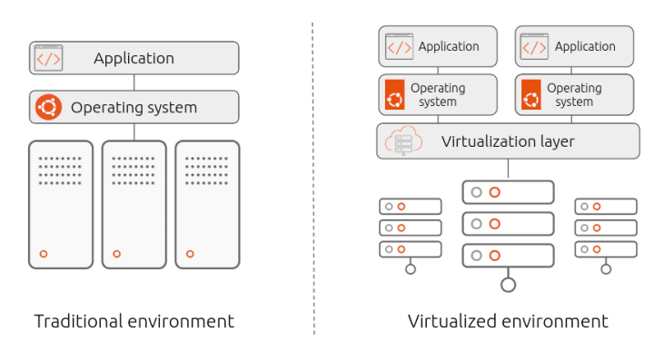
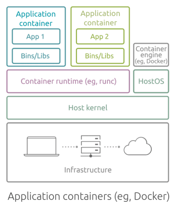

# Infraestrutura em Sistemas Distribuídos

Com o avanço dos modelos de computação distribuída, desde os sistemas primitivos até os contemporâneos, houve uma mudança significativa na forma como os recursos computacionais são utilizados. Inicialmente, sistemas utilizavam máquinas físicas dedicadas, exigindo configurações manuais e alto custo de manutenção.

À medida que os sistemas se tornaram mais heterogêneos e dinâmicos — impulsionados por paradigmas como a computação em nuvem, pervasiva e ubíqua emergiu a necessidade de abstrair ainda mais a infraestrutura subjacente.

## Virtualização

Em vez de usar um único sistema físico para cada tarefa, a tecnologia de virtualização permite dividir o hardware em várias máquinas virtuais (VMs) que operam como sistemas independentes, com seu próprio sistema operacional e aplicações.
Cada VM compartilha os recursos do hardware físico, mas opera de forma isolada das demais.

<!--{ align=left }-->

<figure markdown="span">
  
</figure>

Para gerênciar várias máquinas virtuais existe uma camada chamada `hypervisor`, como por exemplo, VirtualBox, VMwere, KVM. O Hipervisor é responsável dimensionar a máquina virtual, fornecer acesso, iniciar e desligar vms... entre outras tarefas.

Existem dois tipos principais de Hypervisors:

- Hosted: são softwares instalados na máquina, e dependem de um sistema operacional, como VMWare e VirtualBox.
- BareMetal: esses softwares rodam diretamente no hardware do host, tendo um controle do host em mais baixo nível... VMware ESXi, Microsoft Hyper-V, and Citrix XenServer.

  

#### Vantagens da Virtualização

- Isolamento total: Cada VM opera de forma independente, com seu próprio sistema operacional, garantindo segurança e isolamento total.
- Compatibilidade: Permite rodar múltiplos sistemas operacionais no mesmo hardware, como Windows e Linux.
- Facilidade de migração: As VMs podem ser facilmente migradas entre servidores físicos, facilitando o balanceamento de carga e a recuperação de desastres.
- Ambientes robustos e estáveis: Cada VM possui seus próprios recursos alocados, tornando-as adequadas para aplicações pesadas.
  

  

#### Desvantagens da Virtualização

- Consumo de recursos: Cada VM carrega um sistema operacional completo, o que consome mais memória e processamento.
- Inicialização mais lenta: Devido ao sistema operacional independente, o tempo de inicialização das VMs tende a ser mais lento.
- Overhead do hypervisor: O hypervisor consome recursos do sistema físico, o que pode reduzir a eficiência em comparação com contêineres.
  

<!--
Lembrar de falar que a virtualização divide os recursos, memoria, disco e cpu, sendo que os sistemas são isolados um do outro apesar de compartilhar o hardware.
Exemplo EC2 da amazon
-->

## Conteinerização

A conteinerização é uma tecnologia que permite empacotar um aplicativo e suas dependências em um "container", que é um ambiente isolado, mais leve e que roda em cima do sistema operacional.

A conteinerização compartilha o kernel do sistema operacional do host com múltiplos containers, usando recursos nativos. Cada container é uma instância isolada do ambiente necessário para o aplicativo, incluindo dependências e bibliotecas, mas sem precisar de um sistema operacional completo sendo mais leve que a virtualização.

<figure markdown="span">
  
</figure>

  

#### Vantagens da Conteinerização

- Portabilidade: Aplicações podem ser executadas de forma consistente em diferentes ambientes.
- Isolamento: Contêineres são isolados, reduzindo conflitos entre dependências.
- Eficiência: Contêineres são leves em comparação com máquinas virtuais, economizando recursos.
- Escalabilidade: Fácil replicação e escalabilidade horizontal.
  

  

#### Desvantagens da Conteinerização

- Complexidade: Configurações complexas podem ser desafiadoras para iniciantes.
- Persistência de Dados: Contêineres são efêmeros por padrão; gerenciar dados persistentes requer configuração adicional.
- Segurança: Embora isolados, contêineres compartilham o mesmo kernel do sistema operacional host, o que pode representar um risco de segurança em algumas situações.
  

|       **Aspecto**      |               **Virtualização**               |               **Containerização**               |
|:----------------------:|:---------------------------------------------:|:-----------------------------------------------:|
| Isolamento             | Completo com SO próprio                       | Compartilhamento do kernel do host              |
| Consumo de Recursos    | Alto, devido ao SO completo                   | Baixo, devido ao compartilhamento do kernel     |
| Inicialização          | Mais lento                                    | Mais rápido                                     |
| Portabilidade          | Boa, depende dos hypervisors                  | Muito alta, independente de infraestrutura      |
| Escalabilidade         | Escalável, mas com overhead maior             | Facilmente escalável, ideal para microsserviços |
| Segurança              | Maior isolamento                              | Isolamento limitado                             |
| Uso ideal              | Aplicações pesadas, múltiplos SOs             | Microsserviços, aplicações leves e portáveis    |

---

https://ubuntu.com/blog/containerization-vs-virtualization

https://stackoverflow.com/questions/75907472/docker-desktop-does-not-launch-on-ubuntu-failed-to-start-docker-desktop-service

https://www.youtube.com/watch?v=Ud7Npgi6x8E