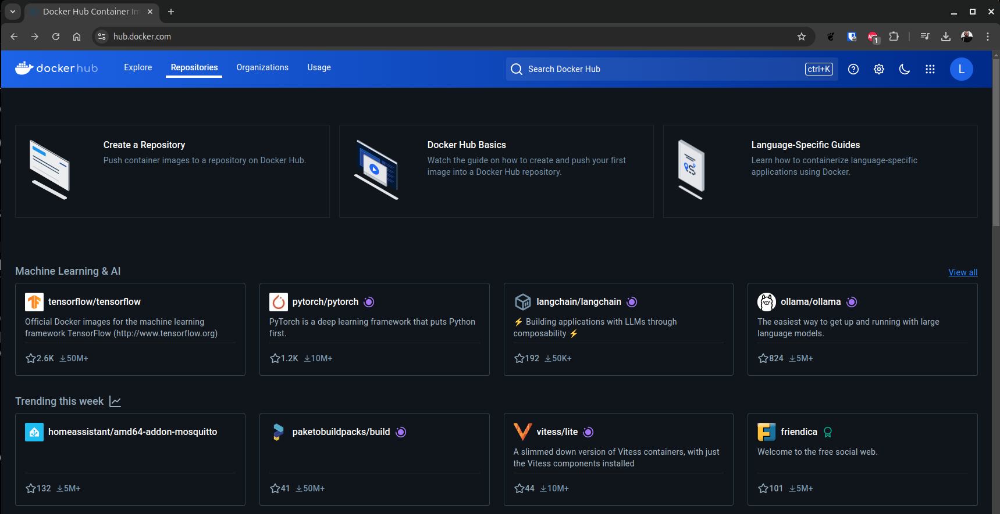
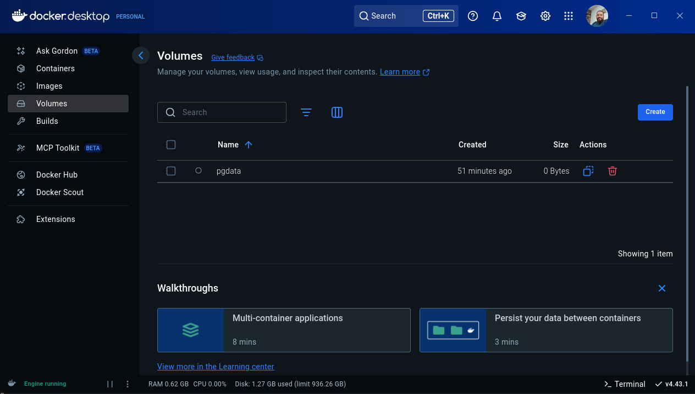
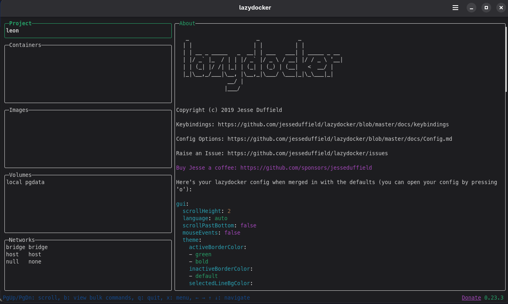

# Docker

{ width=200 align=left}

Docker é uma plataforma open source que automatiza a implantação, escalabilidade e execução de aplicações dentro de contêineres.

Contêineres são ambientes isolados e portáteis que contêm tudo o que uma aplicação precisa para funcionar, incluindo bibliotecas, dependências e configurações.

<!-- <figure markdown="span">
  { width=300 }
</figure> -->

<br/>


## Arquitetura

A arquitetura do docker pode ser dividida em três componentes principais mostrados na imagem  abaixo.

<figure markdown="span">
  
</figure>

!!! info "Arquitetura"

    === "**Cliente**"
        O cliente é o ponto de interação do usuário com o Docker, geralmente por meio da linha de comando. Esses comandos são enviados ao Docker Daemon via API, os comandos são convertidos para chamadas da api.

        - docker run: Executa um container com base em uma imagem.
        - docker build: Cria uma nova imagem a partir de um Dockerfile.
        - docker pull: Baixa uma imagem de um repositório (Registry).

    === "**Host**"
        O docker host é o ambiente de execução do docker sendo o Daemon um serviço que gerência as `imagens` e `containers`. Quando uma imagem é "executada", o Docker a transforma em um container em uma instância isolada para execução.

    === "**Registry**"
        O Docker Registry é um repositório de imagens podendo ser público ou privado


## Instalação

O [`Docker`](https://docs.docker.com/) está disponível para vários SO's, entre os principais sistemas operacionais da atualidade o Docker fornece uma forma de instalação. Para linux as principais distros possuem o repositório oficial disponível para instalação.
<!--
$ sudo sysctl -w kernel.apparmor_restrict_unprivileged_userns=0
$ systemctl --user restart docker-desktop


sudo usermod -aG docker $USER
ls -la /var/run/docker.sock

systemctl status docker
sudo systemctl start docker
sudo systemctl restart docker


sudo apt-get install docker-ce docker-ce-cli containerd.io docker-buildx-plugin docker-compose-plugin
-->

## Primeiro Container

Execute o seguinte comando:

```shell
docker run hello-world
```

```asciinema-player
{
    "file": "../assets/sd/docker_hello.cast",
    "mkap_theme": "none",
    "auto_play": false
}
```

## Docker Hub

[Docker Hub](https://hub.docker.com){:target="_blank"} é um registro de containers (container registry) hospedado pela própria Docker Inc. É o ponto de partida padrão quando você executa comandos como `docker pull` ou `docker run`.

<figure markdown="span">
  
</figure>

<div align="center" markdown="1">
| Funcionalidade            | Descrição                                                                        |
| ------------------------- | -------------------------------------------------------------------------------- |
| **Imagens oficiais**      | Repositórios mantidos por empresas ou pela própria Docker (ex: `nginx`, `mysql`) |
| **Repositórios públicos** | Qualquer usuário pode criar e compartilhar uma imagem abertamente.               |
| **Repositórios privados** | Para projetos privados ou internos. Contas gratuitas têm limite.                 |
| **Tags e versões**        | Cada imagem pode ter várias versões (`latest`, `v1.0`, etc.)                     |
| **Automated Builds**      | Integra com GitHub/GitLab para build automático de imagens.                      |
| **Webhooks**              | Aciona ações externas após o push de uma imagem.                                 |
</div>

## Programa ASCII text

Para exemplificar vamos criar um programa que converte texto para ASCII text, usando o figlet. Crie um arquivo chamado `ascii.sh`

```shell
#!/bin/bash

TEXTO=("Arise, arise, riders of Rohan!
Fell deeds awake, fire and slaughter!
Spear shall be shaken, shield be splintered!
A sword-day, a red day, ere the sun rises!
Ride now, ride now, ride to Gondor!")

figlet -w 200 -f big "$TEXTO"
```

Esse é nosso programa, um arquivo simples `.sh` que usa o programa `figlet`. Para executar localmente é necessário instalar esse programa manualmente. Pensando no contexto de utilização, um programa pode conter diversas bibliotecas e configurações para seu funcionamento.
Para isso criamos um `Dockerfile`.

### Dockerfile

O `Dockerfile` é o ponto de entrada de um container docker, é onde a imagem e toda a lógica do container são definidos. Neste [arquivo](https://docs.docker.com/reference/dockerfile/) definimos as etapas para criação de um container.

- FROM: define a imagem base do container.
- WORKDIR: define o diretório de trabalho dentro do container.
- COPY: copia arquivos do sistema de arquivos host para o sistema de arquivos do container.
- RUN: executa comandos no container durante o processo de build.
- EXPOSE: informa qual porta o serviço do container vai escutar
- CMD: define o comando padrão que será executado quando o contêiner for iniciado. Diferente de RUN, que é executado durante o build, CMD é executado quando o contêiner já está rodando.


```shell
FROM ubuntu:latest
RUN apt update && apt install -y figlet wget
RUN wget -P /usr/share/figlet http://www.jave.de/figlet/fonts/details/big.flf
COPY ascii.sh /ascii.sh
RUN chmod +x /ascii.sh
CMD ["/ascii.sh"]
```

Com esse arquivo pronto vamos montar essa imagem.

### Build image

O comando `docker build` é usado para criar uma imagem Docker a partir de um Dockerfile. A imagem é uma representação em camadas do sistema de arquivos que será utilizado pelos containers. A nomenclatura do comando `docker build` é a seguinte

```bash
docker build [opções] <contexto>
```

O contexto é o diretório no qual o Docker irá buscar o Dockerfile e os arquivos referenciados por ele. Pode ser . (diretório atual) ou um caminho relativo/absoluto.

Em opções temos uma lista de parâmetros que podem ser utilizados

<div align="center" markdown="1">
| Parâmetro       | Descrição                                                                                              |
| --------------- | ------------------------------------------------------------------------------------------------------ |
| `-t` ou `--tag` | Define uma **tag**(*nome*) para a imagem. Ex: `-t myapp:latest`                                        |
| -f              |	Especifica o caminho do Dockerfile se ele não estiver no diretório padrão. Ex: -f Dockerfile.dev       |
| `--no-cache`    | Ignora o cache e força a reconstrução de todas as camadas                                              |
| `--build-arg`   | Permite passar argumentos de build definidos via `ARG` no Dockerfile                                   |
| `--target`      | Define o alvo de uma **multi-stage build**                                                             |
| `--progress`    | Controla a exibição do progresso (`auto`, `plain`, `tty`)                                              |
| `--platform`    | Define a plataforma (arquitetura) para a imagem: `linux/amd64`, `linux/arm64`, etc.                    |
</div>

Por exemplo o comando abaixo cria uma imagem com a tag ascii e o arquivo `Dockerfile` e demais arquivos necessários se encontram na pasta atual.

```shell
docker build -t "ascii" .
```

Ou trabalhar com versões (*melhor prática*)

```bash
docker build -t "ascii:v0.0.2" .
```

### Dockerfile Camadas

O Docker divide o Dockerfile em camadas. Cada instrução (FROM, RUN, COPY, etc.) gera uma nova camada e essas camadas utilizam cache para acelerar builds futuras.

Sempre que uma das camadas é alterada as camadas subsequentes são reconstruídas. Durante o docker build, o Docker:

- Avalia se a instrução já foi executada antes com os mesmos inputs, se sim, ele reutiliza a camada anterior do cache.
- O Docker detecta mudanças nos arquivos e invalida o cache das camadas afetadas, quando isso ocorre ele executa essa instrução novamente e todas as seguintes.

Uso de `.dockerignore`, melhora performance e impede que arquivos desnecessários entrem no contexto. Devemos organizar comandos que são modificados com pouca frequência no começo do arquivo quando possível.

```bash
# Ignora a pasta node_modules (dependências locais)
node_modules/
venv/

# Ignora arquivos de log
*.log

# Ignora arquivos temporários do sistema
*.swp
*.tmp

# Ignora diretórios de testes
tests/
__pycache__/

# Ignora arquivos de configuração e IDEs
.vscode/
.idea/
.env

# Ignora o próprio .dockerignore e Dockerfile se necessário (opcional)
.dockerignore
Dockerfile.dev
Dockerfile.prod
Dockerfile.test

# Ignora arquivos de build locais
dist/
build/
```

### Docker run

O comando docker run é usado para executar um container a partir de uma imagem Docker.

```bash
docker run [opções] <imagem> [comando]
```

<div align="center" markdown="1">
| Opção       | Descrição                                                 |
| ----------- | --------------------------------------------------------- |
| `-d`        | Executa o container em **modo background** (detached)     |
| `-it`       | **Interativo** com terminal (útil para bash, etc.)        |
| `--rm`      | Remove o container automaticamente ao final               |
| `--name`    | Define um **nome personalizado** para o container         |
| `-p`        | Faz o **mapeamento de portas** (ex: `-p 8080:80`)         |
| `-v`        | Faz o **mapeamento de volumes** (ex: `-v $(pwd):/app`)    |
| `-e`        | Define **variáveis de ambiente** (ex: `-e NODE_ENV=prod`) |
| `--network` | Define a rede a ser usada pelo container                  |
| `--restart` | Política de reinício (`no`, `always`, `on-failure`)       |
</div>

Não precisamos executar o `run` toda vez... quando temos um container podemos iniciar usando `docker start`:

<div align="center" markdown="1">
| Comando        | Descrição                                                 |
| -------------- | --------------------------------------------------------- |
| `docker run`   | Cria e inicia um **novo container** baseado em uma imagem |
| `docker start` | Inicia um **container existente parado**                  |
</div>


Vamos usar a imagem que criamos anteriormente

```shell
docker run ascii:latest
```

## Postgresql

Imagine poder trabalhar com uma instalação isolada do banco de dados, seja para testes ou desenvolvimento. O PostgreSQL pode ser executado como um docker container, assim como diversos outros serviços existe uma imagem oficial do docker disponível para download no docker hub.

```bash
docker run -d \
  --name postgres-container \
  -e POSTGRES_USER=postgres \
  -e POSTGRES_PASSWORD=postgres \
  -e POSTGRES_DB=meubanco \
  -p 5432:5432 \
  postgres:latest
```

<div align="center" markdown="1">
| Parâmetro        | Função                               |
| ---------------- | ------------------------------------ |
| `-d`             | Executa em segundo plano             |
| `--name`         | Nome do container                    |
| `-e`             | Define variáveis de ambiente         |
| `-p`             | Mapeia a porta 5432 para o host      |
| `postgres:latest`| Imagem oficial com a versão desejada |
</div>

Podemos conectar ao banco de dados utilizando

```bash
docker exec -it postgres-container psql -U postgres -d meubanco
```

### Volumes

O docker permite criar volumes de dados, imagine como se fosse uma unidade de disco para os containers, (*na verdade é só uma pasta*). Essa unidade é persistente e mesmo que o container seja removido ela continua a existir e pode ser mapeada por outros containers.

```bash
docker volume create pgdata
```

Para usar um volume utilizamos

```bash
docker run -d \
  --name postgres-container \
  -e POSTGRES_USER=postgres \
  -e POSTGRES_PASSWORD=postgres \
  -e POSTGRES_DB=meubanco \
  -v pgdata:/var/lib/postgresql/data \
  -p 5432:5432 \
  postgres:latest
```

Podemos fazer e restaurar backups diretamente do host


```bash
docker exec -t postgres-container pg_dump -U meuusuario meubanco > backup.sql
```

```bash
cat backup.sql | docker exec -i postgres-container psql -U meuusuario -d meubanco
```

### Redes no Docker

O Docker cria automaticamente algumas redes padrão, mas você também pode criar redes personalizadas para maior controle.

| Tipo de Rede | Descrição                                                                                                                          |
| ------------ | ---------------------------------------------------------------------------------------------------------------------------------- |
| `bridge`     | **Padrão para containers standalone**. Cada container recebe um IP interno. Comunicação entre containers na mesma rede é possível. |
| `host`       | O container compartilha a pilha de rede do host. **Sem isolamento de IP.**                                                         |
| `none`       | O container não tem acesso à rede. Útil para segurança ou teste.                                                                   |
| `overlay`    | Permite comunicação entre containers em **hosts diferentes**, geralmente usado com Docker Swarm.                                   |
| `macvlan`    | Atribui um endereço MAC diretamente ao container. Ele se comporta como um dispositivo físico na rede.                              |


Quando você cria um container, ele é conectado por padrão a uma rede bridge chamada bridge:
- Docker cria uma interface de rede virtual (veth) conectando o container ao host.
- O container recebe um IP interno, roteado por NAT.
- Você pode expor portas com `-p` ou `--publish` para acesso externo.

```sh
docker run -d --name meu_app -p 8080:80 nginx
```

!!! warning "Importante"
    O container meu_app escuta na porta 80 internamente, enquanto o host escuta na porta 8080 e redireciona para o container. Os containers podem se comunicar pelo nome (DNS interno do Docker resolve container1).

## Docker Compose

O Docker Compose é uma ferramenta que facilita a definição e o gerenciamento de aplicações multi-container no Docker. Ele permite que você defina todos os serviços, redes e volumes de sua aplicação em um arquivo YAML `docker-compose.yml`.

Vamos utilizar nossa api e criar um `docker-compose.yaml` na pasta raiz da api junto ao Dockerfile.

```shell
docker-compose up --build // ou down
```

Exemplo de um `docker-compose.yaml`

```yaml
version: '3.8'
services:
  api:
    build: .
    container_name: api
    ports:
      - "3000:3000"
    environment:
      - DB_HOST=postgres
      - DB_PORT=5432
      - DB_USER=postgres
      - DB_PASSWORD=${POSTGRES_PASSWORD}
      - DB_NAME=api
    depends_on:
      - postgres
    networks:
      - api-network

  postgres:
    image: postgres:16
    container_name: postgres-db
    environment:
      POSTGRES_USER: postgres
      POSTGRES_PASSWORD: ${POSTGRES_PASSWORD}
      POSTGRES_DB: api
    ports:
      - "5000:5432"
    volumes:
  - postgres-data:/var/lib/postgresql/data
    networks:
      - api-network

networks:
  api-network:
    driver: bridge
volumes:
  postgres-data:
```

<div align="center" markdown="1">
| Seção      | Campo            | Valor / Descrição                        | Explicação                                                                                              |
| ---------- | ---------------- | ---------------------------------------- | ------------------------------------------------------------------------------------------------------- |
| `version`  | `'3.8'`          | Formato da versão do Compose             | Compatível com Docker moderno, usado para definir sintaxe e recursos disponíveis                        |
| `services` | `api`            | Serviço da aplicação (container da API)  | Define a aplicação principal que será construída localmente                                             |
|            | `build`          | `.`                                      | Usa o `Dockerfile` no diretório atual para construir a imagem da API                                    |
|            | `container_name` | `api`                                    | Nome fixo do container da API                                                                           |
|            | `ports`          | `"3000:3000"`                            | Mapeia a porta 3000 do host para a porta 3000 do container (acesso à API via navegador ou cliente HTTP) |
|            | `environment`    |                                          | Define variáveis de ambiente consumidas pela API (credenciais de acesso ao banco)                       |
|            |                  | `DB_HOST=postgres`                       | A API se conecta ao banco com o nome do serviço `postgres`                                              |
|            |                  | `DB_PORT=5432`                           | Porta padrão do PostgreSQL                                                                              |
|            |                  | `DB_USER=postgres`                       | Usuário do banco                                                                                        |
|            |                  | `DB_PASSWORD=${POSTGRES_PASSWORD}`       | Senha vinda do arquivo `.env`                                                                           |
|            |                  | `DB_NAME=api`                            | Nome do banco                                                                                           |
|            | `depends_on`     | `postgres`                               | Garante que o container do banco suba antes da API (mas não espera o banco estar pronto)                |
|            | `networks`       | `api-network`                            | Conecta a API à rede privada do Compose para comunicação entre containers                               |
| `services` | `postgres`       | Serviço do banco de dados PostgreSQL     |                                                                                                         |
|            | `image`          | `postgres:16`                            | Usa a imagem oficial do PostgreSQL versão 16                                                            |
|            | `container_name` | `postgres-db`                            | Nome fixo do container do banco                                                                         |
|            | `environment`    |                                          | Define variáveis internas do PostgreSQL para criar o usuário, banco e senha                             |
|            | `ports`          | `"5000:5432"`                            | Mapeia a porta 5432 do banco para a porta 5000 do host                                                  |
|            | `volumes`        | `postgres-data:/var/lib/postgresql/data` | Volume persistente para armazenar os dados do banco                                                     |
|            | `networks`       | `api-network`                            | Mesmo que a API: permite comunicação privada entre containers                                           |
| `networks` | `api-network`    | `driver: bridge`                         | Cria uma rede virtual isolada para os serviços                                                          |
| `volumes`  | `postgres-data`  | Volume nomeado                           | Armazena os dados do banco de forma persistente no host, mesmo que o container seja recriado            |
</div>


### .env

Não é seguro deixar credenciais expostas em um dockerfile ou docker-compose, para isso podemos utilizar um arquivo `.env` (*na mesma pasta do docker-compose.yml*) que pode ser criado de forma segura utilizando secrets por exemplo.

```bash
# .env
POSTGRES_USER=meuusuario
POSTGRES_PASSWORD=senha123
POSTGRES_DB=meubanco
```

<div align="center" markdown="1">
| Comando                              | Ação                                                  |
| ------------------------------------ | ----------------------------------------------------- |
| `docker-compose up`                  | Sobe todos os containers                              |
| `docker-compose up -d`               | Sobe em background                                    |
| `docker-compose down`                | Derruba e remove containers, redes e volumes anônimos |
| `docker-compose logs`                | Mostra os logs dos serviços                           |
| `docker-compose exec <serviço> bash` | Acessa o terminal de um container                     |
| `docker-compose ps`                  | Lista containers em execução                          |
| `docker-compose stop/start`          | Para ou inicia serviços já criados                    |
</div>


## Outros Commandos

Segue uma lista de comandos do docker para referência.

!!! info "Comandos úteis"

    === "**Help**"
        Lista comandos do docker e outras informações
        ```bash
        docker --help
        ```
    === "**Logs**"
        Logs do container
        ```bash
        docker logs <container-id>
        ```
    === "**Acessar container**"
        Logs do container
        ```bash
        docker exec -it <container-id> /bin/bash
        ```
    === "**Docker cp**"
        Copiar arquivos de dentro do container
        ```bash
        docker cp <origem> <destino>

        #Container para Host
        docker cp postgres-container:/var/log/postgresql/postgresql.log ./meus-logs/

        #Host para container
        docker cp ./backup.sql postgres-container:/tmp/backup.sql
        ```
    === "**Listar Imagens**"
        Listar imagens
        ```shell
        docker images
        ```
    === "**Listar Containers**"
        Listar Containers
        ```shell
        docker ps
        ```

!!! info "Comandos úteis pt 2"

    === "**docker daemon**"
        Iniciar, reiniciar e Parar o service do Docker
        ```shell
        sudo systemctl start docker
        sudo systemctl restar docker
        sudo systemctl stop docker
        ```
    === "**Reiniciar o compose**"
        Reinicia todos os containers de um docker-compose
        ```shell
        docker-compose restart
        ```
    === "**Deletar Containers**"
        Deletar os containers
        ```shell
        docker stop <container-id>
        docker rm <container-id>

        docker rm -f $(docker ps -a -q)
        ```
    === "**Deletar os volumes:**"
        Deletar todos os volumes:
        ```shell
        docker volume rm $(docker volume ls -q)
        ```

## Ferramentas Gráficas

O docker fornece uma ferramenta gráfica chamada [Docker Desktop](https://docs.docker.com/desktop/) para facilitar o gerenciamento do docker.




Outra ferramenta interessante é o [Lazydocker](https://github.com/jesseduffield/lazydocker), uma TUI(*terminal user interface*) para facilitar o gerenciamento do docker.

