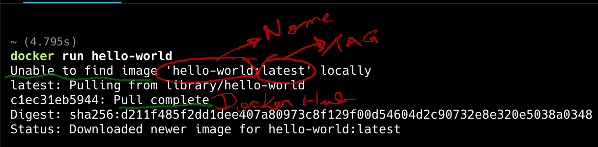

# Docker

{ width=200 align=left}

Docker é uma plataforma open source que automatiza a implantação, escalabilidade e execução de aplicações dentro de contêineres.

Contêineres são ambientes isolados e portáteis que contêm tudo o que uma aplicação precisa para funcionar, incluindo bibliotecas, dependências e configurações.

<!-- <figure markdown="span">
  { width=300 }
</figure> -->

<br/>

## Instalação

O [`Docker`](https://docs.docker.com/) para vários SO's, vamos trabalhar com [Linux](https://docs.docker.com/desktop/install/linux/),
nas máquinas do laboratório temos o Ubuntu instalado e o Docker está nos principais repositórios.

Instalando pré-requisitos:

```shell
sudo apt-get update
sudp apt-get install qemu-system-x86 pass
sudo apt-get install curl apt-transport-https ca-certificates software-properties-common
```

Adiciona a chave GPG, inserindo o comando a seguir:

```shell
curl -fsSL https://download.docker.com/linux/ubuntu/gpg | sudo apt-key add -
```

Agora, adicione o repositório executando este comando:

```shell
sudo add-apt-repository
  "deb [arch=amd64] https://download.docker.com/linux/ubuntu $(lsb_release -cs) stable"
```

Depois disso, atualize a informação do repositório

```shell
sudo apt update
```

Garanta que você está instalando a partir do repositório do Docker, ao invés do repositório padrão do Ubuntu ao usar este comando:

```shell
apt-cache policy docker-ce
```

A saída correta vai ficar como o texto a seguir, com diferentes números de versões:

```shell
docker-ce:
   Installed: (none)
   Candidate: 16.04.1~ce~4-0~ubuntu
   Version table:
       16.04.1~ce~4-0~ubuntu 500
            500 https://download.docker.com/linux/ubuntubionic/stableamd64packages
```

Após o processo anterior ter sido executado instale utilizando o repositório:

```shell
sudo apt install docker-ce
```

No Ubuntu server apenas o comando abaixo é suficiente:

```shell
sudo apt install docker.io
```

E para verificar a instalação

```shell
sudo systemctl status docker
```

Para instalar Docker Desktop, baixe o arquivo em [Deb package](https://desktop.docker.com/linux/main/amd64/docker-desktop-amd64.deb) Se você estiver em uma distro baseada no Debian.

E em seguida entre na pasta onde o arquivo foi baixado:

```shell
 cd ~/Downloads
 chmod +x docker-desktop-amd64.deb
```

Atualize os repositórios e depois instale o package .deb

```shell
 sudo dpkg -i ./docker-desktop-amd64.deb
```

<!--
$ sudo sysctl -w kernel.apparmor_restrict_unprivileged_userns=0
$ systemctl --user restart docker-desktop


sudo usermod -aG docker $USER
ls -la /var/run/docker.sock

systemctl status docker
sudo systemctl start docker
sudo systemctl restart docker


sudo apt-get install docker-ce docker-ce-cli containerd.io docker-buildx-plugin docker-compose-plugin
-->

## Primeiro Container

Execute o seguinte comando:

```shell
docker run hello-world
```

<figure markdown="span">
  
</figure>


## Docker Hub

[Docker Hub](https://hub.docker.com){:target="_blank"} é um registro de containers (container registry) hospedado pela própria Docker Inc. É o ponto de partida padrão quando você executa comandos como `docker pull` ou `docker run`.

<figure markdown="span">
  
</figure>

```sh
# Buscar uma imagem do Docker Hub
docker pull nginx

# Executar diretamente a imagem
docker run -d -p 8080:80 nginx

# Verificar a imagem local
docker images

# Login (necessário para push)
docker login

# Enviar imagem para seu repositório
docker tag minha-imagem usuario/minha-imagem:v1
docker push usuario/minha-imagem:v1
```

| Funcionalidade            | Descrição                                                                        |
| ------------------------- | -------------------------------------------------------------------------------- |
| **Imagens oficiais**      | Repositórios mantidos por empresas ou pela própria Docker (ex: `nginx`, `mysql`) |
| **Repositórios públicos** | Qualquer usuário pode criar e compartilhar uma imagem abertamente.               |
| **Repositórios privados** | Para projetos privados ou internos. Contas gratuitas têm limite.                 |
| **Tags e versões**        | Cada imagem pode ter várias versões (`latest`, `v1.0`, etc.)                     |
| **Automated Builds**      | Integra com GitHub/GitLab para build automático de imagens.                      |
| **Webhooks**              | Aciona ações externas após o push de uma imagem.                                 |

## Dockerfile

O `Dockerfile` é o ponto de entrada de um container docker, é onde a imagem e toda a lógica do container são definidos. Neste [arquivo](https://docs.docker.com/reference/dockerfile/) definimos as etapas para criação de um container.

- FROM: define a imagem base do container.
- WORKDIR: define o diretório de trabalho dentro do container.
- COPY: copia arquivos do sistema de arquivos host para o sistema de arquivos do container.
- RUN: executa comandos no container durante o processo de build.
- EXPOSE: informa qual porta o serviço do container vai escutar
- CMD: define o comando padrão que será executado quando o contêiner for iniciado. Diferente de RUN, que é executado durante o build, CMD é executado quando o contêiner já está rodando.

Etapas do `container`

- Build da imagem: Ao executar `docker build -t nome-da-imagem .`, o Docker lê o Dockerfile, segue as instruções e cria uma imagem.
- Run da imagem: Quando você executa `docker run - 3000:3000 nome-da-imagem`, o Docker cria um contêiner a partir da imagem criada, mapeia a porta 3000 do host para a porta 3000 do contêiner, e executa o comando definido em CMD.

Crie um arquivo chamado `speech.sh`

```shell
#!/bin/bash

TEXTO=("Arise, arise, riders of Rohan!
Fell deeds awake, fire and slaughter!
Spear shall be shaken, shield be splintered!
A sword-day, a red day, ere the sun rises!
Ride now, ride now, ride to Gondor!")

figlet -w 500 -f doh "$TEXTO"
```

Após isso vamos criar um `Dockerfile`:

```shell
FROM ubuntu:latest

RUN apt update && apt install -y figlet wget
RUN wget -P /usr/share/figlet http://www.jave.de/figlet/fonts/details/doh.flf
COPY speech.sh /speech.sh
RUN chmod +x /speech.sh

CMD ["/speech.sh"]
```

Vamos criar a imagem:

```shell
docker build -t "ascii" .
```

<!--
- Usa a versão mais atual do ubuntu
- instala o wget e o figlet
- copia o script
- aplica permissões para o script
- Seta o default para roda o script
-->

E usar a imagem:

```shell
docker run ascii:latest
```

<!--
docker build -t "ascii:v0.0.2" .
-->

### API Node

Nesse exemplo vamos criar um container para uma API com javascript

```dockerfile
FROM node:16
# Define o diretório de trabalho
WORKDIR /app
# Copia o package.json
COPY package.json ./
RUN npm install
# Copia o código da aplicação
COPY . .
# Expomos uma porta
EXPOSE 3001

# Comando para iniciar o serviço
CMD ["npm", "start"]
```


#### Construir a imagem

```shell
docker build -t api .
```

#### Executar o container

```shell
docker run -d -p 3002:3001 api
```

!!! info "parâmetros"
    - `-d`: Executa o contêiner em modo "detached" (em segundo plano).
    - `-p 3002:3001`: Mapeia a porta do contêiner para a porta 3002 do seu host.
    - `nome-da-imagem`: Nome da imagem


#### Listar Containers

```shell
docker ps
```

#### Parar e Remover Containers

```shell
docker stop <container-id>
docker rm <container-id>
```

#### Ver logs

```shell
docker logs <container-id>
```

#### Acessar terminal

```shell
docker exec -it <container-id> /bin/bash
```


#### Dockerignore

Mas assim como temos arquivos que queremos ignorar no gitignore também seria necessário ignorar na imagem do container, por exemplo:
- .env
- node_modules/

Para isso existe o `.dockerignore` ele segue as mesmas regras do `.gitignore`.

```sh
node_modules
.env
```

## Redes no Docker

O Docker cria automaticamente algumas redes padrão, mas você também pode criar redes personalizadas para maior controle.

| Tipo de Rede | Descrição                                                                                                                          |
| ------------ | ---------------------------------------------------------------------------------------------------------------------------------- |
| `bridge`     | **Padrão para containers standalone**. Cada container recebe um IP interno. Comunicação entre containers na mesma rede é possível. |
| `host`       | O container compartilha a pilha de rede do host. **Sem isolamento de IP.**                                                         |
| `none`       | O container não tem acesso à rede. Útil para segurança ou teste.                                                                   |
| `overlay`    | Permite comunicação entre containers em **hosts diferentes**, geralmente usado com Docker Swarm.                                   |
| `macvlan`    | Atribui um endereço MAC diretamente ao container. Ele se comporta como um dispositivo físico na rede.                              |


Quando você cria um container, ele é conectado por padrão a uma rede bridge chamada bridge:
- Docker cria uma interface de rede virtual (veth) conectando o container ao host.
- O container recebe um IP interno, roteado por NAT.
- Você pode expor portas com `-p` ou `--publish` para acesso externo.

```sh
docker run -d --name meu_app -p 8080:80 nginx
```

O container meu_app escuta na porta 80 internamente, enquanto o host (máquina) escuta na porta 8080 e redireciona para o container.
Os containers podem se comunicar pelo nome (DNS interno do Docker resolve container1).

## Docker Compose

O Docker Compose é uma ferramenta que facilita a definição e o gerenciamento de aplicações multi-container no Docker.

Ele permite que você defina todos os serviços, redes e volumes de sua aplicação em um arquivo YAML (docker-compose.yml).

Vamos utilizar nossa api e criar um `docker-compose.yaml` na pasta raiz da api junto ao Dockerfile.

```shell
docker-compose up --build // ou down
```

Exemplo de um `docker-compose.yaml`

```yaml
version: '3.8'
services:
  api:
    build: .
    container_name: api
    ports:
      - "3000:3000"
    environment:
      - DB_HOST=postgres
      - DB_PORT=5432
      - DB_USER=postgres
      - DB_PASSWORD=masterkey
      - DB_NAME=api
    depends_on:
      - postgres
    networks:
      - api-network

  postgres:
    image: postgres:16
    container_name: postgres-db
    environment:
      POSTGRES_USER: postgres
      POSTGRES_PASSWORD: masterkey
      POSTGRES_DB: api
    ports:
      - "5000:5432"
    volumes:
  - postgres-data:/var/lib/postgresql/data
    networks:
      - api-network

networks:
  api-network:
    driver: bridge
volumes:
  postgres-data:
```

## Outros Commandos

Segue uma lista de comandos do docker para referência.

!!! info "Quais são os componentes de uma funcão"

    === "**Help**"
        Lista comandos do docker e outras informações
        ```shell
        docker --help
        ```
    === "**Listar**"
        Listar imagens
        ```shell
        docker images
        ```
    === "**docker daemon**"
        Iniciar, reiniciar e Parar o service do Docker
        ```shell
        sudo systemctl start docker
        sudo systemctl restar docker
        sudo systemctl stop docker
        ```
    === "**Reiniciar o compose**"
        Reinicia todos os containers de um docker-compose
        ```shell
        docker-compose restart
        ```
    === "**Deletar Containers**"
        Deletar os containers
        ```shell
        docker rm -f $(docker ps -a -q)
        ```
    === "**Deletar os volumes:**"
        Deletar todos os volumes:
        ```shell
        docker volume rm $(docker volume ls -q)
        ```