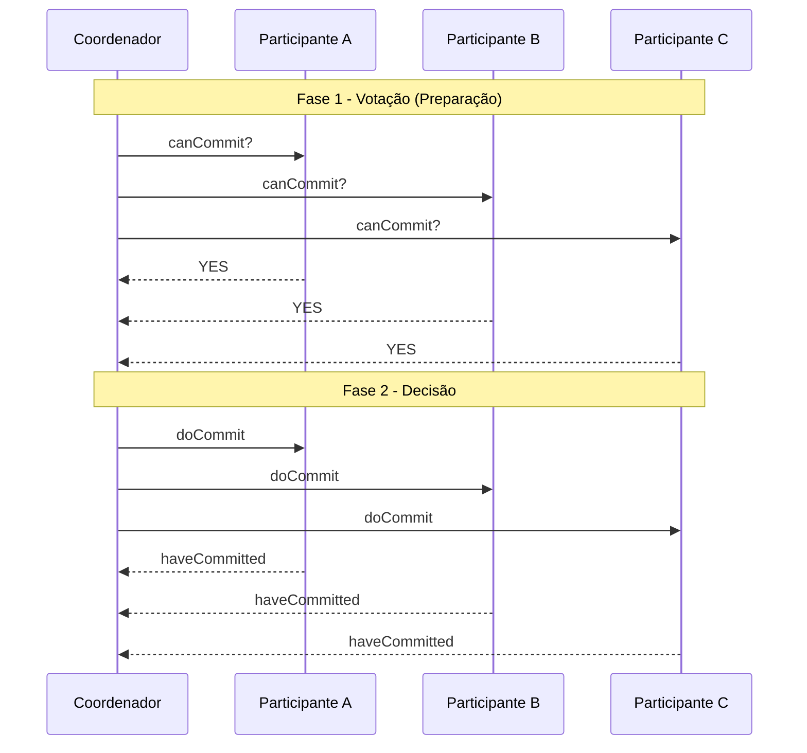
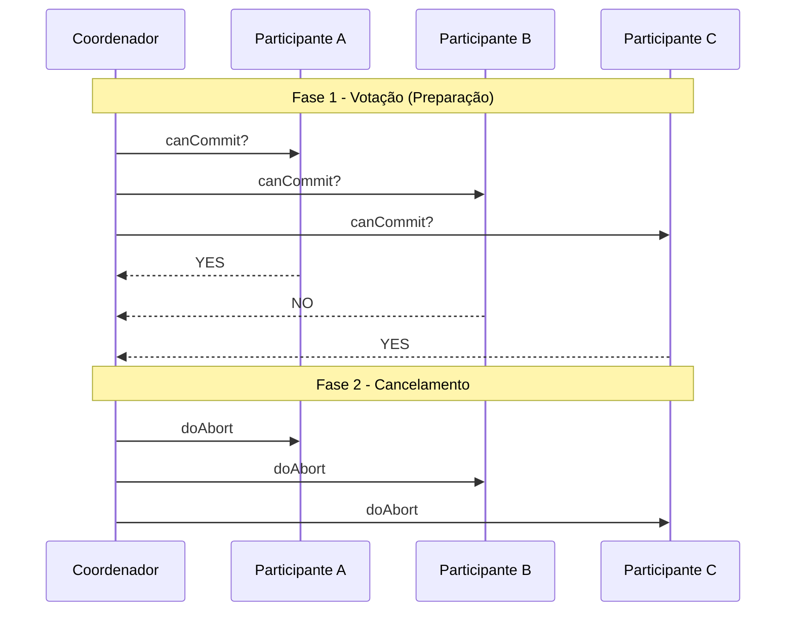

[← Sistemas Distribuídos](/sistemasDistribuidos/)

# Bancos de Dados Distribuídos e Transações

<p class="lesson-subtitle">Fragmentação e replicação · ACID · Controle de concorrência · Two-Phase e Three-Phase Commit</p>

| Banco de Dados Distribuído | Banco de Dados Centralizado |
| --- | --- |
| Vários arquivos de banco de dados são armazenados em locais distintos. | É composto por um único arquivo de banco de dados. |
| Múltiplas pessoas podem acessar e alterar os dados ao mesmo tempo. | Gargalos ocorrem quando muitos usuários acessam o mesmo arquivo simultaneamente. |
| Os dados podem ser recuperados rapidamente a partir da localização mais próxima do usuário. | É possível que a entrega de dados aos usuários leve mais tempo. |
| Os dados podem ser recuperados se um dos sites falhar. | Em caso de falha do sistema, um único site representa indisponibilidade total. |
| É necessária a sincronização de vários arquivos de diferentes bancos. | Em um sistema central, é mais fácil atualizar e gerenciar os dados. |

## Banco de Dados Distribuído

- **BDD**: coleção de bases de dados logicamente integradas, mas fisicamente distribuídas por uma rede de computadores.
- **SGBD-D**: Sistema Gerenciador de Banco de Dados Distribuído, responsável por manter a transparência da distribuição para o usuário final.

A transparência em BDD abrange: localização, fragmentação, replicação e transações distribuídas.

Necessidade de descentralização e alta disponibilidade. Ex: empresas com várias filiais, redes de hotéis, aplicativos móveis, controle militar, etc. Objetivos: confiabilidade, desempenho, expansão facilitada.

### Armazenamento Distribuído

O armazenamento pode ocorrer de três formas: **fragmentação**, **replicação** ou **híbrido**.

<div class="cols2">
<div>

#### Replicação

Consiste em manter cópias dos mesmos dados em mais de um local. Melhora a disponibilidade, resiliência a falhas e pode aumentar o desempenho de leitura.

- **Total**: a relação inteira (tabela) é replicada.
- **Parcial**: apenas parte dos dados é replicada (linhas ou colunas específicas).
- **Síncrona**: cópias atualizadas em tempo real (maior custo de comunicação).
- **Assíncrona**: cópias atualizadas periodicamente (pode haver inconsistência temporária).

</div>
<div>

#### Híbrido

Combina fragmentação e replicação: os fragmentos podem ser replicados para garantir disponibilidade e desempenho. Traz flexibilidade, mas aumenta a complexidade do gerenciamento.

</div>
</div>

#### Fragmentação

Em vez de duplicar dados, a fragmentação os divide entre os nós.

<div class="cols2">
<div>

**Horizontal**: fragmenta a tabela por linhas, onde cada fragmento contém um subconjunto das linhas da tabela original. Reconstrução via `UNION`, útil quando diferentes regiões acessam subconjuntos dos dados.

```sql
SELECT * FROM clientes_USA
UNION
SELECT * FROM clientes_Europa;
```

</div>
<div>

**Vertical**: fragmenta a tabela por colunas. Cada fragmento contém subconjuntos de colunas, com a chave primária replicada. Reconstrução via `JOIN`. Útil quando diferentes aplicações precisam de partes diferentes dos dados.

```sql
SELECT * FROM clientes_nome
JOIN clientes_endereco USING (id_cliente);
```

</div>
</div>

| Modelo | Nó 1 | Nó 2 | Nó 3 | Nó n |
| --- | --- | --- | --- | --- |
| **Centralizado** | ABCD EFGH IJKL MNOP QRST UVXZ | - | - | - |
| **Fragmentado** | ABC DEF | GHI JKL | MNO PQR | STU VXZ |
| **Replicado** | ABCD…UVXZ | ABCD…UVXZ | ABCD…UVXZ | ABCD…UVXZ |
| **Híbrido** | ABCD EFGH | ABCD EFGH IJKL | IJKL MNOP QRST | UVXZ |

**Vantagens do armazenamento distribuído**:

- **Desempenho**: consultas podem ser resolvidas localmente, evitando tráfego de rede.
- **Tolerância a falhas**: se um nó falhar, os dados ainda estão disponíveis em outro.
- **Escalabilidade**: você pode adicionar nós e distribuir mais dados conforme necessário.
- **Localidade dos dados**: acesso mais rápido aos dados onde são mais usados.

## Transações

Uma transação é uma sequência lógica de operações (como `INSERT`, `UPDATE`, `DELETE`, `SELECT`) que deve ser executada como uma única unidade atômica, com o objetivo de manter o estado consistente do banco de dados, mesmo com múltiplos acessos simultâneos, falhas ou interrupções.

**Exemplo clássico: transferência bancária.** Suponha que Alice transfere R$100 para Bob: debita R$100 da conta de Alice, credita R$100 na conta de Bob. Se qualquer etapa falhar, a transação inteira deve ser cancelada: nenhuma mudança parcial deve permanecer.

### Transações Distribuídas

Em sistemas distribuídos, as transações envolvem múltiplos bancos de dados (ou servidores/nós).

**Componentes:**

- **Cliente**: quem inicia a transação.
  - **Planas** (*flat*): modelo clássico, com início, *commit*/*rollback* e fim.
  - **Aninhadas** (*nested*): podem conter subtransações dentro da principal. A subtransação pode falhar e ser anulada sem comprometer a transação-pai.
- **Participantes**: servidores que detêm os dados envolvidos, fazem o *join* e executam suas operações locais.
- **Coordenador**: gerencia o *commit* da transação em todos os nós e determina se ela pode ser finalizada com sucesso.

<div class="cols2">
<div>

#### Possíveis estados de uma transação

- **Ativa**: está sendo executada.
- **Parcialmente concluída**: terminou todas as operações.
- **Falhou**: uma das operações falhou.
- **Abortada**: revertida (*rollback*).
- **Confirmada**: todas as operações foram concluídas com sucesso (*commit*).

</div>
<div>

#### Cenários de falha

- **Falha de rede**: perda de conexão entre coordenador e participantes.
- **Falha de participante**: um servidor reinicia ou trava.
- **Falha do coordenador**: sistema entra em período de incerteza.

</div>
</div>

### Concorrência em BDD

Diversas técnicas são utilizadas para gerenciar a concorrência em bancos de dados distribuídos:

- **Bloqueio** (*Locking*): transações adquirem bloqueios sobre os dados que precisam acessar, impedindo que outras os modifiquem simultaneamente. O gerenciamento de bloqueios pode ser centralizado ou distribuído.
- **Timestamp Ordering**: cada transação recebe um *timestamp*, e as operações são executadas na ordem dos *timestamps* para garantir a serializabilidade.
- **Controle de Concorrência Otimista** (OCC): assume que conflitos são raros e permite que as transações sejam executadas sem bloqueios; no final, são validadas para verificar se houve conflito; se houver, uma ou mais transações são desfeitas (*rollback*).
- **Protocolos de Commit Atômico**: garantem que uma transação distribuída seja confirmada em todos os nós envolvidos ou desfeita em todos eles, mantendo a consistência global. O **Two-Phase Commit (2PC)** é o exemplo mais comum.

Travas e bloqueios são mecanismos para garantir controle de concorrência: evitar que transações concorrentes acessem simultaneamente os mesmos dados de forma conflitante. Funcionam como uma forma de reservar o acesso a um recurso (registro, tabela, etc.) para uma única transação por vez: a primeira transação a chegar adquire a trava e tem uso exclusivo do recurso; as demais devem aguardar a liberação. Isso é típico em travas de leitura/escrita exclusivas, onde a exclusividade evita condições de corrida.

#### Deadlock em bancos de dados

Quando múltiplas transações ficam esperando travas que só serão liberadas se outra transação terminar, pode haver ciclo de espera, formando um deadlock: `T1` trava o Recurso A e precisa do Recurso B; `T2` trava o Recurso B e precisa do Recurso A. Ambas ficam esperando indefinidamente uma pela outra.

Estratégias para lidar com deadlocks: **prevenção** (ordem pré-definida de travamento, ou travar todos os objetos no início), **detecção** (construção de grafo de espera, procurando por ciclos), **timeout** (se uma transação demorar demais para adquirir uma trava, ela é abortada automaticamente).

#### Controle Otimista (OCC)

O OCC parte do princípio de que conflitos entre transações são raros, e por isso não utiliza travas durante a execução normal. *"Deixa todo mundo trabalhar à vontade, e só no final a gente verifica se deu tudo certo."*

<div class="cols2">
<div>

**Fase de Execução (ou Tentativa)**

- A transação executa livremente, sem bloquear dados.
- Manipula cópias locais ou versões temporárias dos dados (sem afetar os dados reais).

</div>
<div>

**Fase de Validação**

- Antes de finalizar, o sistema verifica se houve conflito com outras transações (ex: uma escrita em dado que foi lido).
- Se não houve conflito, a transação prossegue; se houve, é abortada e reiniciada.

**Fase de Atualização**

- Os dados modificados são aplicados ao banco real, de forma atômica.

</div>
</div>

::: details OCC: quando usar e trade-offs
Útil em sistemas com baixo índice de conflitos, ambientes distribuídos onde usar travas é custoso, e aplicações com muito mais leituras do que escritas (dashboards, BI, consultas).

**Vantagens**: evita deadlocks (não há travas durante execução), alta taxa de paralelismo, boa performance com poucas colisões.

**Desvantagens**: pode haver reexecuções repetidas em ambientes com muitos conflitos; desperdício de recursos se muitas transações forem abortadas na validação.

Exemplo: dois clientes tentam atualizar o mesmo saldo bancário. Ambos leem saldo = 100; Cliente A faz +50, Cliente B faz -30. Na validação, o sistema vê que ambos leram o mesmo dado e tentaram escrever: apenas um terá permissão (o outro é abortado).
:::

#### Controle por Marcação Temporal (Timestamp Ordering)

Cada transação recebe um *timestamp* único no momento em que começa. Todas as operações (leitura/escrita) devem respeitar a ordem temporal estabelecida por esses *timestamps*. *"Quem chega primeiro, tem prioridade."*

Cada dado no banco mantém `TS_W(X)` (timestamp da última escrita) e `TS_R(X)` (timestamp da última leitura).

- **Leitura de X por T**: permitida se `TS(T) ≥ TS_W(X)`; aborta se `TS(T) < TS_W(X)` (T estaria lendo um dado já sobrescrito por uma transação mais nova).
- **Escrita de X por T**: permitida se `TS(T) ≥ TS_R(X)` e `TS(T) ≥ TS_W(X)`; aborta se a transação for mais velha que alguma leitura ou escrita já feita (violaria a ordem).

::: details Timestamp Ordering: trade-offs
**Vantagens**: sem deadlocks (não usa travas, sem espera circular); transações serializáveis (a ordem dos *timestamps* assegura execução equivalente a uma serial); boa para ambientes altamente concorrentes onde a ordem temporal é importante.

**Desvantagens**: transações podem ser abortadas com frequência, principalmente se os *timestamps* forem muito próximos ou mal distribuídos; pouco controle de reexecução (transação abortada reinicia do zero com novo *timestamp*).

Exemplo: T1 (timestamp 5) quer ler X; T2 (timestamp 10) já escreveu X. Se T1 tentar ler X agora, será abortada, porque sua leitura violaria a ordem: estaria lendo um valor atualizado por uma transação mais nova.

*Timestamps* podem vir de relógios lógicos (como Lamport) ou físicos (sincronizados com NTP). Usado como base em sistemas sem travas como o Spanner (Google) ou bancos baseados em MVCC.
:::

#### MVCC (Multiversion Concurrency Control)

MVCC permite que várias versões de um mesmo dado coexistam no sistema, de forma que leituras não bloqueiam escritas, escritas não bloqueiam leituras, e cada transação vê uma visão consistente do banco, como se fosse "congelada no tempo". *"Cada transação enxerga o mundo como ele era no momento em que começou."*

<div class="cols2">
<div>

**Leitura**

- A transação lê a versão mais recente do dado que foi criada antes dela iniciar.
- Ignora alterações feitas por transações que ainda não tinham sido finalizadas.

</div>
<div>

**Escrita**

- Ao modificar um dado, o sistema não sobrescreve a versão atual. Em vez disso, cria uma nova versão com novo *timestamp*.
- As versões antigas permanecem para transações mais antigas ainda em andamento.

</div>
</div>

::: details MVCC: trade-offs e quem usa
**Vantagens**: leituras consistentes e sem bloqueios (ótimo para *workloads* com muitas consultas); evita conflitos desnecessários entre leitores e escritores; não há deadlock entre transações de leitura.

**Desvantagens**: acúmulo de versões antigas exige mecanismo de limpeza (*garbage collection*); pode haver custo adicional de armazenamento e gerenciamento de versões.

Bancos que usam MVCC: PostgreSQL, Oracle, Couchbase, Spanner (Google), TiDB, CockroachDB.
:::

#### Controle baseado em Votos (Quorum-Based Protocols)

Cada operação (leitura ou escrita) precisa de permissão de um subconjunto dos nós que mantêm réplicas do dado: esse subconjunto é chamado de **quorum**.

- **Atribuição de votos**: cada nó recebe um certo número de votos, que pode ser igual para todos, ou variar conforme capacidade/confiabilidade.
- **Quórum de Leitura** (`VR`): número mínimo de votos necessários para uma operação de leitura.
- **Quórum de Escrita** (`VW`): número mínimo de votos necessários para uma operação de escrita.

<div class="cols2">
<div>

**Regras para consistência**

- `VR + VW > V`: a soma dos quóruns de leitura e escrita deve ser maior que o total de votos (V). Isso garante interseção entre um quórum de leitura e um de escrita, então uma leitura sempre obtém a versão mais recente.
- `VW > V/2`: o quórum de escrita deve ser maior que a metade do total de votos, evitando conflitos de escrita simultânea.

</div>
<div>

**Operações**

- **Leitura**: obter um quórum de leitura (`VR`) de votos dos nós que armazenam o item; ler de qualquer nó do quórum.
- **Escrita**: obter um quórum de escrita (`VW`) de votos; enviar a nova versão para todos os nós do quórum.

</div>
</div>

::: details Quorum: exemplo e trade-offs
**Vantagens**: garante consistência forte mesmo com réplicas distribuídas; alta tolerância a falhas (se `VR`/`VW` forem bem escolhidos); escalabilidade sem coordenação global.

**Desvantagens**: pode ser ineficiente em leitura ou escrita se os quóruns forem altos; latência aumentada (exige múltiplos acessos simultâneos); mais complexo de gerenciar que modelos com travas simples.

Exemplo: sistema com 5 nós, 1 voto cada. Definindo `VR = 3` e `VW = 3`: para ler, obtemos 3 votos de qualquer combinação de 3 nós; para escrever, o mesmo. Como `VR + VW` (6) é maior que `V` (5) e `VW` (3) é maior que `V/2` (2,5), as regras de consistência são satisfeitas.

Usado em sistemas com dados replicados (Cassandra, DynamoDB) e ambientes que exigem alta disponibilidade e escalabilidade, equilibrando consistência e desempenho.
:::

#### Resumo comparativo de técnicas de controle de concorrência

| Técnica | Usa travas? | Tolerância a falhas | Deadlock? | Ideal para... |
| --- | --- | --- | --- | --- |
| **Lock-based** | Sim | Baixa | Sim | Ambientes com muitos conflitos |
| **Otimista (OCC)** | Não | Alta | Não | Baixo conflito, leitura intensa |
| **Timestamp Ordering** | Não | Alta | Não | Aplicações com ordem temporal |
| **MVCC** (Multiversion) | Sim (internamente) | Alta | Não | Leitura massiva, alta concorrência |
| **Quorum/Votação** | Sim/Não | Alta | Depende | Controle de réplicas distribuídas |

## ACID

ACID refere-se às quatro propriedades de transação de um sistema de banco de dados.

<div class="cols2">
<div>

#### Atomicidade (*Atomicity*)

A transação deve ser executada por completo ou não ter efeito nenhum. Se ocorrer uma falha no meio do caminho, todas as alterações parciais devem ser desfeitas (*rollback*). Exemplo: se uma transferência bancária falhar após o débito, o crédito também não deve acontecer.

#### Consistência (*Consistency*)

O banco de dados deve estar em um estado consistente antes e depois da transação; regras de integridade (chaves estrangeiras, domínios de valores, etc.) devem ser respeitadas. Exemplo: um saldo nunca pode ficar negativo se isso viola as regras do sistema.

</div>
<div>

#### Isolamento (*Isolation*)

Transações simultâneas não devem interferir entre si: o resultado da execução de várias transações concorrentes deve ser o mesmo que se fossem executadas em série (serialização). Exemplo: dois clientes sacando ao mesmo tempo devem ver o saldo correto, sem conflito de leitura/escrita.

#### Durabilidade (*Durability*)

Após uma transação ser confirmada (*commit*), suas alterações devem persistir mesmo após falhas como quedas de energia ou travamentos. Isso é garantido por mecanismos como gravação em log de transações e uso de memória estável (disco).

</div>
</div>

### ACID em Bancos de Dados Distribuídos

No contexto distribuído, ACID se torna mais desafiador, especialmente por conta de: comunicação entre nós distantes (falhas e atrasos), sincronização de *commits* (o protocolo 2PC é usado para isso), e garantir isolamento entre transações que acessam nós diferentes.

## Two-Phase Commit Protocol (2PC)

O 2PC é um *Atomic Commitment Protocol* que visa garantir que todos os participantes de uma transação distribuída concordem sobre confirmar ou abortar a transação.

**Agentes 2PC**: **coordenador** (gerencia a transação) e **participantes** (executam operações locais e seguem as ordens do coordenador). O protocolo ocorre em duas fases: `Votação/Preparação` e `Decisão`.

<div class="cols2">
<div>

#### Fase 1: Votação (*prepare/vote phase*)

O coordenador envia `canCommit?` para todos os participantes.

**Cada participante**:
- Executa a transação localmente.
- Se tudo ok: entra em estado preparado e envia `vote-commit` (garantindo localmente que pode efetivar, sem voltar atrás).
- Se não puder: envia `vote-abort`.

</div>
<div>

#### Fase 2: Decisão (*commit/abort phase*)

O coordenador coleta os votos:
- Se **todos** votaram `commit`: envia `doCommit` para todos.
- Se **algum** votou `abort`: envia `doAbort` para todos.

**Cada participante** executa o *commit* ou *abort* local, e envia confirmação (`haveCommitted`/`haveAborted`) de volta ao coordenador.

</div>
</div>





**Falhas e período de incerteza**: um dos pontos críticos do 2PC é o período de incerteza, que ocorre quando o participante votou *commit*, mas ainda não recebeu o `doCommit` (porque o coordenador caiu). Nesse momento, ele não sabe o destino da transação. Estratégias: consultar outros participantes (generais bizantinos, 3PC), aguardar até o coordenador voltar (*timeout*?), ou reconfigurar com protocolos mais robustos (como 3PC).

<div class="adv-grid">
<div>

#### Vantagens

- Amplamente implementado.
- Garante consistência global mesmo com falhas locais.
- É mais simples que outros protocolos como o 3PC.

</div>
<div>

#### Desvantagens

- Custo: com N participantes, ~3N mensagens em 3 rodadas de comunicação (pedido, resposta, decisão).
- Pode causar bloqueios prolongados no caso de falhas.
- Exige mais mensagens e tempo de espera: simples e confiável, mas lento para sistemas com muitas transações concorrentes ou sujeitos a falhas.

</div>
</div>

## Three-Phase Commit (3PC)

O *Three-Phase Commit* é um protocolo de efetivação atômica **não bloqueante**, que tenta garantir que nenhum participante fique preso em um estado indefinido em caso de falha do coordenador. Ele introduz uma fase intermediária chamada "*prepare to commit*", criando 3 fases no total.

<div class="cols2">
<div>

#### Fase 1: CanCommit (Consulta de Voto)

Igual ao 2PC: o coordenador pergunta aos participantes se estão prontos para efetivar a transação. Participantes respondem `YES` (prontos) ou `NO` (não podem efetivar).

#### Fase 2: PreCommit (Preparar para Commit)

Se todos os votos forem `YES`, o coordenador envia `prepare`/`preCommit`. Participantes executam as ações necessárias, gravam tudo em log, não efetivam ainda mas ficam prontos, e enviam `ACK`.

Aqui está o ponto chave: se o coordenador falhar agora, os participantes têm autonomia suficiente para decidir sozinhos o que fazer (com base no log e nos outros participantes).

</div>
<div>

#### Fase 3: Commit

Após receber todos os `ACK`, o coordenador envia `doCommit` e os participantes efetivam e confirmam.

**Resumo do fluxo**:
1. `canCommit?` → participantes respondem YES/NO
2. `preCommit` → participantes preparam, gravam log, enviam ACK
3. `doCommit` → participantes efetivam

</div>
</div>

### Comparativo: 2PC × 3PC

| Característica | 2PC (Two-Phase Commit) | 3PC (Three-Phase Commit) |
| --- | --- | --- |
| Número de Fases | 2 | 3 |
| Fases | canCommit, doCommit/Abort | canCommit, preCommit, doCommit |
| Bloqueio Possível | Sim (estado de incerteza) | Reduzido (usa fase intermediária) |
| Tolerância a Falhas | Limitada | Maior (participantes têm autonomia) |
| Autonomia dos Nós | Baixa (esperam coordenador) | Alta (decidem em caso de falha) |
| Overhead de Mensagens | Menor | Maior (mensagens adicionais) |
| Complexidade | Menor | Maior (lógica e logs adicionais) |
| Aplicação Prática | Mais comum | Rara (substituído por algoritmos de consenso, ex.: Raft/Paxos) |

::: tip 3PC na prática
O 3PC ainda não é 100% à prova de falhas, especialmente com falhas simultâneas ou partições de rede. Introduz mais mensagens e *overhead*, e é pouco usado na prática: sistemas modernos preferem algoritmos baseados em consenso (Raft ou Paxos) ou compensações (*eventual consistency*) em sistemas de alta disponibilidade.
:::

## Bancos de Dados Distribuídos mais utilizados

- **MongoDB**: banco de dados NoSQL orientado a documentos, amplamente adotado para aplicações que requerem escalabilidade horizontal e flexibilidade no esquema de dados.
- **Cassandra**: banco de dados NoSQL de coluna larga, projetado para lidar com grandes volumes de dados distribuídos em múltiplos nós, garantindo alta disponibilidade e tolerância a falhas.
- **Amazon DynamoDB**: serviço de banco de dados NoSQL totalmente gerenciado, conhecido por sua escalabilidade automática e desempenho de latência de milissegundos.
- **Microsoft Azure Cosmos DB**: banco de dados multimodelo distribuído globalmente, com suporte a vários modelos de dados e APIs, latência baixa e garantias de consistência ajustáveis.
- **Google Cloud Spanner**: banco de dados relacional distribuído que combina a escalabilidade dos bancos NoSQL com a consistência e familiaridade dos bancos SQL tradicionais.

<figure class="doc-figure">
  
</figure>

---

**Próxima página:** [10: Cloud Computing →](/sistemasDistribuidos/cloud-computing)

<style scoped src="./shared.css"></style>
