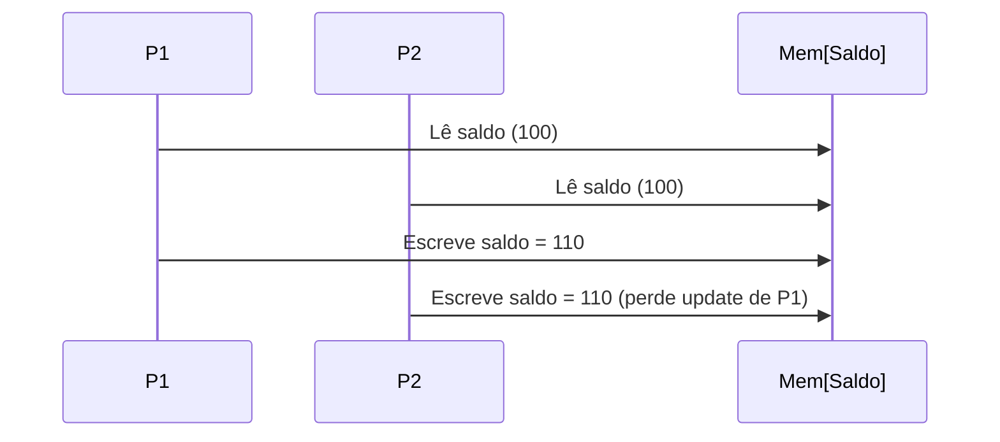

[← Sistemas Distribuídos](/sistemasDistribuidos/)

# Concorrência em Sistemas Distribuídos

Race conditions · Deadlock e o problema dos filósofos · Starvation · Falhas parciais · Threads

Concorrência significa que várias atividades independentes são executadas de forma intercalada ou paralela. Ela faz parte dos sistemas distribuídos:

- Temos múltiplos processos executando em nós distintos.
- Dentro de cada processo, podem existir múltiplas threads.
- Essas atividades precisam compartilhar recursos e trocar mensagens para atingir um objetivo comum.
- Diferente de um sistema centralizado, aqui a concorrência acontece em várias máquinas interconectadas, aumentando a complexidade.

::: tip Concorrência × Paralelismo
**Concorrência**: múltiplas tarefas progridem ao mesmo tempo, mesmo que apenas uma execute de fato em dado instante (ex.: alternância de CPU). **Paralelismo**: várias tarefas realmente executam simultaneamente (ex.: múltiplos núcleos ou múltiplas máquinas em SD).
:::

## Problemas clássicos da concorrência

- **Condições de corrida** (*race conditions*): quando dois processos tentam atualizar o mesmo recurso ao mesmo tempo.
- **Deadlock** (impasse): processos ficam esperando indefinidamente por recursos bloqueados uns pelos outros.
- **Starvation**: um processo nunca recebe acesso ao recurso, pois outros têm prioridade ou chegam continuamente.
- **Falhas parciais**: em SD, um processo pode cair no meio de uma transação, deixando outros em estado de espera; isso exige protocolos de *commit* distribuído (2PC, 3PC).

### Execução simultânea e compartilhamento de recursos

- Processos e threads em diferentes nós executam em paralelo.
- Nenhum processo tem visão global do sistema.
- A ordem dos eventos pode variar dependendo dos atrasos de rede e do escalonamento local.
- Isso gera a necessidade de modelos de tempo e ordenação de eventos (ex.: [relógios lógicos de Lamport](/sistemasDistribuidos/modelos-fundamentais#ordenacao-de-eventos)).

- Recursos críticos podem estar em servidores remotos (banco de dados, arquivos, impressoras).
- O acesso concorrente exige controle de concorrência distribuído: *locks* distribuídos, exclusão mútua distribuída (centralizada, em anel, Ricart-Agrawala).

### Técnicas de controle de concorrência

- Semáforos, *mutex*, monitores (nível local).
- Controle de concorrência em BD distribuídos: *locking* (bloqueios exclusivos), *timestamp ordering* (ordenação por tempo), controle otimista (OCC: executa e depois valida), MVCC (controle multiversão, usado em bancos modernos como PostgreSQL).
- Exclusão mútua distribuída: centralizada (um coordenador concede acesso), distribuída (Ricart-Agrawala: todos votam antes de liberar acesso), token em anel (quem tem o token acessa a seção crítica).

## Race Conditions

- Ocorrem quando múltiplos `processos || threads` acessam o **mesmo recurso** de forma concorrente sem sincronização adequada.
- Resultado depende da **ordem não determinística** dos eventos.
- Difíceis de detectar, normalmente falha *intermitente*.

**Como surge**: variáveis/objetos compartilhados sem sincronização adequada; mensagens fora de ordem (rede assíncrona) aplicando atualizações em sequência incorreta; requisições duplicadas (*retries*) sem idempotência, causando efeitos extra.

**Exemplo**: dois processos tentam atualizar `saldo = saldo + 10` simultaneamente: um *update* pode se perder. Ou: dois microsserviços atualizam o mesmo estoque quase simultaneamente; a réplica A confirma, a réplica B também; sem controle de concorrência, o estoque fica negativo (*oversell*).

::: details Mitigações práticas
- *Mutex*/*locks* (local) e *locks* distribuídos (ex.: via ZooKeeper/etcd/Redis com *leases*).
- Operações atômicas (*compare-and-swap*), seções críticas e monitores.
- Transações (ACID) e controle de concorrência (2PL/locks, OCC, MVCC).
- Idempotência (chave de deduplicação, *request IDs*, *upserts*).
- Versionamento (ETag/If-Match, *vector clocks*) e ordenação por *timestamp*.
- CRDTs quando a aplicação tolera *eventual consistency* com operações comutativas.
:::

## Deadlock (impasse)

Um conjunto de `processos || threads` fica bloqueado para sempre, cada um esperando um recurso que o outro mantém. Quatro condições de Coffman (Coffman Jr., 1971) precisam estar presentes simultaneamente:

1. **Mutual Exclusion**: um recurso não pode ser compartilhado entre os processos: apenas um processo pode usá-lo de cada vez.
2. **Hold and Wait**: um processo que possui pelo menos um recurso pode solicitar recursos adicionais atualmente mantidos por outros processos.
3. **No Preemption**: um recurso não pode ser retirado à força de um processo que o segura; deve ser liberado voluntariamente.
4. **Circular Wait**: um conjunto de processos está esperando de maneira circular por recursos, onde cada processo aguarda um recurso mantido pelo próximo processo na cadeia.

Quando todas essas quatro condições são atendidas, ocorre um impasse, e os processos envolvidos ficam presos, incapazes de continuar.

Exemplo em SD: o Serviço A bloqueia um pedido e solicita estoque; o Serviço B bloqueia o estoque e solicita o pedido. Nenhum progride.

::: details Detecção, prevenção e recuperação
- **Detecção**: construção de grafo de espera (*wait-for graph*) global, difícil em SD por falta de relógio global. Algoritmos de *edge-chasing* (Chandy–Misra–Haas): "sondas" percorrem dependências procurando ciclo. *Snapshots* (Chandy–Lamport) para congelar um estado consistente e analisar dependências.
- **Prevenção/Avoidance**: ordenação global de recursos (sempre adquirir na mesma ordem); evitar *hold & wait* (adquirir tudo de uma vez, nem sempre viável); preempção/*rollback* de transações (escolha de vítima); *timeouts* com *retry* (cuidado com *livelock*); *Banker's Algorithm* (teórico, pouco prático em SD); *Sagas* (substituem *locks* longos por passos com compensações).
- **Recuperação**: matar a vítima (transação/processo) com menor custo, liberar recursos e reexecutar. Em bancos: *rollback* com *write-ahead log*.

Nota: o 2PC não é deadlock, mas pode bloquear (participante preparado esperando decisão). Se o coordenador cai, há período de incerteza que exige *recovery* e, às vezes, consulta a *peers*. Para evitar bloqueios prolongados: monitoração do coordenador, *timeouts* bem calibrados; em cenários críticos, *commit* via consenso (ex.: Paxos/Raft-commit).
:::

### O Problema do Jantar dos Filósofos

<figure class="doc-figure">
  
</figure>

Proposto por Edsger Dijkstra (1965), é uma metáfora para o desafio de sincronização e compartilhamento de recursos entre processos concorrentes.

Imagine que convidamos `n` (digamos 6) filósofos para uma refeição. Eles vão sentar em uma mesa com 6 garfos, um entre cada filósofo. Um filósofo alterna entre querer comer ou pensar. Para comer, o filósofo deve pegar os dois garfos de ambos os lados de sua posição.

<figure class="doc-figure">
  
</figure>

::: details Por que é difícil?
É possível projetar uma solução eficiente para que todos os filósofos comam? Ou alguns vão passar fome, nunca obtendo um segundo garfo? Ou todos vão travar em deadlock? Por exemplo, imagine que cada convidado pega o garfo à esquerda e aguarda o garfo à direita estar livre. Se todos fizerem isso ao mesmo tempo, temos um impasse: cada filósofo é essencialmente igual, executando o mesmo conjunto de instruções, então não é possível simplesmente dizer a "um" filósofo para agir diferente dos demais.
:::

O problema: como projetar um protocolo que permita que todos eventualmente consigam comer, sem deadlock (ninguém consegue comer) e sem *starvation* (alguns comem, outros nunca)?

**Problemas encontrados**: concorrência (vários filósofos podem tentar pegar garfos ao mesmo tempo), deadlock (todos pegam o garfo da esquerda e ficam esperando eternamente pelo da direita), *starvation* (um filósofo faminto pode ser sempre preterido se o algoritmo não garantir justiça), exclusão mútua (apenas um filósofo pode usar cada garfo por vez).

#### Ordenação Parcial (solução de Dijkstra)

Imagine 6 filósofos (0 a 5) e 6 garfos (0 a 5):

1. O filósofo `i` tem os garfos `i` (esquerda) e `(i+1) % 6` (direita).
2. A regra: pegar sempre primeiro o garfo de **menor índice**.

O filósofo 2 precisa dos garfos 2 e 3 → pega 2 primeiro. O filósofo 4 precisa dos garfos 4 e 0 → pega 0 primeiro, pois 0 < 4. Assim, mesmo que todos tentem comer ao mesmo tempo, não há espera circular: não ocorre deadlock.

<figure class="doc-figure">
  
</figure>

**Por que funciona?** O deadlock só ocorre se houver um ciclo de espera (cada processo esperando recurso de outro, formando um *loop*). A ordem parcial nos garfos quebra o ciclo, pois todos os pedidos seguem a mesma hierarquia: não é possível que todos segurem um garfo e esperem eternamente pelo outro.

#### Vantagens

- Evita deadlock de forma simples e elegante.
- Implementação fácil com semáforos/*locks*.

#### Desvantagens

- Ainda pode haver *starvation* (um filósofo pode ficar esperando muito tempo se outros vizinhos comem com frequência).
- Não garante justiça total (não há *aging* ou fila).

::: tip Ordenação de recursos em sistemas reais
Essa técnica é um exemplo de prevenção de deadlock por ordenação de recursos, que também aparece em bancos de dados distribuídos (*lock ordering*). Em SD reais, pode ser aplicada impondo uma ordem global de aquisição de recursos (ex.: IDs únicos em réplicas, chaves em banco, tokens).
:::

## Starvation (inanição)

Um processo nunca progride porque nunca recebe o recurso ou nunca é escalonado, embora não haja deadlock. É o "adiamento indefinido".

**Causas comuns**: escalonamento injusto (prioridades que nunca mudam; *work stealing* mal configurado); concorrência por *locks* (um fluxo com alta taxa de chegada ocupa a fila continuamente); *priority inversion* (tarefa de baixa prioridade segura o *lock* de que a alta prioridade precisa, enquanto a média preenche a CPU).

Exemplo: redirecionamento de chamadas para serviços com *round-robin*.

::: details Mitigações
- *Aging* (aumenta prioridade com o tempo).
- Filas justas (FIFO), *ticket locks*, *bounded waiting*.
- *Rate limiting*/quotas por cliente/tenant.
- *Backoff* exponencial com *jitter* (evita enxame simultâneo).
- Em *distributed locks*: *leases* curtas, renovação controlada e fila (ex.: Redlock com fila/TTL, ZK com *sequential ephemeral znodes*).
- Em *scheduling*: políticas *fair* (ex.: *weighted fair queuing*).
:::

## Falhas parciais

Em SD, partes do sistema podem falhar independentemente (um nó cai, a rede particiona, pacotes se perdem/duplicam, disco corrompe) enquanto o restante continua. Não deveria existir uma "falha total"...

**Efeitos típicos**: indisponibilidade parcial, *timeouts* e retentativas (que amplificam carga); estados inconsistentes entre réplicas; rede particionada com mensagens atrasadas, duplicadas ou perdidas; bloqueio (ex.: participante "preparado" aguardando decisão em 2PC); erros fantasma (ex.: ACK perdido → cliente faz *retry* → operação ocorre duas vezes).

**Detecção**: *heartbeats* e detectores de falha (sempre incertos em redes assíncronas); *failure suspicion* (*phi accrual*, classes de Chandra–Toueg); *health checks* e *circuit breakers*.

::: details Estratégias de tolerância/recuperação
- *Timeouts* + *retries* com idempotência (chaves de *dedupe*, *transaction IDs*).
- *Circuit breaker* e *bulkheads* (conter falhas).
- Quóruns e consenso (Raft/Paxos): maioria decide, líder único, reconfiguração sob falhas.
- Replicação (quóruns de leitura/escrita, *read repair*, *anti-entropy*).
- *Leases* (liderança com expiração) para evitar *split-brain*.
- *Sagas* para transações longas (compensações em vez de bloqueio longo).
- Observabilidade: *tracing* distribuído, logs causais, métricas e alertas.
- Planejamento CAP: escolha explícita de consistência vs disponibilidade sob partição.
:::

## Resumo dos problemas de concorrência

| Tema | Perguntas-chave | Boas práticas |
| --- | --- | --- |
| Race condition | Quem altera o mesmo estado? Em que ordem as mensagens chegam? | Locks/leases, transações, idempotência, versionamento, CRDTs quando couber |
| Deadlock | Existem ciclos de dependência? Ordem global de locks? | Ordenar recursos, timeouts+retry, detecção (edge-chasing), matar vítima, Sagas |
| Starvation | O acesso é justo? Existe aging? | Filas FIFO, fair locks, quotas, aging, backoff com jitter |
| Falhas parciais | O que acontece se um nó/partição cair? | Timeouts, retries idempotentes, circuit breaker, quóruns/consenso, observabilidade |

## Threads

Em sistemas distribuídos, temos múltiplos processos (potencialmente em máquinas diferentes) que precisam cooperar. Cada processo pode, por sua vez, ser composto de várias threads, unidades de execução mais leves do que processos.

> **Processo**: possui seu próprio espaço de endereçamento (memória isolada).

> **Thread**: compartilha o espaço de memória do processo, mas possui seu próprio contador de programa e pilha de execução.

Isso significa que threads permitem concorrência dentro de um processo, essencial para aplicações distribuídas que precisam lidar com múltiplas conexões, requisições e eventos ao mesmo tempo.

**Aplicações de threads em SD**: concorrência (executar múltiplas tarefas ao mesmo tempo, ex.: servidor de banco de dados processando várias requisições); responsividade (manter a aplicação ativa mesmo realizando operações demoradas de rede/I/O); paralelismo (explorar múltiplos núcleos da CPU); escalabilidade (em servidores distribuídos, cada requisição de cliente pode ser tratada por uma thread diferente, permitindo maior *throughput*).

Nos bancos de dados distribuídos, por exemplo, servidores utilizam múltiplas threads para executar transações concorrentes, com mecanismos de sincronização (semáforos, *mutex*, *locks*) garantindo consistência.

**Funcionamento**:

- **Criação**: uma thread é criada dentro de um processo, compartilhando seus recursos (código, memória).
- **Escalonamento**: o sistema operacional gerencia quando cada thread executa, podendo usar escalonamento preemptivo ou cooperativo.
- **Comunicação**: threads de um mesmo processo comunicam-se via variáveis compartilhadas (memória comum); em sistemas distribuídos, threads também trocam mensagens entre processos/nós.
- **Sincronização**: para evitar condições de corrida e inconsistências, são usados mecanismos como *locks*, monitores e semáforos.

::: details Exemplo prático
Um servidor web recebe conexões de múltiplos clientes. Cada conexão pode ser tratada por uma thread. Enquanto uma thread espera resposta de banco de dados, outras continuam processando. Em *middleware* ou APIs distribuídas, threads permitem lidar com milhares de requisições concorrentes sem travar o processo principal.
:::

---

**Próxima página:** [09: Bancos de Dados Distribuídos e Transações →](/sistemasDistribuidos/bancos-distribuidos)

