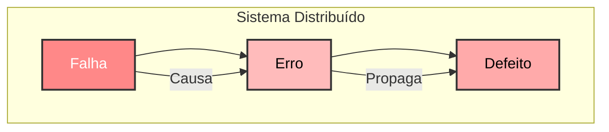

[← Sistemas Distribuídos](/sistemasDistribuidos/)

# Dependabilidade e Modelos de Falha

Confiabilidade e disponibilidade · Modelos de falha · Bizantinos e os dois generais · Segurança e DoS

## Dependabilidade

<figure class="doc-figure">
  
</figure>

**Atributos**

- **Disponibilidade**: o sistema está pronto para uso quando necessário.
- **Confiabilidade**: o sistema continua operando corretamente por um intervalo de tempo.
- **Segurança** (*safety*): o sistema não causa danos a pessoas/ambiente mesmo frente a falhas.
- **Integridade**: o estado/dados não são corrompidos ou alterados indevidamente.
- **Manutenibilidade**: facilidade e rapidez para reparar e evoluir o sistema (tempo de restauração).
- **Confidencialidade**: informação só acessível por quem tem autorização (interseção com segurança).

**Ameaças** (como o problema aparece)

- **Falhas** (*faults*): causas potenciais: humanas, físicas, de software, ambientais.
- **Erros** (*errors*): estados internos incorretos causados por falhas.
- **Defeitos** (*failures*): quando o serviço entregue diverge do especificado (o usuário percebe).

**Meios** (como enfrentamos)

- **Prevenção de falhas**: evitar que falhas entrem no sistema (revisões, padrões, verificação).
- **Tolerância a falhas**: o sistema continua correto apesar de falhas (redundância, detecção/recuperação).
- **Remoção de falhas**: encontrar e corrigir falhas já presentes (testes, depuração, correções).
- **Previsão de falhas**: entender probabilidade/impacto (métricas como MTTF/MTTR, análise e modelagem).

## Modelos de Falhas

Em sistemas distribuídos, compostos por múltiplos computadores interconectados, a ocorrência de falhas não é uma possibilidade remota, mas sim uma realidade inevitável. Diferentemente de sistemas centralizados, onde o erro geralmente se limita a um único ponto, em sistemas distribuídos uma falha pode se propagar por toda a rede, comprometendo a confiabilidade, a disponibilidade e a consistência do sistema como um todo.

- Define como as falhas se manifestam.
- Proporciona entendimento dos efeitos e consequências.
- Conceitos-chave: **Falha → Erro → Defeito**
  - **Falha** (*fault*): trata de inconsistências físicas ou lógicas, que podem causar um erro.
  - **Erro** (*error*): é um estado inconsistente do sistema, que pode levar a um defeito.
  - **Defeito** (*failure*): é um comportamento incorreto de um sistema frente à sua especificação.

<figure class="doc-figure">
  
  <figcaption>Referência: T. S. Weber, 2014</figcaption>
</figure>

### O Problema dos Dois Generais

Imagine dois generais (General A e General B) que comandam exércitos separados e precisam atacar um inimigo em conjunto para terem sucesso. Eles estão posicionados em montanhas opostas, com o inimigo em um vale entre eles.

A única forma de comunicação entre os generais é por meio de mensageiros, que precisam atravessar o vale inimigo para entregar as mensagens. No entanto, esses mensageiros podem ser capturados, impedindo que a mensagem chegue ao destino.

Para que o ataque seja bem-sucedido, ambos os generais precisam atacar exatamente ao mesmo tempo. Se um atacar sem o outro, o exército inimigo derrotará o general solitário. O problema surge porque nenhum dos generais pode ter certeza absoluta de que sua mensagem foi recebida pelo outro. Mesmo que um general envie uma mensagem com a ordem de ataque e o outro responda confirmando o recebimento, não há garantia de que essa confirmação também chegue com sucesso. Isso cria um ciclo infinito de confirmações, sem que um consenso definitivo possa ser alcançado.

<figure class="doc-figure">
  
</figure>

**Implicações em Sistemas Distribuídos**: o problema exemplifica um desafio fundamental, a dificuldade de alcançar um consenso confiável em uma rede não confiável. Isso afeta diretamente:

- **Protocolos de Comunicação**: pacotes de dados podem ser perdidos, corrompidos ou atrasados.
- **Consistência de Dados**: garantir que todas as réplicas tenham exatamente os mesmos dados no mesmo momento.
- **Confirmação de Mensagens**: garantir que uma mensagem foi recebida e processada corretamente.

Embora seja matematicamente impossível resolver com 100% de certeza, na prática soluções aproximadas são usadas: protocolos de confirmação de recebimento (ex.: TCP, que retransmite pacotes perdidos), algoritmos de consenso como Paxos e Raft, e *timeouts*/*retries* para mitigar falhas de comunicação.

### Tipos de Modelos de Falha

- **Transientes**: ocorrem uma vez e desaparecem.
- **Intermitentes**: ocorrem, somem, reaparecem.
- **Permanentes**: continuam até que o problema seja corrigido.
- **Reproduzíveis**: acontecem sempre de acordo com uma ou mais condições.

#### Falhas de Omissão

Ocorrem quando um componente do sistema falha ao executar uma operação esperada, como a não entrega de uma mensagem ou a ausência de resposta de um serviço.

- Ocorrem quando **mensagens não são enviadas ou recebidas** corretamente.
- Podem se manifestar em diferentes níveis: **envio** (processo não transmite a mensagem), **recepção** (processo não recebe a mensagem enviada), **canal** (perda de pacotes na rede).
- Exemplo: em um protocolo cliente-servidor, o servidor nunca recebe a requisição do cliente.
- **Impacto**: pode causar bloqueios ou inconsistência na execução distribuída.

#### Falhas Arbitrárias ou Bizantinas

Incluem comportamentos inesperados e imprevisíveis, como respostas erradas ou funcionamento incorreto.

- Também chamadas de **falhas bizantinas**.
- O processo apresenta **comportamento incorreto ou imprevisível**: envia mensagens inválidas ou contraditórias, responde de forma incoerente a diferentes processos.
- Extremamente difíceis de detectar.
- Exemplo: um nó malicioso em um algoritmo de consenso envia valores diferentes para cada participante.
- **Impacto**: afeta a confiabilidade e pode comprometer totalmente o consenso.

<figure class="doc-figure">
  
</figure>

Imagine um grupo de generais bizantinos que precisam coordenar um ataque a um inimigo. Eles se comunicam apenas por meio de mensageiros, mas alguns generais podem ser traidores e enviar informações erradas. O objetivo do grupo leal é decidir em conjunto se devem atacar ou recuar, garantindo que todos os generais leais tomem a mesma decisão, independentemente da ação dos traidores. O desafio está no fato de que os generais não podem confiar totalmente na comunicação (mensagens podem ser adulteradas), alguns podem mentir deliberadamente, e o consenso precisa ser alcançado mesmo na presença dessas falhas. Sem um protocolo adequado, é impossível alcançar um consenso confiável quando há agentes maliciosos.

Em um sistema distribuído real, uma falha bizantina pode se manifestar de várias formas: um nó pode enviar mensagens diferentes para diferentes partes do sistema; um servidor pode processar requisições incorretamente; mensagens podem ser corrompidas por erro de software ou hardware; ou ataques de segurança podem introduzir nós maliciosos em uma rede peer-to-peer.

::: details Mitigando falhas bizantinas
1. **Algoritmos de Consenso Tolerantes a Falhas Bizantinas**: protocolos que permitem que um sistema atinja consenso mesmo com nós maliciosos ou falhos:
   - **PBFT** (*Practical Byzantine Fault Tolerance*): permite que sistemas distribuídos continuem funcionando corretamente, desde que menos de 1/3 dos nós sejam bizantinos.
   - **Algoritmo de Paxos Bizantino**: versão modificada do Paxos que lida com falhas arbitrárias.
   - **Algoritmo de consenso do Bitcoin** (*Proof-of-Work*): baseado em mineração, tolera até 50% de nós maliciosos.
2. **Redundância e Replicação**: execução redundante (múltiplas cópias comparadas para detectar anomalias) e votação majoritária.
3. **Criptografia e Assinaturas Digitais**: assinaturas digitais para garantir que mensagens não sejam adulteradas, hashing e verificação de integridade.
:::

### Falhas por Omissão e Arbitrárias: resumo

| Tipo | Onde | Descrição |
| --- | --- | --- |
| Parada por falha | Processo | O processo para e permanece parado. Outros processos podem detectar esse estado. |
| Colapso | Processo | O processo para e permanece parado. Outros processos podem não detectar esse estado. |
| Omissão | Canal | Uma mensagem inserida em um buffer de envio nunca chega no buffer de recepção do destinatário. |
| Omissão de envio | Processo | Um processo conclui um envio, mas a mensagem não é enviada. |
| Omissão de recepção | Processo | Uma mensagem é colocada no buffer de recepção de um processo, mas esse processo não a recebe efetivamente. |
| Arbitrária (bizantina) | Processo ou canal | Pode enviar/transmitir mensagens arbitrárias em qualquer momento, cometer omissões; um processo pode parar ou realizar uma ação incorreta. |

#### Falhas de Armazenamento

Relacionadas à **integridade dos dados**.

- Tipos de problemas: dados não gravados, dados gravados de forma incorreta, perda de dados devido a falha de hardware/servidor.
- Exemplo: em um banco distribuído, um nó replica dados incorretamente após falha de energia.
- **Impacto**: afeta consistência e durabilidade das transações.

#### Falhas de Temporização

Acontecem quando um sistema distribuído síncrono não consegue respeitar os prazos estabelecidos para resposta.

- Associadas a sistemas distribuídos síncronos.
- Ocorrem quando um processo não responde dentro do intervalo esperado: **atraso excessivo** no envio, ou **resposta tardia** que já não é mais válida.
- Exemplo: em um protocolo de commit (2PC), um participante responde após o tempo limite, entrando em "período de incerteza".
- **Impacto**: pode gerar bloqueios, *timeouts* e necessidade de abortar operações.

| Tipo | Onde | Descrição |
| --- | --- | --- |
| Relógio | Processo | O relógio local do processo ultrapassa os limites de sua taxa de desvio em relação ao tempo físico. |
| Desempenho | Processo | O processo ultrapassa os limites do intervalo de tempo entre duas etapas. |
| Desempenho | Canal | A transmissão de uma mensagem demora mais do que o limite definido. |

#### Modelo de Falhas de Cristian

É uma abordagem para caracterizar e detectar falhas em sistemas distribuídos baseada em premissas temporais. Nesse modelo, pressupõe-se que os processos podem falhar de forma definitiva (*crash-stop*) e que existe um limite superior conhecido para atrasos nas comunicações e respostas. Assim, se um processo não responder dentro desse tempo previamente estipulado, o sistema o considera como tendo falhado.

- Proposto por **Flaviu Cristian (1989)**.
- Usado em **sincronização de relógios** em sistemas distribuídos.
- Assume um sistema **síncrono**, com limites conhecidos para tempo de execução de processos, tempo de transmissão de mensagens e taxa de desvio dos relógios.
- Fornece uma forma de **estimar o erro máximo** no ajuste de relógios.

1. Cliente solicita a hora a um servidor de tempo.
2. A resposta sofre atrasos na rede: **δmin** (atraso mínimo) e **δmax** (atraso máximo).
3. O horário recebido pelo cliente está dentro de um **intervalo de confiança**.

**Falhas possíveis**: **omissão** (resposta não chega) e **temporização** (resposta fora do limite aceitável).

<figure class="doc-figure">
  
  <figcaption>Referência: T. S. Weber, 2014</figcaption>
</figure>

::: details Premissas do modelo de Cristian
- **Assunção de falhas por crash-stop**: uma vez que um processo falha, ele deixa de operar e não se recupera espontaneamente.
- **Dependência de limites temporais**: o modelo supõe que é possível definir um tempo máximo de resposta (*timeout*) baseado em características conhecidas da rede e do processamento. Se esse tempo for excedido, o processo é marcado como inoperante.
- **Detecção baseada em timeouts**: essa estratégia permite que os sistemas distribuídos identifiquem e isolem falhas, facilitando a implementação de mecanismos de tolerância, mesmo que a determinação exata do "momento" da falha seja complexa em ambientes assíncronos.
:::

### Confiabilidade × Disponibilidade

- **Confiabilidade**: foco em **não falhar** durante o período observado (MTTF).
- **Disponibilidade**: foco no **tempo total em operação**: importa reparar rápido (MTTF + MTTR).
- Um servidor pode ser **confiável** (falha raramente) mas ter baixa disponibilidade (reparo lento).
- Outro pode ser **menos confiável** (falha mais), mas **altamente disponível** (recupera rápido).

<figure class="doc-figure">
  
</figure>

## Modelos de Segurança

Alcançados protegendo processos e canais de comunicação. Visa impedir acessos não autorizados e garantir direitos de acesso. É importante associar invocações e resultados à identidade do executor.

- **Servidor**: confere a identidade e os direitos de quem requisita.
- **Cliente**: verifica a identidade do servidor.

Servidores e processos P2P publicam interfaces que permitem acesso de qualquer local, e as tarefas ficam sujeitas a ataques externos. Um **invasor** (atacante) é um processo que pode enviar mensagens a outros processos, ou ler/copiar mensagens em trânsito. Pode estar em um computador legitimamente conectado, ou agir de forma não autorizada.

#### Ameaças a processos

- Processos podem receber mensagens sem conseguir identificar o remetente.
- **Servidores**: mesmo solicitando identificação, podem não confirmar a legitimidade.
- **Clientes**: ao receber resultados, podem não saber se vêm de um servidor autêntico (risco de *spoofing*).

#### Ameaça aos canais de comunicação

- Invasores podem copiar, alterar ou injetar mensagens.
- Risco à integridade e à privacidade das comunicações.
- Mensagens podem ser armazenadas para uso futuro.

**Canais seguros**: uma camada adicional à comunicação (criptografia e autenticação de mensagens) garante que cada processo conheça a identidade do remetente, fornecendo privacidade, integridade e impedindo reordenação ou reprodução de mensagens.

#### Negação de Serviço (DoS)

Um ataque DDoS visa interromper as operações normais de um servidor, serviço ou rede alvo, inundando-o com tráfego de internet. Sobrecarregado com tráfego, o alvo não consegue mais lidar com solicitações normais, ficando mais lento ou travando completamente.

- Caracterizado por inúmeras solicitações e transmissões contínuas.
- Objetivo: sobrecarregar os recursos físicos, retardando ou bloqueando operações válidas.

#### Códigos Móveis

- Risco na execução de códigos vindos de fontes externas (ex.: anexos de e-mail, navegação).
- Podem atuar como "cavalos de troia".
- Riscos: acesso e modificação não autorizada dos recursos.
- Medidas de segurança: limitar o acesso (ex.: em Java), análise rigorosa do código.

<figure class="doc-figure">
  
</figure>

::: details Ataques DDoS históricos
- **Estônia (2007)**: uma série de ataques DDoS paralisou serviços governamentais, bancários e de mídia, considerados pioneiros em escala nacional, ligados a questões políticas/geopolíticas.
- **Spamhaus (2013)**: um dos maiores ataques DDoS já registrados, com técnicas de amplificação gerando tráfego de centenas de gigabits por segundo.
- **Dyn (2016)**: usou a botnet Mirai (que explorava dispositivos IoT mal protegidos) para atingir o provedor de DNS Dyn, derrubando Twitter, Netflix e Reddit.
- **GitHub (2018)**: ataque recorde que explorou servidores Memcached para amplificar o tráfego, alcançando picos de 1,35 terabits por segundo.

Esses exemplos ilustram a evolução técnica e o aumento de escala dos ataques DDoS, e a necessidade contínua de mecanismos de defesa robustos.
:::

<figure class="doc-figure">
  
</figure>

<figure class="doc-figure">
  
</figure>

---

**Próxima página:** [07: Comunicação em Sistemas Distribuídos →](/sistemasDistribuidos/comunicacao)

